# Agent Coding System

Last updated: 2026-09-13

A coding-agent system whose skills coordinate through shared repository memory. The distributable product lives in [`system/`](system/); copied upstream material stays in the local, ignored `references/` workspace.

## Quick start

```bash
/plugin marketplace add XinheLIU/agent-coding-skills
/plugin install agent-coding-skills@agent-coding-skills
```

1. Run `/agent-coding-skills:setup` in the target repository — it writes `docs/agents/memory.md`, which tells every skill where shared memory lives.
2. Use the six lifecycle verbs to move through the SDLC: `/plan` → `/design` → `/build` → `/test` → `/deploy` → `/maintain`.
3. Invoke individual skills by name for focused work (`/brainstorm`, `/engineer-domain-model`, `/tdd`, etc.). The six verbs are routers; skills are the units of work.

## Architecture

| Component | Role |
| --- | --- |
| [`system/skills/`](system/skills/) | 51 flat symlinks (loader entry points) into `skills-src/` |
| [`system/skills-src/`](system/skills-src/) | Skill source packages organized by lifecycle phase |
| [`system/memory/`](system/memory/) | Shared read/write protocol for core, human, optional wiki, and working memory |
| [`system/workflows/`](system/workflows/) | Six lifecycle workflows plus legacy sequences |
| [`system/commands/`](system/commands/) | Claude Code entry points, including one-time repository setup |
| [`system/agents/`](system/agents/) | Shared specialist agents used by review and delivery skills |
| [`system/docs/`](system/docs/) | Human-facing catalog, organization report, and retained domain guides |

Markdown is the semantic source of truth. HTML is a maintained human view for architecture, code maps, and dependency roadmaps; it must remain reproducible from its Markdown inputs.

## Skill organization

Skills live under `system/skills-src/<phase>/<skill>/`. Six phases map directly to the lifecycle verbs; one is cross-cutting.

| Phase | Skills | What it covers |
| --- | --- | --- |
| [`plan/`](system/skills-src/plan/) | 11 | Problem discovery through accepted product intent. Idea generation, demand validation, PRD. |
| [`design/requirements/`](system/skills-src/design/requirements/) | 1 | WHAT the product provides: functional requirements and testable acceptance criteria. |
| [`design/ux/`](system/skills-src/design/ux/) | 6 | HOW capabilities are delivered: interaction flows, visual system, unified design doc. |
| [`design/technical/`](system/skills-src/design/technical/) | 12 | HOW to engineer them: domain model, architecture, ADRs, adversarial review. |
| [`build/`](system/skills-src/build/) | 6 | Feature implementation: plan approval, TDD loop, handoff. |
| [`test/`](system/skills-src/test/) | 1 | Coverage audit and integration tests after build. |
| [`maintain/`](system/skills-src/maintain/) | 1 | Incident diagnosis and autonomous fix loop. |
| [`quality/review/`](system/skills-src/quality/review/) | 5 | Review pipeline: design doc → gap analysis → code quality → refactor. Cross-cutting. |
| [`quality/debugging/`](system/skills-src/quality/debugging/) | 2 | Triage and merge-conflict resolution. Cross-cutting. |
| [`craft/context/`](system/skills-src/craft/context/) | 4 | Agent memory: init, sync, translate, manage. Cross-cutting. |
| [`craft/meta/`](system/skills-src/craft/meta/) | 4 | Research, DAG rendering, skill authoring. Cross-cutting. |

`system/skills/` holds flat symlinks into `skills-src/` so the loader — which scans one level deep — can discover every skill while the source stays browsable by phase.

## Lifecycle flow

```mermaid
graph LR
    subgraph PLAN["plan/"]
        BR[brainstorm] --> VD[validate-demand] --> SS[shape-solution] --> PRD[write-prd]
    end

    subgraph DESIGN["design/"]
        SR[settle-requirements] --> DI[design-interaction-flow] --> HA[harden-architecture]
    end

    subgraph BUILD["build/"]
        PI[plan-implementation] --> TDD[tdd] --> HO[handoff]
    end

    subgraph TEST["test/"]
        ATG[analyze-test-gaps]
    end

    subgraph DEPLOY["deploy/"]
        DEP([release + evidence])
    end

    subgraph MAINTAIN["maintain/"]
        DX[diagnose-incident] --> DEP
    end

    PRD --> SR
    HA --> PI
    HO --> ATG
    ATG --> DEP
    DEP --> DX

    subgraph CRAFT["craft/ (cross-cutting)"]
        IC[init-context]
        MC[manage-context]
    end

    style PLAN fill:#eef6ff,stroke:#5b8def
    style DESIGN fill:#f3efff,stroke:#8f6fe8
    style BUILD fill:#eafaf0,stroke:#3fae6a
    style TEST fill:#fff4e8,stroke:#e8923f
    style DEPLOY fill:#fef9e8,stroke:#c8a228
    style MAINTAIN fill:#fdf0f0,stroke:#c85a5a
    style CRAFT fill:#f5f5f5,stroke:#999
```



## Public catalog

This repository publishes skill-set metadata through [`catalog/skill-set.json`](catalog/skill-set.json). The shared frontend and cross-repository catalog live in [Agent Skills](https://github.com/XinheLIU/agent-skills); this repository is the source of truth for the Coding Skills product and its releases.

For manual or cross-runtime installation, copy the skill's real directory from `system/skills-src/<phase>/<skill>/`. Each skill is self-contained: it carries its own `references/` (including the shared memory protocol at [`craft/context/init-context/references/PROTOCOL.md`](system/skills-src/craft/context/init-context/references/PROTOCOL.md)) and refers to sibling skills by name.

## Development boundary

- Adapt useful principles under `system/`; do not ship raw reference snapshots.
- Keep `references/` read-only, ignored, and outside distribution.
- Record external influence in [`system/THIRD_PARTY_NOTICES.md`](system/THIRD_PARTY_NOTICES.md).
- Do not commit unless explicitly requested.

## Status

Core lifecycle phases (plan, design, build) are mature. Test and maintain phases have initial skills; deploy phase workflows are written but deploy skills are planned. See [`system/TODO.md`](system/TODO.md) for the prioritized work and [the organization report](system/docs/organization-report.md) for the inventory.
