# Agent Coding System

Last updated: 2026-09-26

Inspired by the [AI-native SDLC playbook](https://claude.com/blog/the-ai-native-sdlc-playbook) from Anthropic.

A coding-agent system whose skills coordinate through shared repository memory. The distributable product lives in [`system/`](system/); copied upstream material stays in the local, ignored `references/` workspace.

## Quick start

**Claude Code:**
```bash
/plugin marketplace add XinheLIU/agent-coding-skills
/plugin install agent-coding-skills@agent-coding-skills
```

For Codex, OpenCode, Cursor, Pi, and multi-agent setups see [installation.md](installation.md).

1. Use existing project context or explicit task inputs. Run `/acs-init-context` when routing needs configuration — it writes `docs/agents/memory.md`, which tells every skill where shared memory lives.
2. Follow the [lifecycle workflows](system/workflows/README.md): plan → design → build → test → deploy → maintain. These are workflow documents, not installed commands or router skills.
3. Select a skill by its public ID (`acs-brainstorm`, `acs-engineer-domain-model`, `acs-tdd`, etc.), using the host's invocation syntax and plugin namespace.

All suite skill IDs use `acs-`; the plugin remains `agent-coding-skills`. See the [portable harness architecture](system/docs/harness-architecture.md).

## Architecture

| Component | Role |
| --- | --- |
| [`system/skills/`](system/skills/) | Flat symlinks (loader entry points) into `skills-src/` |
| [`system/skills-src/`](system/skills-src/) | Skill source packages organized by lifecycle phase |
| [`system/protocols/`](system/protocols/) | Canonical memory, coordination, domain, and Presenter contracts |
| [`system/evals/`](system/evals/) | Structural checks and context handoff/retention scenarios |
| [`system/workflows/`](system/workflows/) | Six lifecycle workflows plus legacy sequences |
| [`system/commands/`](system/commands/) | Claude Code entry points, including one-time repository setup |
| [`system/agents/`](system/agents/) | Shared specialist agents used by review and delivery skills |
| [`system/docs/`](system/docs/) | Human-facing catalog, organization report, and retained domain guides |

## Memory system

Skills coordinate through two memories and one Presenter. Domain skills own judgment; the active agent, acting as **coordinator**, resolves paths and applies writes; the **Presenter** turns versioned records into human views. Review feedback flows back as a decision on a specific record and revision — never as page state.

```mermaid
graph LR
    SKILL[Domain skill] -->|results, proposals| COORD[Coordinator<br/>the active agent]

    subgraph WORKING["Working Memory — one run"]
        STATE["state.md — the single recovery entry"]
        SCRATCH["plans · claims · drafts · raw output"]
    end

    subgraph PERSISTENT["Persistent Memory — across runs"]
        INTENT["Intent<br/>mission · principles · non-goals"]
        CURRENT["Current<br/>evidenced state · design rules"]
        CHANGES["Changes<br/>tickets · specs · decisions · evidence"]
    end

    subgraph VIEWS["Derived views — rebuildable, own no facts"]
        VIEW["reports · delivery DAGs · code maps"]
    end

    COORD -->|checkpoint| WORKING
    COORD -->|save by ownership| PERSISTENT
    PERSISTENT --> PRESENTER[Presenter]
    WORKING -.->|labelled run state| PRESENTER
    PRESENTER --> VIEW
    VIEW --> HUMAN[Human review]
    HUMAN -->|feedback on record + revision| COORD

    style WORKING fill:#fff4e8,stroke:#e8923f
    style PERSISTENT fill:#eafaf0,stroke:#3fae6a
    style VIEWS fill:#f5f5f5,stroke:#999
```



Three questions place any record: *serves only this run* → Working; *a later task or decision will cite it* → Persistent, with its own status (`proposed` is valid); *reconstructible from recorded sources* → a view. Ownership decides, not file extension: `product.html` and accepted `prototype.html` are canonical persistent artifacts even though they are HTML; reports are derived even when they carry a `.md`.

The contracts layer so each file answers one question:

| Layer | Answers | Read |
| --- | --- | --- |
| L0 Memory model | What memory exists, how records gain identity, freshness, and retention | [skill-declarations.md](system/protocols/skill-declarations.md) |
| L1 Domain records | Which records each domain owns and what their statuses mean | [product](system/protocols/product-memory.md) · [design](system/protocols/design-memory.md) · [engineering](system/protocols/engineering-memory.md) · [operations](system/protocols/operations-memory.md) |
| L2 Formats | How records serialize | [html-records.md](system/protocols/html-records.md) · [working-memory.md](system/skills-src/context/acs-init-context/references/working-memory.md) · [ADR](system/skills-src/context/acs-init-context/references/ADR-FORMAT.md) / [CONTEXT](system/skills-src/context/acs-init-context/references/CONTEXT-FORMAT.md) templates |
| L3 Presenter | How humans read and review, and how feedback is reconciled | [presenter.md](system/protocols/presenter.md) → [visual report](system/skills-src/authoring/references/visual-report.md) · [tabbed report](system/skills-src/authoring/references/tabbed-discovery-report.md) |
| L4 Runtime | How the coordinator assembles context, serializes writes, and dispatches work | [context-coordination.md](system/protocols/context-coordination.md) · [orchestration.md](system/protocols/orchestration.md) |

Start at the [protocols index](system/protocols/README.md); the accepted [design rationale](system/docs/context-memory-presenter-proposal.md) explains the trade-offs. In a target repository, `/acs-init-context` writes `docs/agents/memory.md` (routing), keeps run scratch under `.scratch/<run-id>/`, and records local changes under `docs/changes/<change-id>/`.

## Skill organization

Skills live under `system/skills-src/<phase>/<skill>/`. Six phases map directly to the lifecycle verbs; one is cross-cutting.

| Phase | What it covers |
| --- | --- |
| [`plan/`](system/skills-src/plan/) | Problem discovery through accepted product intent, including multi-session decision mapping. |
| [`design/requirements/`](system/skills-src/design/requirements/) | Functional requirements and testable acceptance criteria. |
| [`design/ux/`](system/skills-src/design/ux/) | Interaction flows, visual system, unified design doc. |
| [`design/technical/`](system/skills-src/design/technical/) | Architecture, shared foundations, module contracts, and reachability. |
| [`build/`](system/skills-src/build/) | Delivery planning, ticket DAGs, TDD execution, and verification. |
| [`test/`](system/skills-src/test/) | Coverage audit, review, debugging, and integration tests after build. |
| [`deploy/`](system/skills-src/deploy/) | Release, governance, and PR review. _(planned)_ |
| [`maintain/`](system/skills-src/maintain/) | Incident diagnosis and fix loop. |
| [`test/review/`](system/skills-src/test/review/) | Design review, gap analysis, code quality, and refactoring. |
| [`test/debugging/`](system/skills-src/test/debugging/) | Triage and merge-conflict resolution. |
| [`context/`](system/skills-src/context/) | Agent memory, terminology, decisions, and the explicit-only compatibility router. |
| [`authoring/`](system/skills-src/authoring/) | Research, decision challenge, DAG rendering, and skill authoring. |

`system/skills/` holds flat symlinks into `skills-src/` so the loader — which scans one level deep — can discover every skill while the source stays browsable by phase.

## Lifecycle flow

```mermaid
graph LR
    subgraph PLAN["plan/"]
        BR[acs-brainstorm] --> VD[acs-validate-demand] --> SS[acs-shape-solution] --> PRD[acs-write-prd]
    end

    subgraph DESIGN["design/"]
        SR[acs-settle-requirements] --> DI[acs-design-interaction-flow] --> DA[acs-design-architecture]
    end

    subgraph BUILD["build/"]
        PD[acs-plan-delivery] --> IMP[acs-implement] --> TDD[acs-tdd]
    end

    subgraph TEST["test/"]
        ATG[acs-analyze-test-gaps]
    end

    subgraph DEPLOY["deploy/"]
        DEP([release + evidence])
    end

    subgraph MAINTAIN["maintain/"]
        DX[acs-diagnose-incident] --> DEP
    end

    PRD --> SR
    PRD --> PD
    DA --> PD
    PD -->|design blockers| SR
    IMP --> ATG
    ATG --> DEP
    DEP --> DX

    subgraph CONTEXT["context/ + authoring/"]
        IC[acs-init-context]
        MC[acs-manage-context]
    end

    style PLAN fill:#eef6ff,stroke:#5b8def
    style DESIGN fill:#f3efff,stroke:#8f6fe8
    style BUILD fill:#eafaf0,stroke:#3fae6a
    style TEST fill:#fff4e8,stroke:#e8923f
    style DEPLOY fill:#fef9e8,stroke:#c8a228
    style MAINTAIN fill:#fdf0f0,stroke:#c85a5a
    style CONTEXT fill:#f5f5f5,stroke:#999
```



## Public catalog

This repository publishes skill-set metadata through [`catalog/skill-set.json`](catalog/skill-set.json). The shared frontend and cross-repository catalog live in [Agent Skills](https://github.com/XinheLIU/agent-skills); this repository is the source of truth for the Coding Skills product and its releases.

Generated plugins embed their transitive protocols, procedures, templates and scripts. Install the complete plugin directory, including `resources/`; copying a source skill directory alone can leave missing dependencies. Isolation tests check package links, deterministic builds and the packaged DAG renderer. Host runtime parity remains separate under the [standalone package contract](system/docs/harness-architecture.md#standalone-package-contract).

Run `python3 system/evals/validate_suite.py --inventory-only` to verify and count source skills, loader entries, catalog records, and the context subpackage. The full command also audits context declarations and local Markdown links.

## Development boundary

- Adapt useful principles under `system/`; do not ship raw reference snapshots.
- Keep `references/` read-only, ignored, and outside distribution.
- Record external influence in [`system/THIRD_PARTY_NOTICES.md`](system/THIRD_PARTY_NOTICES.md).
- Do not commit unless explicitly requested.

## Status

Plan, design, and build have domain skills. Test and maintain have initial skills; deployment uses the project's authorized tooling under the Operations contract. The [context design](system/docs/context-memory-presenter-proposal.md) defines memory and review boundaries; validators check source and package integrity, while behavioral scenarios assess agent execution separately.
