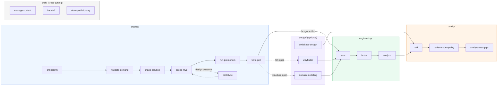

# Agent Coding System

Last updated: 2026-08-10

This repository develops a coding-agent system whose skills coordinate through shared repository memory. The distributable product lives in [`system/`](system/); copied upstream material stays in the local, ignored `references/` workspace.

## Architecture

| Component | Role |
| --- | --- |
| [`system/skills/`](system/skills/) | 47 flat symlinks (loader entry points) into `skills-src/` |
| [`system/skills-src/`](system/skills-src/) | The skills as browsable source, organized by SDLC phase (see below) |
| [`system/memory/`](system/memory/) | Shared read/write protocol for core, human, optional wiki, and working memory |
| [`system/workflows/`](system/workflows/) | Idea, feature-delivery, testing, and debugging sequences |
| [`system/commands/`](system/commands/) | Claude Code entry points, including one-time repository setup |
| [`system/agents/`](system/agents/) | Shared specialist agents used by review and delivery skills |
| [`system/docs/`](system/docs/) | Human-facing catalog, organization report, and retained domain guides |

Markdown is the semantic source of truth. HTML is a maintained human view for architecture, code maps, and dependency roadmaps; it must remain reproducible from its Markdown inputs.

## Skill organization

Skills live under `system/skills-src/<phase>/<sub-area>/<skill>/`. Four phases follow the software delivery lifecycle; two are cross-cutting.

| Phase | Sub-areas | What it covers |
| --- | --- | --- |
| [`product/`](system/skills-src/product/README.md) | `discovery/`, `definition/` | Is the problem real, and what exactly are we building? Idea generation through PRD. |
| [`design/`](system/skills-src/design/README.md) | `ux/`, `technical/` | How the product works: user experience, and domain model / system structure. |
| [`engineering/`](system/skills-src/engineering/README.md) | `feature/`, `frontend/`, `backend/` *(planned)* | Building the thing: spec, task breakdown, iterative delivery, UI implementation. |
| [`quality/`](system/skills-src/quality/README.md) | `testing/`, `review/`, `debugging/` | Correctness and resilience: TDD, review passes, diagnosis. Runs throughout delivery. |
| [`operations/`](system/skills-src/operations/README.md) | `ci-cd/`, `mobile/`, `infra/` *(all planned)* | Shipping and running software. No skills yet. |
| [`craft/`](system/skills-src/craft/README.md) | `context/`, `meta/` | Cross-cutting: agent memory, codebase indexing, documentation, skill authoring, research. |

`system/skills/` holds flat symlinks into `skills-src/` purely so the Claude Code loader — which scans one level deep — can discover every skill while the source stays browsable by phase.

## Workflow sample

Workflows in [`system/workflows/`](system/workflows/) compose skills across phases around the shared memory protocol. A representative idea-to-shipped-feature DAG:



The design column is optional; `write-prd` owns the routing criteria (its Design Gate), and `prototype` serves both the scoping loop and open design questions. `ideate-product` routes the product chain when the entry point is unclear; `craft/` skills apply at any stage. Ticket dependencies stay canonical in issue files; `draw-portfolio-dag` renders them to `roadmap.md` / `roadmap.html`.

## Start here

1. Install the plugin.
2. Run `/agent-coding-skills:setup` in the target repository.
3. Let setup write `docs/agents/memory.md`, which tells every skill where shared memory lives.
4. Use `ideate-product` when the correct product entry point is unclear; open the [workflows](system/workflows/README.md) when the sequencing is.

```bash
/plugin marketplace add XinheLIU/agent-coding-skills
/plugin install agent-coding-skills@agent-coding-skills
```

## Public catalog

This repository publishes its skill-set metadata through [`catalog/skill-set.json`](catalog/skill-set.json). The shared frontend and cross-repository catalog live in [Agent Skills](https://github.com/XinheLIU/agent-skills); this repository remains the source of truth for the Coding Skills product and its releases.

For manual or cross-runtime installation, copy the skill's real directory from `system/skills-src/<phase>/<sub-area>/<skill>/`. Each skill is self-contained: it carries its own `references/` (including the shared memory protocol, which ships inside [`craft/context/manage-context/references/PROTOCOL.md`](system/skills-src/craft/context/manage-context/references/PROTOCOL.md)) and refers to sibling skills by name, so it works when lifted out on its own.

## Development boundary

- Adapt useful principles under `system/`; do not ship raw reference snapshots.
- Read `references/README.md` before comparing local references; the complete gstack snapshot and guide is grouped separately under `references/gstack/`.
- Keep `references/` read-only, ignored, and outside distribution.
- Record external influence in [`system/THIRD_PARTY_NOTICES.md`](system/THIRD_PARTY_NOTICES.md).
- Do not commit unless explicitly requested.

## Status

The repository is organized around the shared-memory model, but integration cleanup remains. See [`system/TODO.md`](system/TODO.md) for the prioritized plan and [the organization report](system/docs/organization-report.md) for the inventory and decisions.
