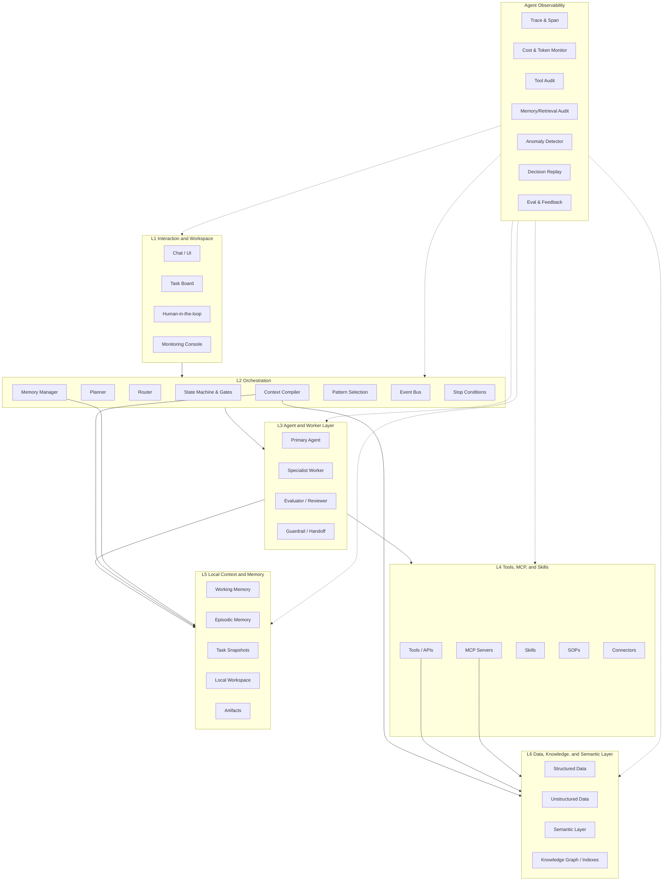

## General Six-Layer Agent Architecture Reference

Last updated: 2026-06-01

This reference is intentionally domain-agnostic. Use it for any agent: coding, research, support, sales, operations, healthcare, finance, internal automation, or creative production.

Source pattern basis: Anthropic, ["Building effective agents"](https://www.anthropic.com/engineering/building-effective-agents) (Dec 19, 2024), especially the distinction between workflows and agents; the preference for simple composable patterns; augmented LLMs with retrieval, tools, and memory; and the patterns of prompt chaining, routing, parallelization, orchestrator-workers, evaluator-optimizer, and autonomous agents.

### Design Principles

1. **Simplicity first** - Start with the smallest system that can meet the success criteria. Add multi-step workflows or autonomous loops only when a simpler call with retrieval/tools/memory is insufficient.
2. **Transparent orchestration** - Put routing, planning, state transitions, gates, stop conditions, and feedback loops in L2 so they can be inspected and tested.
3. **Clear agent-computer interface** - Put executable capabilities in L4 with explicit tool names, parameters, examples, edge cases, and failure boundaries.
4. **Ground-truth feedback** - Let agents observe tool results, environment state, tests, evals, or human feedback before proceeding.
5. **Context separation** - Keep data/knowledge/semantics in L6, local runtime context in L5, executable tools in L4, agent roles in L3, orchestration in L2, and user/workspace surfaces in L1.

---

### Layer Responsibilities

| Layer | Name | Core responsibility | Typical contents |
|-------|------|---------------------|------------------|
| L6 | Data, Knowledge, and Semantic Layer | Persistent information substrate | Structured data, unstructured data, semantic layer, ontologies, taxonomies, entity definitions, vector/keyword indexes, knowledge graphs |
| L5 | Local Context and Memory Layer | Agent-local state and durable working context | User/project preferences, working memory, episodic memory, task snapshots, local workspace files, generated artifacts, session state |
| L4 | Tools, MCP, and Skills Layer | Executable capabilities and external interfaces | Tools, MCP servers, APIs, scripts, skills, connectors, SOPs, permission scopes, tool contracts |
| L3 | Agent and Worker Layer | Role-specific reasoning units | Primary agent, specialist workers, reviewers, evaluators, guardrail agents, human handoff role |
| L2 | Orchestration Layer | Control flow and context assembly | Pattern selection, planner, router, state machine, gates, context compiler, memory manager, event bus, stop conditions |
| L1 | Interaction and Workspace Layer | User-facing and operator-facing surfaces | Chat, web/mobile UI, IDE surface, task board, approval queue, monitoring console, notifications |

### Layer Boundaries

- L6 stores or exposes persistent information. It does not execute actions.
- L5 stores local and agent-specific context. It does not contain global source-of-truth data unless copied as a task snapshot.
- L4 executes actions. It should be easy for an LLM to understand and hard to misuse.
- L3 decides within a role. It should not hide orchestration logic that belongs in L2.
- L2 coordinates. It should be inspectable and reusable across domains.
- L1 presents, collects input, and supports human review.

---

### Agentic Pattern Selection

| Pattern | Shape | Use when | Layer impact |
|---------|-------|----------|--------------|
| Augmented LLM | One LLM call with retrieval, tools, and memory | The task is narrow and can be solved without multi-step control flow | L2 remains thin; L3 may have one agent; L4/L5/L6 matter most |
| Prompt chaining | Step A -> gate -> Step B -> gate -> Step C | The task naturally decomposes into known sequential stages | L2 state machine and gates are central |
| Routing | Classifier/router -> specialized path | Inputs fall into distinct categories with different prompts, tools, or risk levels | L2 router chooses L3 worker or workflow |
| Parallelization | Independent workers -> aggregation/vote | Independent subtasks improve speed, coverage, or confidence | L2 manages fan-out/fan-in; L3 workers stay narrow |
| Orchestrator-workers | Orchestrator decomposes unknown subtasks -> workers -> synthesis | Subtasks are not predictable upfront | L2 planner plus L3 workers; strong observability required |
| Evaluator-optimizer | Generator -> evaluator -> revision loop | Clear evaluation criteria can improve output measurably | L2 loop and stop conditions; L3 evaluator role |
| Autonomous agent | Agent plans and acts through environment feedback until done or stopped | The path cannot be hardcoded and the environment provides ground truth | L2 must define limits, checkpoints, replay, and escalation |

```
Decision rule:
1. Try augmented LLM first.
2. If fixed steps exist, use prompt chaining.
3. If categories diverge, add routing.
4. If independent work exists, add parallelization.
5. If subtasks are unknown, use orchestrator-workers.
6. If quality can be judged, add evaluator-optimizer.
7. Use autonomous agents only when the task is open-ended and tool feedback can ground progress.
```

---

### Runtime Context Packs

Each run should make context assembly explicit. The L2 Context Compiler assembles:

| Pack | Primary source | Contents |
|------|----------------|----------|
| Data Pack | L6 + L5 snapshots | Structured facts, records, metrics, user/account/task state, retrieved rows |
| Knowledge Pack | L6 | Unstructured passages, docs, files, graph neighborhoods, semantic entities, retrieved examples |
| Instruction Pack | L2/L3/L4 plus domain policy | System instructions, workflow policy, tool-use rules, evaluation criteria, human constraints |
| Local Context | L5 + L3/L4 runtime | Working memory, current plan, intermediate tool results, artifact paths, open blockers |

---

### L2 State Machine Template

Use a simple state machine and customize only when needed.

```
Intake -> Clarify -> Plan -> Execute -> Verify -> Review -> Done
```

For autonomous loops, add explicit controls:

```
Plan -> Act -> Observe -> Reflect -> Continue | Escalate | Stop
```

---

### Tool Contract Checklist

For each L4 tool, define:

- Purpose and non-purpose
- Required parameters and exact formats
- Example calls
- Expected outputs
- Failure modes
- Permission or approval requirements
- Whether the tool reads, writes, sends, spends money, deletes, or triggers external side effects

---

### Agent Observability Components

Observability cuts vertically across all layers and should not be embedded in domain logic.

| Component | Responsibility |
|------|------|
| Trace & Span | Complete call tree, timing, prompts, tool calls, observations, and outputs |
| Cost and Token Monitor | Token usage, model cost, budget alerts by agent and workflow |
| Tool Call Audit Log | L4 tool name, parameters, result, latency, error, side effect |
| Memory R/W Audit | L5 reads/writes and L6 retrieval provenance |
| Decision Replay | Reconstruct plans, actions, observations, and revisions for debugging |
| Anomaly Detector | Detect loops, timeouts, tool failure spikes, low confidence, repeated retries |
| Latency Dashboard | End-to-end and per-layer P50/P95/P99 latency |
| Eval and Feedback Loop | Automated evals, human ratings, regression tests, and improvement tickets |

---

### Adaptation Checklist

1. Replace L6 data, knowledge, and semantic models.
2. Replace L5 local memory defaults, workspace conventions, and artifact types.
3. Register L4 tools, APIs, MCP servers, skills, and SOPs.
4. Define L3 roles only where responsibility boundaries are real.
5. Select the simplest L2 pattern that satisfies success criteria.
6. Expose L1 controls and human checkpoints.
7. Add observability before increasing autonomy.

---

### Mermaid Diagram Template


