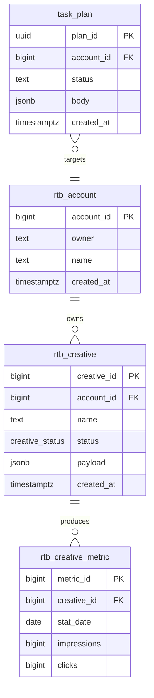

# Data Model & ER Playbook

Last updated: 2026-05-16

The **data model doc** is the internal skeleton. It pairs with the entry-point trace (external contract): one names what flows in, the other names what gets stored.

Output file: `docs/codebase-documentation/data-model.md`. Template: `assets/templates/DATA_MODEL.template.md`.

## Scope

Cover **canonical, long-lived tables and entities**. Skip:

- Ephemeral caches and queue payloads (those belong in entry points or ADRs).
- Generated/audit tables that are pure projections of others.
- Tables owned by a different project sharing the same database.

If the project has a layered data model (e.g. ODS / DWD / APP), document each layer separately and explicitly note which module owns writes (per project's schema-ownership rule).

## Discovery recipes

Inspect every source of truth for model shape:

```bash
# Raw DDL
find . -path '*/sql/*.sql' -o -name 'schema*.sql' -o -name 'init*.sql' \
  -not -path '*/.venv/*' -not -path '*/node_modules/*'

# Alembic / migrations
find . -name 'alembic.ini' -o -path '*/migrations/*.py' -o -path '*/versions/*.py'

# SQLAlchemy / SQLModel
grep -rnE 'class\s+\w+\(.*(Base|SQLModel|DeclarativeBase|Model).*\):' services/ pipelines/

# Pydantic models that are also persistence models
grep -rnE 'class\s+\w+\(.*(BaseModel|TableModel).*\):' services/

# DTOs / API contracts — confirms external names and request/response shape
grep -rnE 'class\s+\w+\(.*BaseModel.*\):|TypedDict|dataclass' services/ pipelines/

# Pipeline write paths — confirms schema ownership
grep -rnE 'INSERT INTO|COPY .* FROM|ON CONFLICT' pipelines/ services/
```

When DDL and ORM disagree, **DDL wins** for the published doc and the mismatch is flagged in the Phase 4 report.

## Required per entity

Capture this for every canonical model:

- **One-sentence description** — the business concept the entity represents.
- **Fields** — field name, SQL type, nullability, default, and source.
- **Primary key** — including composite PKs.
- **Foreign keys** — target table/field and relationship meaning.
- **Unique constraints** — including natural uniqueness not represented by the PK.
- **Natural / business keys** — external identifiers or human-meaningful identities.
- **Idempotency keys** — if writes dedupe on a key other than the PK.
- **Indexes** — only those that explain query or uniqueness behavior.
- **Enums** — allowed values, one-line semantics for each value, and declaration source.
- **ER cardinality** — why the relationship is one-to-one, one-to-many, or many-to-many.
- **Write owner** — module allowed to create/update rows.
- **DTO mapping** — request/response/message models that expose the entity externally.

## What to capture per table

A small table per entity, not a paragraph. Order: fields → keys → enums → relationships → schema owner.

```markdown
### `ods.rtb_creative`

Raw creative records ingested from RTB external sync.

| Field | Type | Null | Default | Notes |
|---|---|---|---|---|
| `creative_id` | `BIGINT` | no | — | PK |
| `account_id` | `BIGINT` | no | — | FK → `ods.rtb_account.account_id` |
| `name` | `TEXT` | no | — | |
| `status` | `creative_status` | no | `'pending'` | enum below |
| `created_at` | `TIMESTAMPTZ` | no | `now()` | |
| `payload` | `JSONB` | yes | `NULL` | raw RPA response |

- **Primary key:** `creative_id`
- **Foreign keys:** `account_id` → `ods.rtb_account.account_id`
- **Unique constraints:** `(account_id, name)`
- **Natural / business keys:** `external_creative_id`
- **Idempotency keys:** `source_system + external_creative_id`
- **Enum `creative_status`:** `pending | active | paused | archived | error`
- **Enum semantics:** `pending` = accepted but not live; `active` = eligible to serve; `paused` = intentionally stopped; `archived` = retained for history; `error` = rejected or failed sync
- **Indexes:** `(account_id, created_at DESC)`
- **Schema owner:** `pipelines/rtb_data/` (writes via `ON CONFLICT DO NOTHING`)
```

Notes:

- Use `BIGINT` / `TEXT` / `JSONB` (the actual SQL types), not Python annotations like `int` / `str`.
- One-sentence description above the field table, not after.
- "Schema owner" is the module allowed to write to the table; cite the project's ownership rule.

## ER diagram (Mermaid `erDiagram`)

One diagram for the canonical entities — typically 5–12 tables. If the model is larger, draw multiple sub-diagrams scoped by schema or by feature area, not one mega-diagram.



Rules:

- Cardinality syntax: `||--o{` (one-to-many), `}o--|{` (many-to-many through a junction), `||--||` (one-to-one — rare).
- Show keys (`PK`, `FK`) only. Don't list every column in the diagram body — that goes in the prose tables.
- One label per relationship, ≤20 chars. Verb or domain noun ("owns", "produces"), not "has".
- Skip lookup / enum tables. Inline enums as text bullets per table.

## Prose around the ER

| Section | Content |
|---|---|
| **Frame** | One sentence: "Canonical entities across the `ods/dwd/app` schemas." |
| **ER diagram** | The Mermaid block. |
| **Schema ownership** | A small table: schema → owning module → write API. |
| **Per-table sections** | One per canonical entity, per the structure above. |
| **Lookups & enums** | A short section listing enum names, allowed values, and where they're declared. |
| **Retention & lineage** | If the project has retention or layered-derivation rules, summarize and link. |

## Anti-patterns

- Drawing every table that exists. Pick the canonical set — usually fewer than you think.
- Inlining `CREATE TABLE` SQL. The doc is the *interface*; the DDL is the *implementation*. Link to the migration file.
- Re-stating enum members in three places. One canonical list per enum.
- Skipping schema ownership. In repos that layer data (ODS / DWD / APP), the "who writes this" answer is the most valuable line on the page.
- ER diagrams with 30+ tables. Split.
