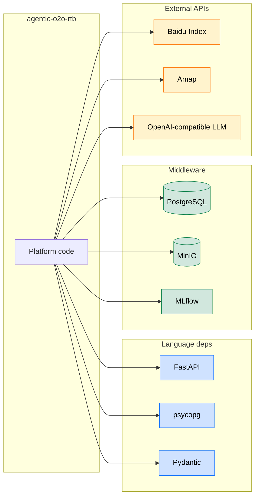

# External Dependency Diagram Playbook

Last updated: 2026-05-16

Scope: **everything the project depends on outside its own source tree**. Three categories, three colors.

Output file: `docs/codebase-documentation/architecture/external-deps.md`.

Use this doc as the implementation-side catalog for key technologies. Explain what role each technology plays, why it is load-bearing, and whether it is replaceable infrastructure or part of the public model/interface contract.

## Three categories

| Category | Examples | Color | Mermaid fill |
|---|---|---|---|
| **Core language deps** | `fastapi`, `psycopg`, `pydantic`, `numpy`, `requests` | Blue | `#cfe2ff` |
| **Middleware / infrastructure** | PostgreSQL, MinIO, Redis, Kafka, nginx, MLflow tracker | Green | `#d1e7dd` |
| **External APIs** | Baidu Index, Amap, OpenAI-compatible LLM, ad-backend RPA endpoints | Orange | `#fff3cd` |

A dep belongs to **exactly one** bucket. If it's borderline (e.g. a Postgres driver), classify by what it *connects to*: the driver is a language dep, the database itself is middleware.

## Discovery recipes

### Language deps

```bash
# Python (uv / poetry / setuptools)
find . -name 'pyproject.toml' -not -path '*/.venv/*' -exec echo '== {} ==' \; -exec sed -n '/^\[project\]/,/^\[/p; /^\[tool\.poetry\.dependencies\]/,/^\[/p' {} \;

# Node
find . -name 'package.json' -not -path '*/node_modules/*' -exec jq '.dependencies' {} \;

# Go
find . -name 'go.mod' -exec head -20 {} \;
```

Keep only **direct** dependencies. Transitive deps are noise; if a transitive is load-bearing (e.g. `pydantic-core` for `pydantic`), the parent already covers it.

### Middleware

Compose / Helm / Terraform is the source of truth.

```bash
# Docker Compose
grep -E '^\s+image:' deploy/docker-compose.yml deploy/docker-compose*.yml 2>/dev/null

# Kubernetes
grep -rhE '^\s*image:' deploy/k8s/ 2>/dev/null

# Helm
find . -name 'values*.yaml' -exec grep -l 'image:' {} \;
```

### External APIs

Pull from settings and `.env.example`:

```bash
grep -rnE '_(URL|HOST|ENDPOINT|API)\b' deploy/.env.example services/*/.env.example 2>/dev/null
grep -rnE '(httpx|requests|aiohttp)\.(get|post|put|delete)' services/ pipelines/ \
  --include='*.py' | grep -oE 'https?://[^"'"'"' ]+' | sort -u
```

External APIs that authenticate (have an API-key envvar) are always worth a node. External APIs called once from a one-off script are usually not.

## Mermaid recipe

Use `flowchart LR` with subgraphs per category. The project sits at the center; arrows go **outward** to every external node.



Rules:

- One subgraph per category. Color the **nodes** inside, not the subgraph background — Mermaid's subgraph fill is unreliable across renderers.
- Cap each category at 8 nodes. If you have more, group transitively (e.g. "FastAPI stack" covering `fastapi` + `starlette` + `uvicorn`).
- Edges from the project to externals only. Don't draw edges *between* externals — that's not what this diagram is for.
- If `docs/external-deps.svg` exists, embed it under the Mermaid as the canonical visual; the Mermaid is the editable source.

## Prose around the diagram

| Section | Content |
|---|---|
| **Frame** | One sentence: "External surface area: language deps, middleware, and outbound APIs." |
| **Diagram** | The Mermaid block. |
| **Language deps** | Bullet list. For each: name + minimum version + one-line "why". |
| **Middleware** | Bullet list. For each: name + version pinned in compose + one-line role. |
| **External APIs** | Bullet list. For each: name + auth model + one-line role + link to API docs if public. Call out **rate limits, cookie/credential rotation cadence, and known fragilities** (e.g. "Baidu Index cookies expire — refresh `BIZ_DATA_BAIDU_INDEX_COOKIES` from a live browser session"). |
| **Key technology decisions** | Short table: technology → implementation role → why chosen → replacement cost / constraint. |
| **Reused asset** | Embed `docs/external-deps.svg` if present. |

## Anti-patterns

- Listing every transitive pip dep. Direct only.
- Mixing categories ("Postgres + psycopg" as one node). Split — one is middleware, one is a language dep.
- Forgetting auth notes for external APIs. The "where do credentials live" question must be answered inline.
- Drawing edges between externals. This diagram is about *what the project depends on*, not how externals talk to each other.
