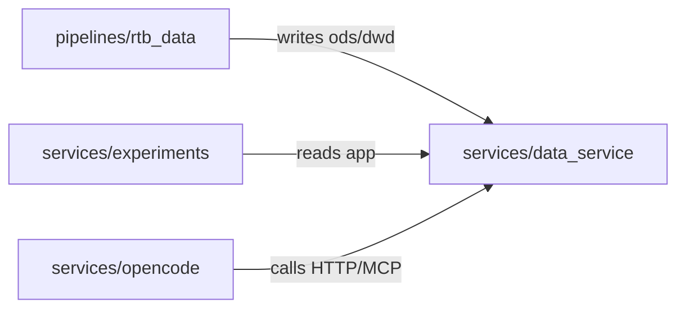

# Module Dependency Diagram Playbook

Last updated: 2026-05-16

Scope: **internal modules only**. Show which first-party package depends on which other first-party package. Cycles are highlighted in red.

Output file: `docs/codebase-documentation/architecture/module-deps.md`.

## What counts as a node

A node is a **top-level internal package** — the unit of ownership, not every Python file.

- Good nodes: `services/data_service/app`, `pipelines/rtb_data`, `services/experiments/src/experiments`.
- Bad nodes: individual files (`db.py`, `routes.py`) — too noisy.
- Excluded: tests, `examples/`, vendored code, third-party deps (those belong in `external-deps.md`).

Cap the graph at **≤25 nodes**. If the project has more, split per top-level directory (one diagram per `services/`, one per `pipelines/`).

## Role classification

Before drawing edges, classify each node by role. This keeps the diagram about structure instead of implementation trivia.

| Role | Question to ask | Dependency expectation |
|---|---|---|
| Core domain | Would the product still be the same without this? | Should not depend on interface adapters or replaceable infrastructure. |
| Interface adapter | Does this expose HTTP, CLI, RPC, jobs, or messages? | May call domain/application modules; should stay thin. |
| Application service | Does this orchestrate use cases without owning storage/frameworks? | Bridges interface adapters to domain and infrastructure. |
| Infrastructure | Is this database, queue, cache, auth, logging, config, deployment, or framework glue? | Replaceable behind stable domain/application calls. |
| Persistence | Does this own repositories, migrations, or schema write/read mechanics? | Should not own business decisions. |
| Shared utility | Is this used everywhere but owns no domain concept? | High blast radius; keep pure and small. |
| Legacy or migration | Does this preserve an old contract or transition path? | Edge direction often explains strange constraints. |

## Discovery recipe (Python)

Strategy: read every `import` statement under the project's source roots, then collapse imports to their top-level package and dedupe.

```bash
# Enumerate first-party source roots
ROOTS="services pipelines examples"

# Raw imports
grep -rnE '^(from|import) ' $ROOTS \
  --include='*.py' \
  --exclude-dir=tests \
  --exclude-dir=.venv \
  --exclude-dir=__pycache__
```

Then, by hand or with a one-shot script:

1. For each importing file `services/X/app/foo.py`, the **source node** is `services/X` (or the next-level package — keep it consistent across the diagram).
2. For each `from services.Y.bar import baz`, the **target node** is `services/Y`.
3. Discard standard library and third-party imports (anything not under `$ROOTS`).
4. Build a deduped edge list `(source, target)`.

A more rigorous option, if installed, is `pydeps` or `importlab`:

```bash
uvx pydeps --max-bacon=2 --noshow --cluster services/data_service -T svg -o /tmp/data_service_deps.svg
```

Treat the tool output as a hint; the published diagram is a hand-curated Mermaid block — too-noisy auto-output isn't useful.

## Cycle detection

After building the edge list, look for cycles with a depth-first search (or `tsort` failure):

```bash
# Quick check via tsort — exits non-zero on cycle
printf '%s\n' "${edges[@]}" | tsort 2>&1 | grep -i cycle
```

Every cycle is documented in two places:

1. **In the diagram**: color the involved edges red.
2. **In a "Cycles" section** below the diagram: list each cycle as `A → B → A`, give the file pairs that create it, and call out whether it's intentional (rare) or a refactor candidate (most cases).

## Mermaid recipe

Use `flowchart LR` (`TD` for ≤10 nodes is fine). Mark cycle edges with `linkStyle` red.



Rules:

- One-line edge label only (verb + medium). Long labels collide on crossing edges.
- Edge labels must explain dependency intent, not just import direction: `validates command`, `persists task`, `calls external API`, `loads config`.
- Do not draw an edge for every imported symbol — one edge per directed package pair, regardless of how many imports cross it.
- Do not draw self-loops; they are usually noise.

## What goes in the prose around the diagram

| Section | Content |
|---|---|
| **Frame** | One sentence: "Internal module dependencies across `services/` and `pipelines/`." |
| **Diagram** | The Mermaid block. |
| **Nodes** | One bullet per node: `path` — role + one-sentence responsibility. |
| **Cycles** | Empty if none. Otherwise one bullet per cycle with file pairs + refactor note. |
| **Invariants** | Any documented dependency rules (e.g. "Platform services do not import `pipelines/*`" from `DESIGN.md`). Link to the source. |
| **Reused asset** | If `docs/module-deps.svg` exists, embed it under the Mermaid as a visual cross-check; don't try to regenerate. |

## Anti-patterns

- Putting third-party deps on the graph → that's `external-deps.md`.
- Drawing every `.py` file → noise. Roll up to packages.
- "Helper" or "common" pseudo-nodes that aren't real directories → invent a node only if a real shared package exists at that path.
- Hiding cycles to make the diagram look clean → defeats the purpose. If a cycle exists, ship it visibly in red.
