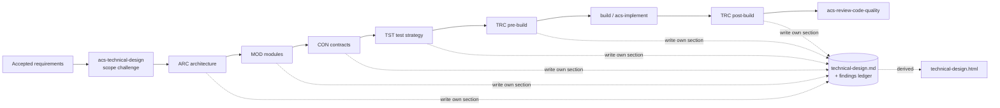

# Design · Technical

Last updated: 2026-09-29

Technical design turns accepted requirements into a structure that can be implemented, evolved, and checked. It is cut into **vertical aspect cards**. Each card owns one aspect end to end: it assesses the current state, designs the target, and reviews a proposal. Design and review of an aspect are the same skill in two modes.

Every card writes its own section of **one shared record**, `docs/design/technical-design.md`. That record has one findings ledger, and Presenter rebuilds **one derived view** from it, `docs/design/technical-design.html`. No card creates its own report file. The contract all cards follow is [references/card-contract.md](references/card-contract.md), and the view is specified in [references/technical-view.md](references/technical-view.md).

```text
requirement → ARC capability → MOD interface → CON contract → TST verification → TRC status
```

## Cards

| Skill | Card | Owns | Produces |
| --- | --- | --- | --- |
| `acs-technical-design` | Router | Scope challenge, card selection, ledger consolidation, verdict | `## Overview` |
| `acs-design-architecture` | ARC | System shape: capability map, current/ideal/feasible target, shared foundations and their form, data/tech/deploy fit, decision ledger; optional deep mode with six explorer/reviewer lenses | `ARC-n`, `FND-ARC-n` |
| `acs-design-modules` | MOD | Code structure: responsibilities, deep interfaces, dependency direction, wiring, foundation contracts by form, bootstrap, migration | `MOD-n`, `FND-MOD-n` |
| `acs-design-contracts` | CON | Correctness: invariants, pre/postconditions, error semantics, idempotency and ordering, trust boundaries, API/schema evolution, failure modes | `CON-n`, `FND-CON-n` |
| `acs-design-test-strategy` | TST | Verification before code: critical paths, layer assignment, seams and doubles, fixtures, characterization, CI gates | `TST-n`, `FND-TST-n` |
| `acs-trace-requirements` | TRC | Connectedness: requirement → entry → registration → module → contract → test, before and after build; scoped wiring repairs | `TRC-n`, `FND-TRC-n` |

## Flow

The graph is a routing map, not a ceremony. The router picks the cards the request and repository state need; any card also runs alone.



| Situation | Cards |
| --- | --- |
| Greenfield | ARC → MOD → CON → TST → TRC, design mode |
| Brownfield change within the current architecture | MOD → CON → TST → TRC; ARC only if a boundary moves |
| "This is tangled" / tech-debt audit | ARC and MOD in review mode against the code |
| Plan or RFC review before coding | All five in review mode against the plan |
| "What's left?" | TRC post-build |

## Boundaries

- A card edits only its own section and ledger rows. A cross-card issue becomes an `Open` item on the owning card.
- Code-level defects go to `test/review/acs-review-code-quality`, and it drills into open `FND-ARC` rows and `TRC` statuses. Behavior-preserving restructuring goes to `acs-refactor-code`, which consumes `CON` invariants. Coverage of existing tests is measured by `test/acs-analyze-test-gaps`, which starts from `TST` critical paths.
- Multi-session decision routes belong in `plan/acs-explore-unknowns`. NFR analysis, domain clarification, splitting, and adversarial challenge are techniques inside the owning card, not separate skills.
- Interface naming and selection rules are persisted in `AGENTS.md` or Claude Rules through `acs-sync-context`.

A design is ready to build when every requirement has an ARC or MOD owner, every CON item names where it is enforced, every critical path has a TST layer, pre-build TRC has no `MISSING` rows, and no `P0` is open.
