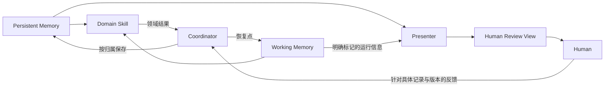

# Context 设计提案：两类记忆，一个 Presenter

Last updated: 2026-09-25

状态：已于 2026-09-25 获用户接受并授权实施。本文保留设计理由；执行规则以 [共享记忆协议](../skills-src/context/acs-init-context/references/PROTOCOL.md)、[协调协议](../protocols/context-coordination.md)和 [Presenter 契约](../protocols/presenter.md)为准。既有规范文档按实际需要迁移，不批量改变格式。

## 结论

顶层只保留 **Working Memory** 和 **Persistent Memory** 两类记忆。**Presenter** 独立负责组织 Human Review View；审阅产生的决定属于 Persistent Memory，不建立第三套事实库。

Working / Persistent 回答「信息为谁保留、保留到什么时候」，Presenter 回答「如何让人理解和判断」。这两个维度不能作为三个同级存储层。

当前四种生命周期重组为：

```text
Working Memory
└── Run Context：当前执行的恢复点、临时推理、原始输出

Persistent Memory
├── Intent：North Star，产品意图、原则、约束
├── Current：Current State，当前适用规则与有证据的实际状态
└── Changes：Change Context，提案、需求、决策、验证和发布记录

Presenter
└── 从上述记录组织 Human Review View；HTML 是首选复杂展示格式
```

Intent / Current / Changes 是持久记录的用途分类，不再要求每个 Skill 理解四套生命周期。身份、版本、事实归属和保留规则仍然保留。

## 1. 记忆边界

| 项目 | Working Memory | Persistent Memory | Human Review View |
| --- | --- | --- | --- |
| 服务对象 | 当前 run，允许跨会话恢复 | 项目与变更，跨 run 复用 | 当前阅读、比较、进度查看或审阅 |
| 典型内容 | 下一步、阻塞、执行计划、claim、原始日志、探索草稿 | 产品意图、规范需求、候选设计、已接受决策、关键证据、审阅结果 | 结论摘要、对比图、选项、待决事项、来源链接 |
| 事实归属 | 只拥有运行事实 | 拥有领域记录及其历史 | 不拥有独有领域事实 |
| 保存介质 | 可以落盘；默认被 Git 忽略 | 既有 tracker 或受版本管理的文件 | 可重建 HTML / Markdown；必要的审阅快照可归档 |
| 清理条件 | run 已结束，必要内容已归入持久记录 | 按项目保留规则处理 | 可重建的随时可丢；作为决策证据的快照必须保留 |

**Working 不等于内存，Persistent 不等于已接受。**

运行状态必须落盘才能冷启动恢复，但不因此变成项目知识。反过来，一份尚未接受、已经正式送审的方案，必须作为 `proposed` 的持久变更记录保存；否则审阅人几天后返回时可能面对已消失或已变更的提案。

三个判断足够决定归属：

1. 只为当前 run 续跑服务，结束后没有独立价值：Working。
2. 后续任务、协作者或决策需要引用：Persistent，并明确 `proposed`、`accepted`、`rejected` 等领域状态。
3. 可以仅凭已记录的来源重新组织出来：View。

只因文件是 HTML、Markdown、JSON 或位于 `docs/`，不能推断它属于哪一类。

## 2. Presenter 的职责



Skill 负责「结论是什么、证据是什么、哪里需要决定」；Presenter 负责「如何让人迅速看懂」。Coordinator 是协调职责，不需要新增服务进程。

| 角色 | 唯一职责 |
| --- | --- |
| Domain Skill | 领域推理、候选方案、结论、证据、待决问题 |
| Coordinator | 解析引用、协调写入、恢复状态、检查版本、记录反馈并路由领域修订 |
| Presenter | 阅读顺序、信息密度、图表、对比、来源与审阅状态的展示 |

Presenter 可以调整措辞和图表，但不得新增领域结论、改变推荐顺序的实质含义、隐藏阻塞或把 `proposed` 展示成 `accepted`。发现缺少判断依据时，将缺口返回领域 Skill。

只需要一个调用接口：

```text
present(references, focus) -> view_reference

references = 带 record ID 与 revision 的规范来源
focus      = 本次让人理解或决定什么
```

Presenter 从来源提取已有结论、推荐和问题。结果包含可访问页面及其来源版本；这些信息直接写入页面，不新增长期维护的 `view-model.json`。渲染需要的临时 JSON 可以存在 Working Memory。

简单结果直接用会话或 Markdown 展示；多方案比较、结构图、交付进度使用 HTML。不强制每个 Skill 调用另一个完整工作流，也不要求每次 handoff 生成人工报告。

可先将 Presenter 实现为共享协议、模板及现有 renderer 的组合。只有确有调用需要时才增加薄的 `acs-present` 入口；不建立每个领域各一套 Presenter。

## 3. HTML 的三种角色必须拆清

| 现有产物 | 提案中的归属 | 处理方式 |
| --- | --- | --- |
| `product.html` 中的产品记录 | Persistent | 保留规范身份；Presenter 按需从中组织阅读视图，不另建同步 Markdown 真源 |
| `prototype.html`、被接受的视觉设计 | Persistent artifact | 布局与交互本身有语义；保留准确版本及依赖资源，Presenter 只展示或链接 |
| 架构审阅、分析报告的 HTML companion | View | 领域结论与证据先写入规范记录；HTML 可重新生成 |
| `delivery-plan.html`、DAG | View | 继续从规范 Ticket、依赖和证据派生 |
| `discovery.html` 中的探索 | Working | 送审或供下游依赖的结论先转成持久提案；其余探索可留在 run 中 |

因此，**Presenter 的边界按事实归属划分，不能按 `.html` 后缀划分**。

无需把 `product.html` 全量迁移为 Markdown。对目前兼具规范内容和展示的 HTML，只需明确规范记录 ID 和版本。之后确有布局维护成本时，再针对该文档解耦；不维持两份同权内容。

原型也不能被宣布为「删掉再生成即可」。模型重新生成视觉设计通常不能复现用户接受的准确结果；被接受的原型版本本身就是需要保留的证据。

## 4. Human Review 的闭环

审阅包含两种不同产物：**页面**和**决定记录**。页面可以派生；决定及其依据必须保留。

```text
领域 Skill 保存 proposed 记录与必要证据
→ Presenter 展示明确版本
→ 用户提出反馈、接受、拒绝，或要求修改
→ Coordinator 校验反馈所指范围与版本
→ 保存决定，交由领域 Skill 处理内容变化
→ 刷新视图，并让下游消费规范记录
```

正式送审前，候选内容必须已保存。一次即时探索可以不生成持久记录；一旦用户据此接受某方案，就必须先保存其准确内容及依据，再让下游依赖。

决定可以直接写在现有 decision / change 记录中，无需额外审批数据库。最低内容为：

```yaml
id: D-12
subject: DESIGN-7
reviewed_revision: sha256:<reviewed-content>
outcome: accepted
scope: export interaction; implementation not authorized by this decision
basis: reviewer chose inline feedback to preserve task continuity
source: <actual user response or durable review reference>
```

这是结构示意，不要求新 YAML 文件。现有 Markdown 字段或 HTML 记录同样有效。`scope` 和 `basis` 必须来自实际反馈，不由 Presenter 补写授权。

规则：

- 审阅按记录或明确范围生效，不把整张报告上所有内容一起视为已批准。
- 接受方案与授权实现、提交或发布分开记录，复用已经明确存在的授权。
- 普通事实更新不强制人工审阅；仅在任务、领域规则或未解决决策需要时进入该流程。
- 实质内容或依赖变化后，旧决定仍作为历史保留；受影响结论标为 `needs review`，不能继承原版本的接受状态作为新版本依据。
- 纯排版变化不使领域决定失效；视觉设计审阅中布局本身属于实质内容，因此需绑定原型版本。
- 关键评论与修改要求写入规范记录；浏览器 localStorage 只保存折叠、布局等 UI 偏好。
- 记录 ID 加实际反馈来源用于去重；重复处理同一反馈不得新增决定。无法确认是否重复时先核对。

决定引用的确切内容必须可取回：已受版本管理的记录可以引用保留的 revision；尚无可靠历史的文档保存必要快照。若呈现方式本身影响了决定，还要保留所审阅页面及其依赖资源。此时它是 Persistent 的历史证据，不是另一个当前事实源。

静态 HTML 的第一版无需实现审批按钮。用户在会话中反馈，Coordinator 完成记录即可；将来增加界面按钮时也应走同一条写入路径。

## 5. Skill 间统一的 handoff

**下游接收领域记录和运行检查点；HTML 只作为可选的人类阅读入口。**

沿用现有六字段 `context` 声明，不添加每个 Skill 自创的 Memory 格式。共享协议统一定义产物角色的归属：产品记录、规范需求、接受的设计、验证结论归 Persistent；临时探索、执行步骤、claim 归 Working；报告和图谱归 View。

领域 `produces` 必须能对应到共享角色或明确的会话临时结果。Skill 不决定工作根目录，也不各自选择持久化策略。实际位置由 `docs/agents/memory.md` 的配置和既有规范 homes 决定。

统一 handoff 仍然很小：

```yaml
change: EXP-42
references: [SPEC-42@r3, DESIGN-7@r2, D-12@r1]
delta: interaction accepted; upload implementation remains unverified
blockers: []
next_action: implement AC-9
```

需要恢复执行时附 run 检查点；需要人工阅读时附 `view` 链接。`view` 不成为所有交接的必填项。示例中的 ID 是逻辑示意，实际必须附可访问路径或 tracker 引用。

跨 Agent 的结果也先保存最小必要证据，再交接引用；原始日志和不相关上下文留在 Working。临时可读摘录可以用于传输，但必须携带规范来源和 revision，不能成为第二份 Spec。

一个 run 只配置一个权威恢复入口。默认沿用 `<work-root>/<run-id>/state.md`；实现调度器若保留 `execution.json`，它只是该入口引用的内部细节。已经以 JSON 为入口的项目可以保留，但必须明确指定，不能同时维护两个独立的下一步或 Ticket 状态。

## 6. 保存、更新与清理

三个持久化时机：

1. **需要引用时保存。** 正式送审、跨 run 交接、形成规范提案或供下游工作依赖时，保存最小必要记录及证据；内容可以仍然 proposed。
2. **产生结论时更新。** 决策、验证和发布结果回写各自规范记录。保留原结论，按相关版本更新适用性。
3. **事实改变后同步。** 验证出实际行为变化后更新 Current；仅有 accepted 设计时只更新意图或变更记录，不宣称已经实现。

Working 的清理有两个条件：run 已完成或明确放弃；屏蔽 run 目录后，必要的提案、决定、证据和准确的受审内容仍然可读。活跃 run 的草稿与恢复点不能因为「临时」二字而随意删除。

Presenter 的重建条件更简单：规范来源仍存在且版本可识别。刷新页面不得改动源记录；旧页面只能代表其列明的来源版本。展示和接收反馈时重新核对版本，不承诺静态文件在离线打开时会自动发现源变更。

## 7. 最小落地范围与验收

本设计不需要向量数据库、通用事件总线、事件溯源框架或新的前端项目。复用文件、已有 tracker、现有 HTML 模板和 DAG renderer。

实现范围仅为：合并记忆分类协议；统一配置中的 run 入口；提取共享 Presenter 契约；将重复的 Skill 排版指令移入 Presenter；明确审阅结果写回；修复协议引用与发布包依赖。产品 HTML 和原型无需批量改格式。

| 验收情景 | 必须满足 |
| --- | --- |
| 冷启动一个活跃 run | 从唯一入口找到规范变更、阻塞、所需版本和下一步，无需读报告或聊天历史 |
| 删除一个可派生报告 | 能从规范记录重建；领域事实、决定与 Ticket 状态不变 |
| 删除已完成的 Working | 已接受及仍需保留的提案、设计、决定和证据全部可读 |
| 审阅后内容改变 | 旧决定保留，新版本不能冒用旧接受结果；无关排版不触发领域重审 |
| 重复处理同一反馈 | 不新增重复记录、不覆盖并行反馈 |
| 独立安装任一 Skill | 需要的协议和模板可达，未安装 Presenter 也能完成领域工作并用文本交付 |
| 仅凭现有明确输入运行 | 无需先创建空白 memory 目录或执行完整初始化 |

## 研究依据与取舍

以下是启发来源，不是声称这些项目采用了本提案的完整架构。

1. **[LangGraph Memory overview](https://docs.langchain.com/oss/python/concepts/memory)**：短期记忆是 thread-scoped state，也通过 checkpointer 持久化；长期记忆跨 thread、按 namespace 使用。采用「按使用范围划分」的原则；本套件把 Working 的范围设为 run，可跨会话，不照搬其数据库实现。[Interrupts](https://docs.langchain.com/oss/python/langgraph/interrupts) 将外部输入与持久检查点关联，恢复时节点可能重新执行；这支持审阅与具体状态关联、写入需要去重的设计。它本身不替本提案提供内容版本校验或接受语义。
2. **[Anthropic — Effective context engineering for AI agents](https://www.anthropic.com/engineering/effective-context-engineering-for-ai-agents)**：按需取回引用、渐进加载、结构化笔记和压缩。采用紧凑检查点与按需读取，不以全量 HTML 或历史对话作为恢复材料。
3. **[Martin Fowler — Presentation Model](https://martinfowler.com/eaaDev/PresentationModel.html)**：展示状态与行为独立于 UI 控件和领域层。采用展示职责分离；这里主要是静态报告，第一版不引入双向绑定或另一个长期 ViewModel 存储。
4. **[OpenSpec](https://github.com/Fission-AI/OpenSpec)**，本地只读快照 `bae58cf`：concepts (source-checkout provenance: `references/OpenSpec/docs/concepts.md`)。采用当前状态与变更记录分开、以 delta 表达变更、保留决策历史。没有采用「保留全部执行产物」作为默认清理策略，也不把归档动作本身作为行为已上线的证据。
5. **[Superpowers](https://github.com/obra/superpowers)**，本地只读快照 `5bf4e78`：Visual Companion (source-checkout provenance: `references/superpowers/skills/brainstorming/SKILL.md`)。参考视觉交互按需要启用、适合视觉的问题才进浏览器；不继承其强制审批和提交步骤。

官方网页于本次研究实际读取；OpenSpec / Superpowers 的观察针对上述本地固定版本。外部方案未作为依赖安装或执行。

现有实现中，[交付报告契约](../skills-src/build/acs-plan-delivery/references/delivery-report.md)及 `render_dag.py` 已实践「规范 Ticket → 派生 HTML」。这是 Presenter 可复用的起点；[Product](../skills-src/context/acs-init-context/references/product-memory.md) 和 [Design](../../skills/acs-design-context/references/design-memory.md) 则证明必须保留规范 HTML 与视觉 artifact 的例外。
