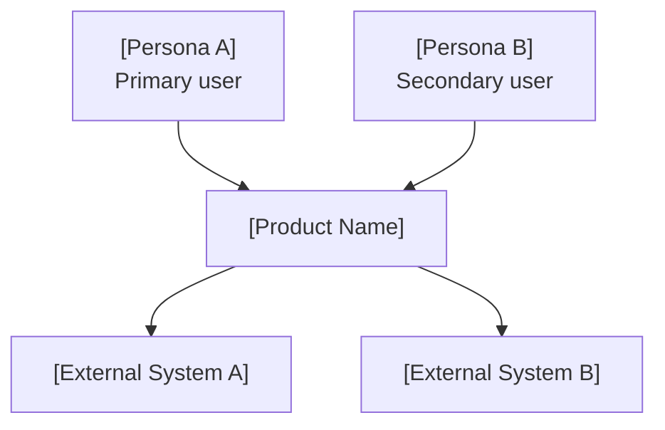
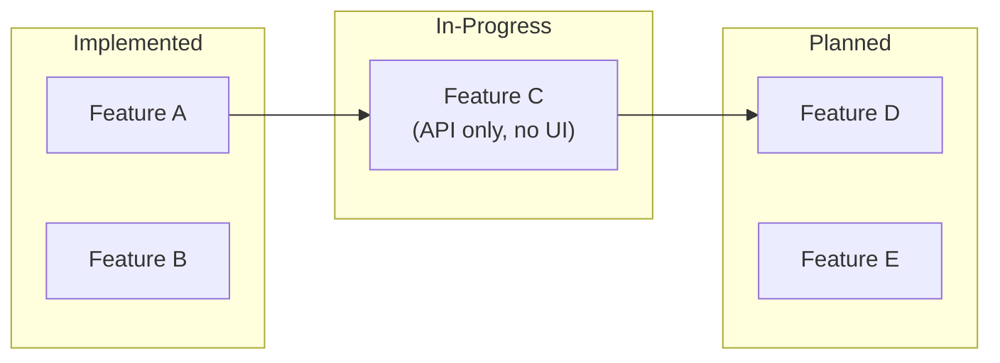
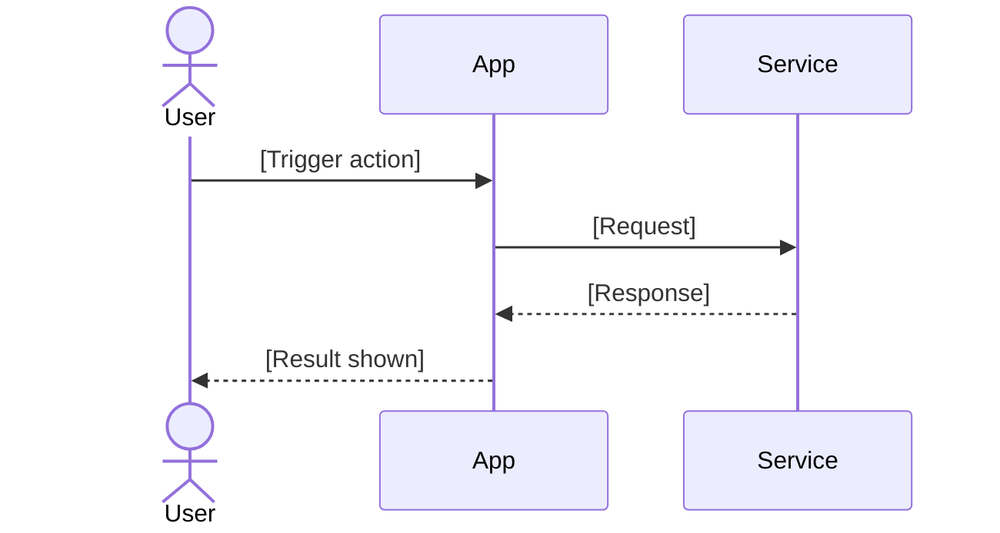

# Shape Solution

Last updated: 2026-09-25

## Context contract

```yaml
context:
  requires: [product.problem_or_baseline]
  retrieves: [product.demand_assessment, north_star.relevant_goals]
  produces: [product.solution_proposal]
  updates: [product.discovery_records]
  invalidates: [product.solution_dependents]
  handoff_to: [product, design]
```

Shared semantics: [shared protocol](../../resources/protocols/skill-declarations.md#skill-declarations); shared execution: [Coordination](../../resources/protocols/context-coordination.md). Apply their memory ownership and save-before-handoff rules; existing authorization persists. For human reports or review feedback, use [Presenter](../../resources/protocols/presenter.md); source records retain authority.


Three narrative outputs plus the scenarios they imply — for new ideas and already-mapped
existing products. One purpose: make the user real enough that every design tradeoff has a
human answer.

This is stage 2 of product ideation — **Solution Shaping**. Stage 1 established that the job is real;
this stage decides what the solution looks like from the user's side. The user story is the key
artifact, because it is what makes scope decisions arguable instead of arbitrary.

1. **3D Persona** — who they are, what they currently do (their hack), what they fear
2. **4-Act Narrative** — status quo → breaking point → product → new identity
3. **4-Stage Journey** — discovery → first use → core habit → long-term dependency
4. **Scenarios** — the concrete situations the solution must cover

**Output depth is adaptive.** Both simple and complex work enrich shared HTML records. Complex
codebases or multi-persona systems may need diagrams and an optional illustrative HTML demo.
Don't produce more than the situation calls for.

Full framework detail, examples, and failure modes: [references/framework.md](references/framework.md)

## Shared Memory Contract

Read [the product memory contract](../../resources/protocols/product-memory.md) before persistence. It defines record identity, enrichment, authority, promotion, HTML structure, and legacy input handling.


Read users/problems, demand assessments, current capabilities and coverage, gaps, and accepted decisions. Enrich shared personas and capabilities with proposed behavior and scenarios; reuse established answers.

Follow read–match–enrich–verify: create only missing records, preserve other contributions, link related evidence and questions, and return record anchors to the coordinator. If invoked standalone, use supplied context and create useful partial memory; an absent prior artifact is not an absent answer. Missing substantive prerequisites remain explicit questions, not invented facts. Existing authorization governs decisions.

If a relevant demand assessment is Yellow, Red, disputed, or assumption-only, name the unresolved claim and route to `acs-validate-demand` before treating the solution as validated. A user-authorized exploratory solution can proceed as a proposal with that uncertainty explicit. Do not infer a passed demand gate from document existence.

## Phase 0A — Triage the Input

| Input type | Signals | Entry point |
| --- | --- | --- |
| **Upstream artifacts present** | problem and persona records and demand assessment records exist | Harvest them → Phase 0B |
| **Existing product baseline** | current capability records exist | Read it → Phase 0C → Phase 0B |
| **Existing behavior needs assessment** | Required behavior lacks source evidence, or the user asks what the app does | Route that assessment to `acs-map-current-product`; reuse any supplied baseline |
| **Vague idea** | "I want to build X for Y" | Missing all three dimensions → Phase 0B → Phase 1 |
| **Feature list** | Itemized features, no user context | Have the "what", missing Who + Fear → Phase 0B → Phase 1 |
| **Partial context** | PRD with some user description or scenarios | Assess gaps → Phase 0B → ask only what is missing |
| **Rich context** | Persona named, current hack described, emotional stakes stated | Phase 0B → Phase 3 |
| **Solution already settled** | Target experience agreed; questions are about commitments and verification | → `acs-define-outcomes` directly |

If you have enough context, generate. Don't interview when you can infer.

---

## Phase 0B — Rate Complexity

Complexity determines output depth. Rate before generating anything.

**Signals of a Simple situation:**

- No existing codebase — pure idea or single feature concept
- Single persona (one user type does everything meaningful)
- Fewer than five distinct user flows
- No external system integrations (auth, payments, messaging, third-party APIs)
- Contained scope: a single-purpose tool or one bounded feature within a product

**Signals of a Complex situation:**

- Existing-product baseline with multiple modules, layers, or services
- Two or more distinct user roles with different permissions or journeys
- Five or more user flows, especially where they interact or branch
- Multiple integrated systems (auth + data storage + external APIs + notifications)
- Architecture constraints: multi-tenancy, offline capability, real-time sync, compliance
- Explicit tension between existing design decisions and new requirements

**Output by rating:**

| Rating | Output |
| --- | --- |
| **Simple** | Semantic HTML records: persona, narrative, journey, scenarios, story prompt |
| **Complex** | The same records with relevant diagrams; optionally an illustrative HTML demo for UI-heavy features |

When in doubt, start Simple and promote to Complex only if the narrative requires it. A
diagram for a to-do app is noise; missing one for a multi-role SaaS is a gap.

---
## Phase 0C — Current Product Baseline

*Run only when current capability records exist. Skip for greenfield ideas.*

Use source-backed current capability records for implemented stories,
in-progress behavior, planned work, and gaps. Do not re-read the whole codebase here unless a
specific evidence pointer is ambiguous.

Extract only what shaping needs:

- primary and secondary personas already visible in the product
- implemented user stories that anchor the narrative
- candidate or confirmed vision records and the deep needs behind implemented stories — the solution shape must serve the deep need, not re-serve the surface ask
- in-progress or planned behavior that affects the primary scenario
- gaps that change the user's journey or first-use moment

If a needed baseline claim is stale or lacks evidence, record that question and route the relevant inspection to `acs-map-current-product`. Enrich linked gaps and proposed journeys within this skill; do not overwrite unsupported current-behavior claims.

---
## Phase A — Frame Outcome and Ambition

Before generating personas or narratives, establish:

- Whose problem is being solved and what the deeper need is behind the requested functionality.
- What a substantially better experience would look like — not just a small delta on today.
- Which constraints are real and which are inherited assumptions. Supporting an existing data format may be a real constraint; modifying only the existing screen may merely be an assumption.

For existing-product work: "existing" does not imply "incremental." The solution may be a local improvement, a new subsystem, or a substantial redesign — let the deep need guide the ambition, not the current surface.

---
## Phase B — Explore the Relevant Experience

Map preparation, use, and consequences before narrowing to a scenario:

- What must happen before the main action?
- What happens during it?
- What does the user do with the result?
- What changes on repeated use?
- What happens when something fails?
- Where do other people or systems enter the journey?

The primary scenario is the center of the solution. Secondary scenarios may be in scope if they are coherent with the target experience; assess them rather than excluding them by default.

---
## Phase 1 — Diagnose Persona Gaps

**Read shared records and supplied context first.** Reuse established user context, workaround, trigger, and emotional stakes. Mark inferred narrative detail rather than treating it as observed persona evidence.

| Dimension | Already answered upstream by |
| --- | --- |
| **Who** (surface) | JTBD Pillar 1 user context; validation Q1 zone and beachhead segment; current capability records roles or inferred personas |
| **What** (behavior) | JTBD Current Pain; validation status-quo evidence; existing features reveal what users currently can do; deep-layer entries on problem records from `acs-map-current-product` |
| **Fear** (motivation) | JTBD Task Trilogy emotional/social layers; validation 5-Whys terminus; fundamental-layer entries on problem records and vision records from `acs-map-current-product` |

Layer definitions: `references/need-layers.md`.

Do not re-ask what an upstream artifact or codebase exploration already answers.

Then assess what genuinely remains:

| Dimension | Present if input mentions… | Still missing if… |
| --- | --- | --- |
| **Who** | Specific role, tech fluency, device or context | Says "users" or "busy professionals" — no named identity |
| **What** | The current workaround — specific tool + where it breaks | Story starts with your product already solving things |
| **Fear** | Anxiety, accountability, status threat, specific consequence | Only positive desires: "wants efficiency", "save time" |

**Rule**: all three present → Phase 3. Any genuine gap → Phase 2.

---

## Phase 2 — Targeted Interview

Ask only what is missing. Consolidate into a single question block — numbered, labeled, each
with a recommended answer from what the records suggest (`references/shared-understanding.md`)
— no back-and-forth chain.

- **Who gap**: "Who is the primary user — exact job title, and are they comfortable with technology?"
- **What gap**: "What do they do today to solve this problem, before your tool exists?"
- **Fear gap**: "What are they afraid of? If this goes wrong, who finds out?"

### When to probe deeper

Good answers are concrete and uncomfortable. Vague answers produce generic stories.

| They say… | Problem | Push for |
| --- | --- | --- |
| "A busy professional" | No identity — could be anyone | "What's their exact job? What does their worst morning look like?" |
| "They want to save time" | Desire, not fear — no stakes | "If they fail at this, who finds out? What do they lose?" |
| "They're frustrated with current tools" | No specific tool or failure | "Which tool? Where exactly does it break down?" |
| "I don't know" | — | Make a reasonable assumption, flag it: "I'll assume X — correct me if wrong." |

**Stop when you have** a persona with a name and job context, a concrete current hack (tool + the
moment it fails), and a specific fear with a named consequence or audience.

---
## Phase 3 — Generate the Narrative

### 3D Persona

Specific enough that two people would draw the same mental picture.

- **Who**: name + exact job title + one-sentence daily context (device, setting, pace)
- **What**: the current hack — the specific tool and exactly where it fails them
- **Fear**: what they are running from, not what they want — name the person or audience who would witness the failure

For multiple personas (Complex), give each their own 3D card and rank them by product impact.

### 4-Act Narrative

The story arc is the "why" behind every feature. Show it happening; don't summarize.

- **Act 1 — Status Quo**: the ordinary routine, the workaround in action. No drama. Establish time, place, rhythm.
- **Act 2 — Breaking Point**: a specific triggering event (meeting, deadline, public moment) where the hack fails visibly. Show the emotional consequence, not just the logistical one.
- **Act 3 — Intervention**: one named interaction with the product, with a concrete time contrast (old way vs. new). Name the exact click or action.
- **Act 4 — New Reality**: an identity shift. "I'm now the person who…" — not a metric, not a feature.

### 4-Stage User Journey

Where UX decisions live. Each stage has a job:

- **Discovery**: what surfaces the product? What skepticism must it overcome ("just another tool I'll abandon")?
- **First Use**: one action, immediate value. For simple tools, a single visible result quickly. For more complex or discovery-oriented products, a clear demonstration that the core job is achievable matters more than a fixed time target.
- **Core Process**: the repeated trigger and habit. What keeps the 10th use from feeling stale?
- **Long-Term Value**: the identity moment when they realize the tool changed who they are. Design implication for retention.

For multiple personas (Complex), map only the journey segments that diverge between personas.

### Scenarios

For each scenario: the trigger, who is present, where they are, what they have at hand, and what "done" looks like. Also note: frequency, session length, participants, connectivity, and whether the user waits or the work runs in the background.

Mark the **primary scenario** — the core job the solution must serve. Secondary scenarios may be in scope depending on the coherence of the target experience; note which are included in the solution shape and which are deferred.

When complexity is Complex, also state for the primary scenario: which personas participate,
which existing features already serve it, and which features are still needed (referencing
current capability records by name).

### Story Prompt

Close with a paragraph anyone can hand to a teammate or paste into any AI system:

> "I'm building [tool] for [Who], who currently [current hack]. They are terrified of [Fear]. The
> first use should be [one action]. The core habit is [Core Process]. The goal: they feel
> [Ending Emotion]."

---
## Phase 3B — Rich Output (Complex only)

*Skip entirely when complexity rating is Simple.*

Generate diagrams and optionally an HTML demonstration after the narrative is complete.
Only produce what adds signal — a diagram that duplicates prose is noise.

### Mermaid: System Context Diagram

Show who uses the system and what external systems it connects to. Use a C4-style or simple
flowchart — whichever is clearer for the specific product.



Include only systems that are real and named. Don't invent integrations.

### Mermaid: Feature Status Map

Show what is implemented, in-progress, and planned. Use subgraphs or node styles to distinguish
status. Derive this directly from current capability records.



Omit this diagram when there is no existing-product baseline. For greenfield complex systems,
use a feature dependency map instead — which features must ship before others can.

### Mermaid: Primary User Journey

The core scenario as a diagram. Use a sequence diagram for multi-party interactions
(user ↔ system ↔ external service). Use a flowchart for single-user decision flows.



Keep it to the primary scenario. Secondary scenarios get a brief prose note, not a second diagram.

### HTML Demonstration (optional)

Generate a self-contained HTML page when the product is UI-heavy and a static mockup
communicates the key interaction better than prose or a diagram.

Rules:
- Fully self-contained: no external CSS frameworks, no CDN script tags, no remote fonts
- Inline all styles; inline any JavaScript
- Demonstrate the primary scenario only — the one action that produces the "Aha!" moment
- Label it "Design Demo — [YYYY-MM-DD]" so readers know it is illustrative, not production
- Use realistic data, not Lorem Ipsum placeholders

Skip the HTML demo entirely when the product is a CLI, API, background service, or data pipeline.

---
## Phase C — Compare Meaningful Alternatives

For consequential decisions, compare mechanisms or experiences rather than only small, medium, and large feature lists. Possible distinctions include:

- Assist an existing workflow.
- Automate it while retaining user control.
- Remove the need for it by changing how information is organized.

For each option assess: outcome coverage, coherence, assumptions, risk, and likely complexity. Complexity informs the decision; it does not automatically select the smallest option.

When the Expand posture applies, produce two or three meaningfully different options — including a focused baseline. For each: target outcome, differentiation, assumptions tested, effort class (S/M/L/XL), upside, and failure mode.

Recommend one and name the evidence that would change the recommendation. No scope change is accepted without explicit user approval.

---
## Phase C2 — Locate the Solution in Scope Space

The chosen option is not yet a shape. The same job produces a different solution depending on
three axes, and they decide what every capability *costs* before `acs-define-outcomes` decides whether
that cost is worth paying. Read [references/axes.md](references/axes.md) for the selection tables,
grading scales, and coherence checks.

Resolve them in order — scenario constrains form; form and scenario together determine what data
must be available and when:

1. **Scenario** — take the primary scenario and its five properties from the journey records
   produced in Phase 3. Name the binding constraint: the property that rules out the most options.
2. **Product form** — choose the cheapest form that can produce the first-use moment. Apply the
   Wizard of Oz test: if a human could do this manually for the first ten users, that is the form.
3. **Data** — list every element the core promise depends on and grade each A–D. Grade C and D
   elements cannot carry a full-depth capability; note which capabilities they constrain.

Write the resolution as one sentence, then run the coherence checks in the reference:

> "For **[primary scenario]**, delivered as a **[form]**, using **[data at grade X]**."

A failed coherence check means the combination is wrong — fix the axis and re-resolve. Resolving
after commitments are set means rebuilding them, not adjusting them.

---
## Phase D — Confirm the Target Solution

**Exit condition:** the target solution is understood, even if its first release is not yet selected.

Produce:

- Intended outcomes and connected journeys
- The scope-space resolution sentence: primary scenario, product form, and data grade
- Required capabilities and their relationships, with any constrained by grade C/D data flagged
- Important alternatives considered and why they were rejected or remain open
- Evidence-backed constraints (distinguished from assumptions)
- Unresolved questions with the observation that would settle each

Before persisting, read the primary scenario and the target experience back to the user and confirm or correct the reading (the close in `references/shared-understanding.md`). Corrections update the records; a disagreement the conversation cannot settle is recorded with the observation that would settle it, not resolved by yielding.

The goal at this stage is a solution understood well enough to define its outcomes — not a delivery plan. Commitment and depth belong to `acs-define-outcomes`; delivery sequencing belongs downstream.

---
## Phase 4 — Quality Validation

Check every output before presenting. If anything fails, revise it.

### Always check (Simple and Complex)

| Element | Must pass | Common failure to catch |
| --- | --- | --- |
| **Who** | Has a name, specific job title, one concrete daily detail | "A busy professional" with no role or context |
| **Current hack** | Names the specific tool + the exact moment it fails | "They struggle with the problem" |
| **Fear** | Answers "who finds out if this fails?" — names a person or audience | "They want to save time" (a desire, not a fear) |
| **Act 2** | A specific triggering event (meeting, deadline, public failure) | "They were frustrated one day" |
| **Act 3** | One named interaction + visible time contrast | "They discovered all the features" |
| **Act 4** | Identity statement ("I'm now the person who…") — not a metric | "They saved 120 hours this quarter" |
| **First Use** | One action, immediate value, no multi-step onboarding | "The onboarding was smooth" |
| **Scenarios** | A primary scenario marked, all five axis properties stated | "Users will use it at work" |
| **Scope space** | Resolution sentence written; every coherence check passes; grade C/D data named | Form chosen by default or fashion; "we'll get the data" |
| **Story Prompt** | Complete, usable as-is, no placeholders | Missing fear or ending emotion |

### Additionally check when Complex

| Element | Must pass | Common failure to catch |
| --- | --- | --- |
| **Current product baseline** | Three-tier list (implemented / in-progress / planned) is present when existing-product work is in scope | Jumping to narrative without reading current capability records |
| **Multiple personas** | Each has a 3D card; narrative shows where journeys diverge | All personas collapsed into one generic user |
| **Diagrams** | Every diagram adds signal not already present in prose | Diagram is a prettier version of an existing table |
| **System context** | All real external dependencies are named | Internal modules drawn as if they are external systems |
| **Feature status** | Implemented vs. planned are clearly distinguished | All features shown as equal, regardless of build status |
| **Architecture constraints** | Stated explicitly as scenario constraints | Multi-tenancy or compliance mentioned once then forgotten |
| **Gap assessment** | Relevant journeys assessed; existing gaps enriched or "no gap found within assessed coverage" recorded with evidence | Inventing a gap to satisfy a quota, or implying unassessed flows work |
| **HTML demo** | Self-contained, labeled, primary scenario only | Contains placeholder data or external script tags |

If any element feels generic — it probably is. Flag it and offer a sharper version.

### Confirm the shape

Before persisting, read the primary scenario and the first-use moment back to the user and
ask them to confirm or correct the reading (the close in `references/shared-understanding.md`).
Corrections update the records; a disagreement the conversation cannot settle is recorded
with the observation that would settle it, not resolved by yielding.

---
## Output: enrich the product model

Persist HTML records in `discovery.html`. The Simple/Complex distinction controls analysis depth, not file format.

- Enrich shared personas with job context, current workaround, and supported fears; label inferred characterization. Do not replace validated persona facts with fictional narrative details.
- Link the four-act narrative to its persona and problem. Keep it as an illustrative journey narrative; do not duplicate their canonical definitions.
- Enrich capabilities with proposed actor/action/outcome stories and five-state interaction coverage where established. Preserve observed current behavior separately.
- Update primary and secondary journey/scenario records with discovery, first use, core process, long-term value, frequency, session length, participants, connectivity, attention, and the resulting constraints. Reuse scenario IDs when the context matches.
- Match and enrich gaps or open questions exposed by missing flows and integrations. If evidence shows no gap, record the assessed coverage without inventing one.
- For complex work, attach system context, feature-status and journey diagrams to the relevant records, linking current capability evidence. Add distinct personas only when their context differs.

The narrative and story prompt remain usable human presentations, but point to shared facts. Any optional HTML demo is an illustrative prototype linked from the relevant journey, not a second product-memory document. Return routing updates to the coordinator with affected record anchors.

### Verify memory records

- Every record `<article>` has a document-unique id and a closed-list `data-kind` (see the contract's kind table).
- Records sit inside one of the shared sections listed in the contract's section table (including `research` in `discovery.html` and `roadmap` in `product.html`).
- Local `#anchor` links resolve; unrelated records and IDs are preserved.
- `Last updated` dates are current on changed records and the document.
- Run `python3 scripts/validate-product-memory.py <file>` when available; fix errors before reporting.

## What This Skill Does NOT Do

- **Does not validate demand** — it shapes a solution for a demand already judged real
- **Does not map an existing codebase** — `acs-map-current-product` owns source-backed current behavior
- **Does not define outcome commitments** — `acs-define-outcomes` decides which capabilities are committed and at what depth; this skill resolves the scope space those decisions rest on
- **Does not write the PRD** — it drafts the solution, not the consolidated spec
- **Does not build prototypes** — it produces narratives and diagrams, not code
