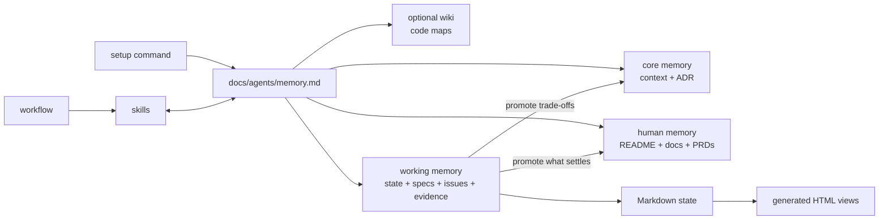

# Agent Coding System

Last updated: 2026-08-18

This directory is the plugin and product. Its skills share a repository memory system: setup declares the paths and protocols once, then idea, delivery, testing, debugging, review, and documentation skills coordinate through those artifacts.

## System model



The protocol makes ownership explicit: each fact has one canonical Markdown home; skills follow pointers instead of copying state; HTML is regenerated after source changes. Promotion runs one way — a settled decision moves out of the disposable work root into a tracked layer, leaving a link behind rather than a copy.

## Structure

| Path | Contents |
| --- | --- |
| [`skills-src/`](skills-src/) | Skill source packages grouped into browsable categories |
| [`skills/`](skills/) | Flat symlinks into `skills-src/` for one-level loader discovery |
| [`memory/`](memory/) | Layer definitions, read/write protocol, ownership registry |
| [`workflows/`](workflows/) | Ideas, feature delivery, testing, debugging |
| [`commands/`](commands/) | Setup and Git commands |
| [`agents/`](agents/) | Shared explorer, reviewer, and delivery agents |
| [`docs/`](docs/) | Human guides and organization report |
| [`.claude-plugin/`](.claude-plugin/) | Plugin manifest |

## Memory layers

| Layer | Answers | Lifetime | Git | Typical contents |
| --- | --- | --- | --- | --- |
| Core | What words and constraints bind this project | Project | Tracked | `CONTEXT.md`, ADRs, architecture Markdown and HTML |
| Human | What we are building, why, and how it works | Project | Tracked | README, PRDs under `docs/product/`, architecture and conventions docs, runbooks |
| Wiki | Where the code for X lives | Rebuildable | Either | Code-map Markdown and HTML for large repositories |
| Working | How the current effort is going and what happens next | Effort | Ignored | State, progress log, discovery drafts, specs, plans, issues, research, diagnoses, handoffs, roadmaps |

A layer is defined by the question its artifacts answer, not by who reads them. The boundary that matters in practice: **working memory is scaffolding, the Human and Core layers are the building.** Before writing persistent state, apply the durability test — *if the work root were deleted today, would the project have lost a fact it still needs?* If yes, it belongs in a tracked layer. Facts are promoted upward only, never demoted.

This is why product intent (`docs/product/<slug>/prd.md`) is Human-layer while a feature spec is Working-layer: the PRD states what the product is for and stays true after the effort closes; the spec states how one increment gets built, and the shipped code supersedes it.

Setup defaults working memory to `.scratch/<effort>/` in the Matt-style local tracker model, while preserving established roots such as `specs/`.

## Workflow entry points

- [Ideas](workflows/ideas.md): greenfield product discovery plus existing-product baselines and increments, with research/prototype/wayfinder detours.
- [Design](workflows/design.md): design context (DESIGN.md / system.md) → interaction design → visual variants → production implementation, orchestrating external design skills.
- [Feature delivery](workflows/feature-delivery.md): specification → plan → dependency tickets → implementation → review.
- [Testing](workflows/testing.md): public seams → TDD → checks → test-gap audit.
- [Debugging](workflows/debugging.md): red-capable reproduction → evidence → regression test → fix.

`manage-context` sets up and reconciles memory state. `handoff` carries pointers into a fresh session. `domain-modeling` owns the shared glossary and ADRs.

## Setup

Run the setup command once per target repository:

```text
/agent-coding-skills:setup
```

It inspects existing conventions, proposes the memory configuration, and writes `docs/agents/memory.md` after approval. It does not create empty memory artifacts.

## Current limitations

The missing integrated `plan` skill still interrupts feature delivery. Several imported existing skills also need memory-protocol, runtime, and ownership cleanup. These are intentionally explicit in [`TODO.md`](TODO.md), not hidden behind the new structure.

External adaptations and revisions are recorded in [`THIRD_PARTY_NOTICES.md`](THIRD_PARTY_NOTICES.md).
