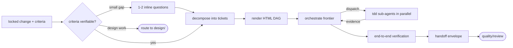

# Build

Last updated: 2026-09-13

The implementation loop. Starts **after** the spec phase with a locked, verifiable change — acceptance criteria testable at code level and at experience level (browser or local run) — and delivers working code verified end-to-end, with evidence. Design-phase work (intent exploration, spec authoring, architecture) lives in `design/`; code review and refactoring live in `quality/`.

Read [the engineering memory contract](../craft/context/init-context/references/engineering-memory.md) for context ownership and update rules.

## The loop

One user-facing entry point. The user states a verifiable requirement, optionally answers one or two clarifying questions, then goes AFK while parallel agents deliver the change.

## The skills

**`implement`** — the delivery orchestrator and only entry point. Gates on verifiable acceptance criteria; decomposes any change — bootstrap, feature, or bugfix — into dependency-ordered tickets by understanding current state and desired state (no modes); renders the ticket DAG as interactive HTML; dispatches parallel `tdd` sub-agents through the orchestration protocol (herdr binding primary, in-process Agent tool fallback); verifies the result on the running system; returns the handoff envelope.

**`tdd`** — the execution unit `implement` dispatches, one ticket at a time: write a failing test naming observable behavior, implement the minimum to pass, refactor keeping green, repeat per criterion. Never fabricates passing evidence. Returns criterion → test/evidence → revision mapping.

## Absorbed responsibilities

Former standalone skills now live inside `implement`:

- Ticket decomposition and parallel boundaries (was `break-into-tasks`) — [decomposition rules](implement/references/decomposition-rules.md)
- Greenfield bootstrap execution (was `bootstrap-project`) — the foundation is now *designed* by `design/technical/design-foundation` (five slices with binary gates) and *executed* here as an ordinary change; a worked example lives in the decomposition rules
- The handoff envelope (was `handoff`) — the return protocol of every run, defined in [the shared protocol](../craft/context/init-context/references/PROTOCOL.md#handoff-envelope)

Design-phase skills formerly here (`brainstorm-approaches`, `plan-implementation`, `analyze`) were removed; their capabilities belong to the design phase.

## Handoff to quality and test

Build hands verified code changes to `quality/review` (Standards and Spec axes) and `/test`. The test phase audits coverage and adds integration/e2e tests; it does not redo unit tests written inside the loop.
