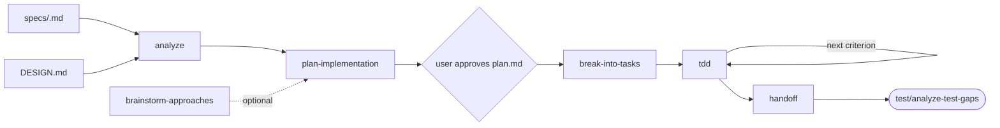

# Build

Last updated: 2026-09-12

Implement features from settled requirements and engineering design. Consumes `specs/<spec>.md` and `DESIGN.md`; produces working code with passing unit tests and a committed `plan.md` that records the approach before implementation begins.

Read [the engineering memory contract](../craft/context/init-context/references/engineering-memory.md) for context ownership and update rules.

## The loop

Every feature gets a `plan.md` approved before a line of code is written. TDD happens inside the build loop, not in a separate phase.

## Where to start

| You have | Start with |
| --- | --- |
| A spec and DESIGN.md, ready to implement | `analyze` — understand affected surfaces first |
| A spec but no clear approach | `brainstorm-approaches` — generate options, pick one |
| An approved approach, need an ordered plan | `plan-implementation` — write plan.md |
| An approved plan.md, need tasks | `break-into-tasks` |
| A task with acceptance criteria | `tdd` — red/green/refactor |
| Completed implementation, need handoff | `handoff` — write state.md |

## The skills

**`analyze`** — reads the codebase to understand context before touching anything: which files are affected, what the existing patterns are, where the seams are. Produces a codebase snapshot for the plan. Run first, every time.

**`brainstorm-approaches`** — generates two or three distinct implementation approaches with trade-offs when the right path isn't obvious. Keeps options honest: forces a comparison before committing. Skip for straightforward changes.

**`plan-implementation`** — the read-only planning pass. Reads spec, DESIGN.md, and codebase analysis; writes `docs/changes/<change-id>/plan.md` with problem statement, proposed approach, ordered implementation steps, verification plan, and risks considered. Does not write a single line of implementation code. The user reviews and approves this artifact before any code is written.

**`break-into-tasks`** — decomposes the approved plan into independently testable incremental steps. Each task maps to one or more acceptance criteria from the spec. Produces a task list the TDD loop executes.

**`tdd`** — executes one criterion-based red-green-refactor slice at a time. Writes a failing test naming observable behavior, implements the minimum code to pass, refactors while keeping tests green, repeats. Never fabricates passing evidence. Returns criterion → test/evidence → revision mapping for the coordinator.

**`handoff`** — writes `state.md` recording where the effort stands: what was done, which criteria are green, deviations from plan.md with rationale, open items, and next action. The resume point for a fresh session or the test phase.

## plan.md as a durable artifact

`plan.md` is committed to the feature branch before implementation begins. It is the approval gate. After implementation, the "Actual Implementation Notes" section records any deviations and why. Code review checks plan conformance: new files not in the plan, skipped steps, or a different approach all need explicit justification in the notes.

## Handoff to test

Build hands off code changes with passing unit tests to `/test`. The test phase audits coverage and adds integration/e2e tests; it does not redo unit tests already written here.

## Typical workflows

**Standard feature:**
`analyze` → `plan-implementation` → [user approves plan.md] → `break-into-tasks` → `tdd` (repeat per task) → `handoff`

**Uncertain approach:**
`analyze` → `brainstorm-approaches` → `plan-implementation` → ... (same)

**Resume from handoff:**
Read `state.md` → continue from the next open task in `tdd`
