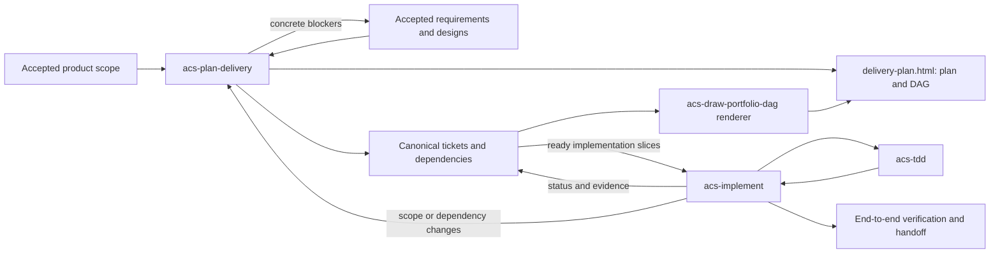

# Build

Last updated: 2026-09-17

Plan delivery from accepted Product or Design inputs, then execute the ready slices. Planning and implementation are independently callable; an implementation request can invoke planning when its tickets are missing or stale.

Read the [engineering memory contract](../craft/context/acs-init-context/references/engineering-memory.md) for context ownership and update rules.

## Skills and ownership

- **[acs-plan-delivery](acs-plan-delivery/SKILL.md)** owns decomposition, design blockers, dependency validation, criterion coverage, and reconciliation across sessions. After scope confirmation it generates and opens one HTML plan with an embedded DAG; `acs-draw-portfolio-dag` remains the reusable renderer. Planning-ready accepted scope is sufficient to start; execution readiness is checked per slice. Planning alone does not dispatch implementation.
- **[acs-implement](acs-implement/SKILL.md)** reuses the graph or invokes `acs-plan-delivery` when needed, checks readiness and claims, dispatches safe implementation tickets, reconciles execution evidence, and verifies delivered behavior. It refreshes the graph on status changes.
- **[acs-tdd](acs-tdd/SKILL.md)** executes one criterion-backed slice and returns test/evidence/revision mappings.

Specs own requirements, tickets own durable status/dependencies/readiness, and the coordinator owns claims and scheduling. DAG files are generated views. Write conflicts constrain concurrent execution without becoming artificial dependency edges.

## Retained capabilities

- Former `break-into-tasks` decomposition now belongs to [acs-plan-delivery's rules](acs-plan-delivery/references/decomposition-rules.md).
- Greenfield foundations are designed by `design/technical/acs-design-foundation`, then planned and executed as ordinary changes; the rules include a bootstrap example.
- Every handoff uses the [shared envelope](../craft/context/acs-init-context/references/PROTOCOL.md#handoff-envelope).

Verified code goes to `quality/review` and `test`. Product and Design retain ownership of substantive scope, behavior, and contract decisions.
