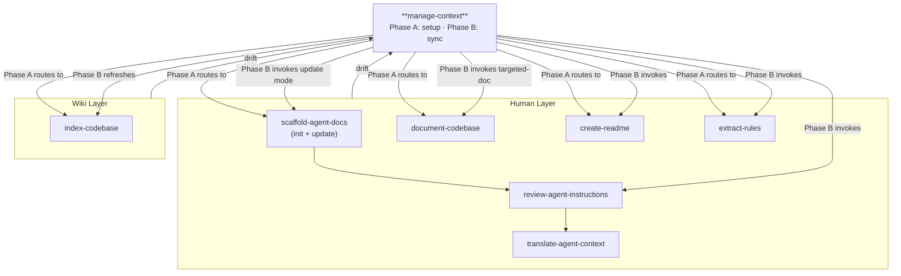

# Context Management

Last updated: 2026-08-05

A codebase carries more context than any single session can hold. This collection keeps that context in three durable layers so any agent — in any session — can recover the full picture from files instead of memory.

> **This folder is a category, not a skill.** It groups the context-management skills for browsing. Each subdirectory here is a self-contained skill — it carries its own `references/` and refers to sibling skills by name, never by a path that reaches outside its own folder.

## The core principle

**What the agent cannot see does not exist.** Architecture decisions, naming conventions, and technology choices only count if they live in a file the agent reads. These skills exist to write that context down, keep it accurate, and route the agent to it.

## The three layers

| Layer | Question it answers | Lives in | Git | Regenerated by |
| --- | --- | --- | --- | --- |
| **Human** | "How is this built, and why?" | `AGENTS.md`, `CLAUDE.md`, `docs/`, `README.md` | Tracked | People (agent-assisted) |
| **Wiki** | "Where is X, and what connects to it?" | `docs/wiki/`, `graphify/`, `.codemap/` | Tracked by default | Tools (`codemap`/`graphify`) or the `wiki-*` skills |
| **Working** | "What am I doing right now, and where did I leave off?" | `.scratch/<effort>/` | Ignored | The active workflow |

The shared memory protocol — read/write rules and the full ownership registry — travels with its owning skill at [`manage-context/references/PROTOCOL.md`](manage-context/references/PROTOCOL.md).

`docs/agents/memory.md` is the canonical routing config — a machine-readable file that skills read to locate the work root, active layers, and wiki index path.

### Human layer — readable, agreed, git-tracked

The durable documentation a maintainer reads. One agreed structure, verified against code, kept small:

```text
AGENTS.md                    ← directory/index file, <200 lines
docs/
├── ARCHITECTURE.md          ← module boundaries, dependency direction
├── CONVENTIONS.md           ← naming rules, code style
├── TECH_DECISIONS.md        ← why each technology was chosen
├── QUALITY.md               ← acceptance criteria, definition of done
└── exec-plans/
    ├── active/              ← in-progress plans (.gitkeep)
    ├── completed/           ← finished plans (.gitkeep)
    ├── backlog.md           ← known-but-unscheduled work
    └── tech-debt-tracker.md ← known technical debt
```

Owned by these member skills:

- [`manage-context`](manage-context/SKILL.md) — **Phase A**: write `docs/agents/memory.md` routing, bootstrap the working-memory layer (init script, `state.md`, `progress.md`), and enable the layers this repo needs. Routes to `scaffold-agent-docs` and `index-codebase` for what remains.
- [`scaffold-agent-docs`](scaffold-agent-docs/SKILL.md) — Mode A: create `AGENTS.md` and the `docs/` structure from templates. Mode B: audit existing Human-layer docs, verify claims against live code, repair structure.
- [`document-codebase`](document-codebase/SKILL.md) — generate or refresh architecture, data-model, API, and C4 docs from the code.
- [`create-readme`](create-readme/SKILL.md) — author or revamp the root `README.md`.
- [`review-agent-instructions`](review-agent-instructions/SKILL.md) — keep `CLAUDE.md` or `AGENTS.md` canonical and under their line ceilings.

### Wiki layer — semantic + procedural code index

- **Code index** — generated by a tool from the source. Owned by [`index-codebase`](index-codebase/SKILL.md).
- **Prose wiki** — curated reading notes. Owned by `llm-wiki-init` / `llm-wiki-ingest` / `llm-wiki-lint` in [learning-os](https://github.com/XinheLIU/learning-os).

### Working layer — episodic session memory

Scratch state for the effort in flight. Shared by every skill through the protocol, gitignored so local exploration never pollutes history.

```text
.scratch/<effort>/
├── state.md          ← status, next action, blockers, pointers
├── spec.md  plan.md  ← definition and execution of the current effort
├── issues/NN-*.md    ← executable tickets with claim/status
├── handoffs/         ← cross-session continuation payloads
└── roadmap.md/.html  ← dependency views
```

`wayfinder` and `tasks` (in feature-delivery) chart and slice large efforts into claimable tickets. `handoff` (in feature-delivery) preserves the current effort for a fresh session.

## Keeping the layers in sync

The three layers drift apart the moment code changes. **[`manage-context`](manage-context/SKILL.md) Phase B is the one entry point for reconciling them** — it detects drift, promotes settled working-memory decisions into Human docs, refreshes the wiki index, and repairs `AGENTS.md`. Run it after a merge, before a handoff, or whenever the docs feel stale.

### Why two phases

The split is on whether `docs/agents/memory.md` exists, not on repo age. The two phases have different inputs, so merging them would wrap most of the skill in `if (config exists)`:

- **Phase A** has no config — it does not know the work root, whether the wiki is on, or where human docs live. It must **ask and decide**, then write the answers down.
- **Phase B** has config — every path is already resolved. It only **compares code against docs**, and needs no configuration questions.

An old repo whose config was never written still enters Phase A; that is correct, because the config genuinely is missing. Every skill detects its own mode rather than trusting the caller, so `scaffold-agent-docs` will still pick Mode B when it finds existing docs.

## Skill map



## Where to start

| You want to… | Run |
| --- | --- |
| Set up context management in a new repo | `manage-context` (Phase A auto-selected) |
| Reconcile all three layers after big changes | `manage-context` (Phase B auto-selected) |
| Give the agent a queryable code map | `index-codebase` |
| Start a curated prose knowledge base | `llm-wiki-init`, then `llm-wiki-ingest` (learning-os) |
| Create Human-layer docs from scratch | `scaffold-agent-docs` |
| Audit and repair existing Human-layer docs | `scaffold-agent-docs` (update mode, or via `manage-context` Phase B) |
| Hand work to the next session | `handoff` (feature-delivery) |
