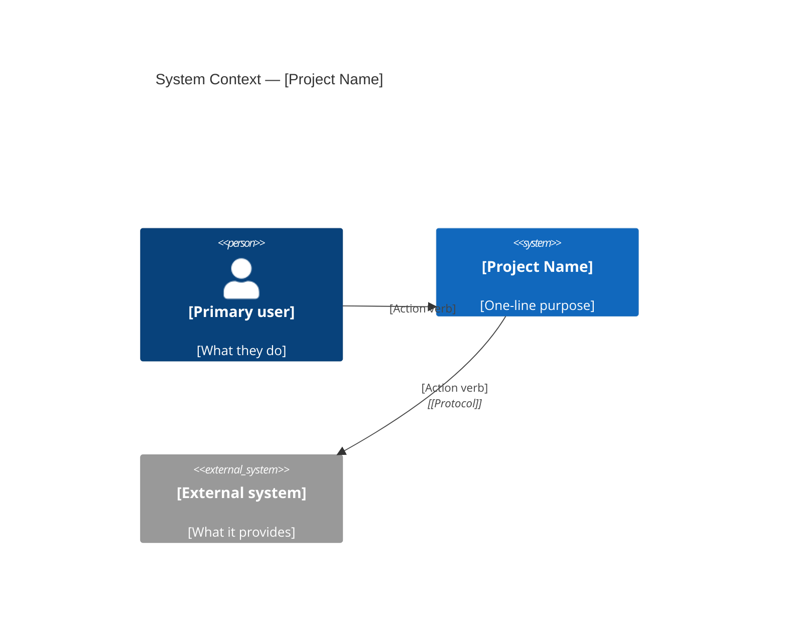
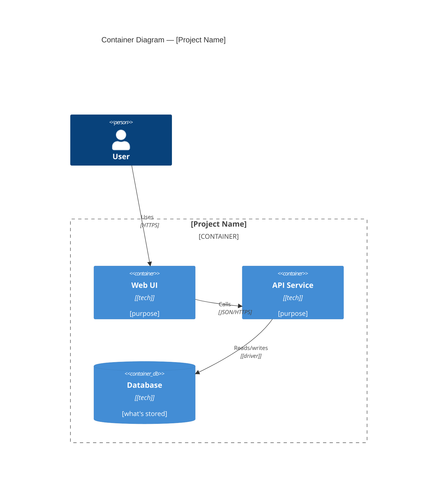

<!-- Template last updated: 2026-08-02 -->

# Architecture Overview

Last updated: [YYYY-MM-DD]

## Scope

This document describes the high-level architecture of [Project Name]: how containers interact, which design decisions are load-bearing, and where to extend the system.

Target audience: developers making non-trivial changes. For casual navigation, the root `README.md` is enough.

All diagrams use the C4 model rendered in Mermaid. See `docs/architecture/c4-*.md` for individual diagram files; this document summarizes them and captures the narrative that surrounds them.

Architecture documentation answers three questions:

- **What** concepts and modules the system is built around.
- **How** those concepts are exposed and implemented.
- **Why** the boundaries, trade-offs, and key technologies exist.

## Model / interface / implementation map

Start here before directory structure or framework details.

| Model concept | Problem it solves | Interface surface | Implementation module | Data model | Key technologies |
|---|---|---|---|---|---|
| `[Domain concept]` | [why the product needs this concept] | `[GET /... | cli ... | event ...]` | `[path/to/module]` | `[table/model]` | `[framework/storage/etc.]` |
| `[Domain concept]` | [...] | [...] | [...] | [...] | [...] |

## Module roles

Classify modules by role before describing internals.

| Module | Role | Why it has this role | Entry points / callers | Replaceability notes | Source |
|---|---|---|---|---|---|
| `[path/to/domain]` | Core domain | [product would change without it] | `[entry point]` | [hard to replace; owns model] | `[file:line]` |
| `[path/to/routes]` | Interface adapter | [exposes HTTP/CLI/RPC/job/message surface] | `[surface]` | [replace adapter without changing model] | `[file:line]` |
| `[path/to/db]` | Infrastructure | [database/cache/auth/config/deploy concern] | `[domain module]` | [replaceable implementation detail] | `[file:line]` |
| `[path/to/utils]` | Shared utility | [broad helper, no domain ownership] | `[many modules]` | [high blast radius] | `[file:line]` |
| `[path/to/migrations]` | Legacy or migration | [preserves old contract or transition path] | `[caller]` | [constraint until migration ends] | `[file:line]` |

## System context (Level 1)

See [`c4-context.md`](./c4-context.md). Summary:



- `[Project Name]` — [what the system is, at the highest level]
- `[External system]` — [why we depend on it; what we'd do without it]

## Containers (Level 2)

See [`c4-containers.md`](./c4-containers.md). Summary:



Per-container notes:

- **Web UI** — [responsibility; why it's a separate container rather than merged with API]
- **API Service** — [responsibility; boundaries it enforces]
- **Database** — [what it holds; schema migrations path; backup policy]

## Components (Level 3 — optional)

Create component diagrams only for containers where the internal shape is non-obvious. One file per feature: `c4-components-{feature}.md`.

## Dynamic flows (optional)

Create dynamic diagrams for flows that cross ≥3 containers or have subtle ordering (auth, retries, sagas). One file per flow: `c4-dynamic-{flow}.md`.

## Deployment (optional, for production systems)

See [`c4-deployment.md`](./c4-deployment.md). Skip for dev-only or single-user local tools.

## Directory structure

```
project-root/
├── src/                 # Application code
│   ├── [module].py      # [one-line purpose]
│   └── ...
├── tests/               # Mirrors src/ layout
├── docs/
│   ├── architecture/    # C4 diagrams (this folder)
│   └── decisions/       # ADRs
└── config/              # Runtime configuration
```

### Directory rules

**src/[module].py** — [what rule applies to this module; what belongs / what doesn't]

**config/** — [why config is the source of truth; what changes require a restart]

**tests/** — [test layering: unit vs integration vs property; which mirror src/]

## Key design decisions

Each decision below links to an ADR for full context. Diagrams show the *outcome* of each decision; ADRs explain the *why*.

### Decision 1: [Title]

**Chose**: [what was picked]
**Why**: [the core constraint that forced this]
**Trade-off**: [what becomes hard]
**ADR**: [`decisions/00X-title.md`](../decisions/00X-title.md)

### Decision 2: [Title]

**Chose**: [...]
**Why**: [...]
**Trade-off**: [...]
**ADR**: [...]

## Module dependency rules

```
api/   ──► services/   ──► repositories/   ──► storage/
                 │                 │
                 └──► utils/ ◄─────┘
```

Rules:
1. Lower layers never import from higher layers.
2. `utils/` is pure (no I/O, no global state).
3. Circular imports between peers in the same layer must be resolved by extraction, not by local import or indirection.

## External dependencies

| Package | Version | Used for | Why this, not alternative |
|---------|---------|----------|---------------------------|
| [pkg] | [x.y] | [purpose] | [constraint or benchmark that pinned it] |

## Extension points

### Adding a new [thing]

1. [Step — where the file goes]
2. [Step — what to register]
3. [Step — how to test]

### Adding a new integration

1. [Step]
2. [Step]

## Performance considerations

### Critical paths

- **[Path]** — [current latency / throughput; known bottleneck; optimization lever]

### Caching

- **[Cache name]** — [what's cached, invalidation trigger, TTL]

## Security architecture

### Authentication

[One paragraph + a pointer to the dynamic diagram showing the flow.]

### Authorization

| Role | Permissions |
|------|-------------|
| [role] | [what they can do] |

### Data at rest / in transit

- Encryption at rest: [yes/no — where]
- Transport: [TLS version]
- Secret management: [where secrets live, rotation policy]

## Observability

### Logging

| Level | What gets logged |
|-------|------------------|
| ERROR | [...] |
| WARN  | [...] |
| INFO  | [...] |

### Metrics

| Metric | What it measures | Alert threshold |
|--------|------------------|-----------------|
| [name] | [...] | [...] |

### Tracing

[If applicable — tool, sample rate, where traces land.]

## Further reading

- [`c4-context.md`](./c4-context.md)
- [`c4-containers.md`](./c4-containers.md)
- [`c4-components-*.md`](.) — one per non-trivial container
- [`c4-dynamic-*.md`](.) — one per non-trivial flow
- [`../decisions/`](../decisions/) — ADRs
