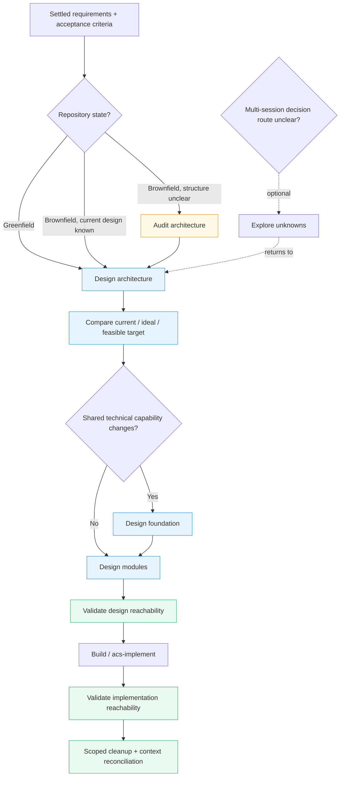

# Design · Technical

Last updated: 2026-09-17

Technical design turns accepted feature requirements into an architecture that can be implemented, evolved, and checked. It covers two related shapes of work:

- **Business modules**: capabilities such as orders, search, billing, or reporting.
- **Technical foundations**: libraries, SDKs, UI or domain components, middleware, storage/transport adapters, and other capabilities shared by named consumers.

The output is one connected chain:

```text
requirement → capability/module → contract → code entry → verification evidence
```

## Workflow DAG

The graph is a routing map, not a mandatory ceremony. Start at the earliest node whose input is missing; follow only branches earned by the repository and the request.



## Nodes and responsibilities

| Node | Use it when | It owns | It hands off |
| --- | --- | --- | --- |
| `acs-audit-architecture` | Brownfield behavior, dependencies, or compatibility are unclear | Current modules, entry points, coupling, shared capabilities, constraints, evidence | Current-state map and ranked design questions |
| `acs-design-architecture` | Features need a system shape or existing boundaries need reconsideration | Feature-to-module map, capability consumers, alternatives, selected target, gaps | Stable architecture and capability IDs |
| `acs-design-foundation` | A library, SDK, component, middleware, or infrastructure adapter is introduced, changed, or adopted | Consumer scenarios, public contract, lifecycle, failure behavior, packaging form, real verification path | Foundation contracts and optional bootstrap/adoption criteria |
| `acs-design-modules` | Architecture must become code structure | Responsibilities, interfaces, types, directories, dependency direction, registration and migrations | Implementation-ready module and wiring contracts |
| `acs-validate-codebase` | Design or implementation needs proof of connectedness | Route/menu/export/interface/module reachability, alignment findings, scoped repairs, evidence | Build tasks, tests, or context reconciliation |

For a decision route that spans sessions or has independent prerequisites, leave technical design and use `plan/acs-explore-unknowns`. NFR analysis, domain clarification, module splitting, boundary repair, and adversarial challenge are techniques inside the owning node, not standalone technical skills.

## Greenfield route

Greenfield work starts from requirements and designs the first useful system shape. `acs-design-architecture` assigns every accepted feature an owner and identifies only the foundations needed by the first real end-to-end scenario. `acs-design-foundation` then chooses the smallest delivery form: local module, package/library, component, middleware, or service.

When a runnable skeleton is needed, the foundation spec may include five optional slices: minimal scaffold, encapsulated infrastructure, declared module positions, one real full-link path, and one-command startup. A complete set of empty placeholders is not required; a 501 response proves registration only. The acceptance gate is a real scenario traversing the selected foundation and business module contracts.

## Brownfield route

Brownfield work begins with `acs-audit-architecture` only when current behavior or constraints cannot be established cheaply from the repository. The audit distinguishes:

1. **Current architecture** — what imports, routes, registrations, and runtime paths actually do.
2. **Ideal architecture** — the clean structure we would choose with freedom to reorganize.
3. **Feasible target** — the evolution worth making now, including compatibility, migration, and operational cost.

`acs-design-architecture` records the gap between these three views. `acs-design-modules` preserves observable behavior with characterization evidence, facades, adapters, staged caller migration, and rollback points where required. Existing libraries should be adopted directly when their contract is sufficient; extraction or replacement needs named consumers and measurable benefit.

## Foundation design rules

Foundation design is consumer-led. For each shared capability, record:

- named consumers and concrete scenarios;
- public types, configuration, lifecycle, errors, ordering, and observability;
- private implementation and supported variation;
- why the capability is centralized and why the chosen form is the smallest useful one;
- a verification path through at least one real consumer.

Use the appropriate emphasis:

| Form | Questions to settle |
| --- | --- |
| Library / SDK | Import surface, examples, errors, configuration, compatibility, distribution |
| Component | State ownership, composition, accessibility, extension points |
| Middleware | Registration, execution order, context propagation, short-circuit and failure behavior |
| Infrastructure adapter | Resource lifecycle, timeout/transaction/message semantics, health and observability |

Shared technical capability must not become a dumping-ground `common` module. A reused domain rule remains owned by its domain module. Independent publishing adds version and compatibility decisions only when that delivery form is actually selected.

## Module contract and validation

Every module contract names one responsibility, its callers, public interface, invariants and failures, owned types, dependencies, registration point, and test surface. Routes, menus, commands, jobs, public exports, dependency injection, middleware order, and dynamic registration are included whenever they participate in the requirement path.

`acs-validate-codebase` traces each requirement and contract through its entry point, registration, interface, owning module, adapter, and test. It classifies rows as `REACHABLE`, `PARTIAL`, `MISSING`, `DIVERGENT`, or `UNASSESSED`. It can repair broken wiring, stale links, missing exports, obsolete local guidance, and redundant documentation within scope; design changes return to the design owner.

## Artifacts and handoff

The canonical technical artifact is `technical-design.md` (or the established design home), with stable requirement, capability, module, and contract IDs. It contains the option comparison, selected architecture, current-to-target gaps, foundation contracts, module contracts, wiring map, migration notes, and validation references. Keep consequential rationale in Change Context/ADRs; keep disposable exploration and raw output in Run Context.

Context management persists interface naming and selection rules in the applicable `AGENTS.md` or Claude Rules. It owns routing, retention, and reconciliation; technical skills own the design judgment. A design is ready for build when every requirement has an owner, every shared capability has consumers and a contract, every code entry is locatable, and every remaining gap has an actionable next step.
