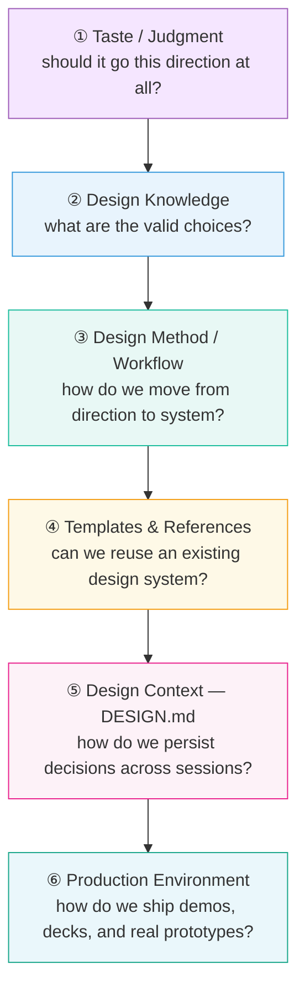
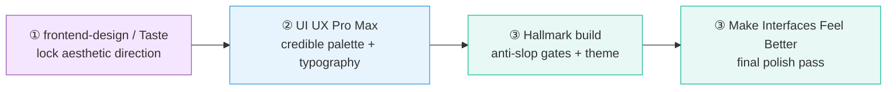
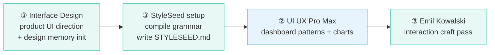
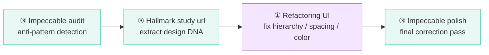
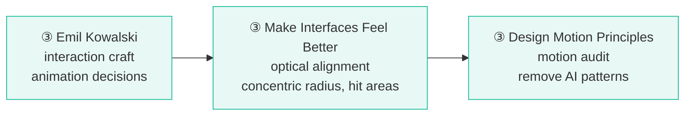
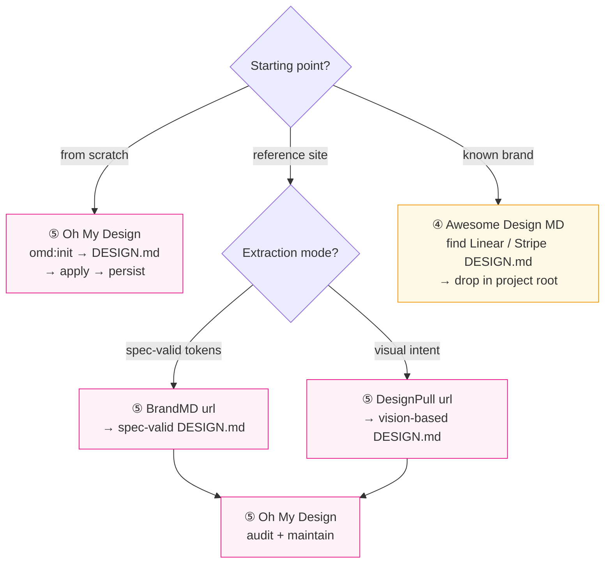
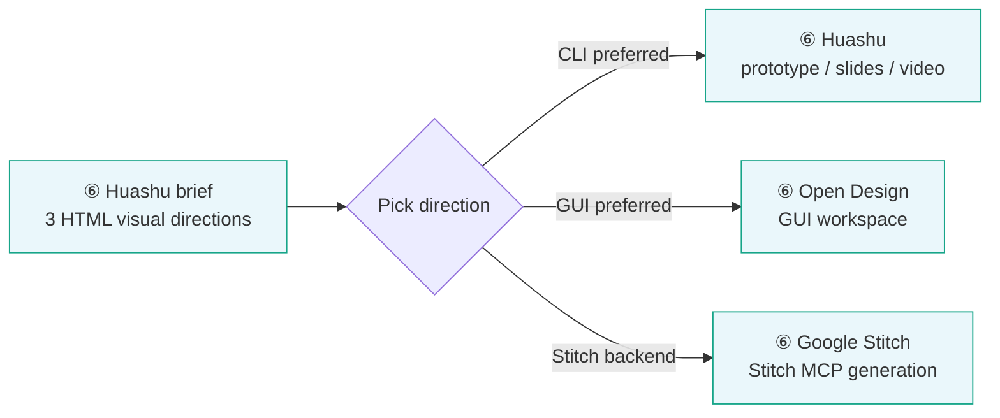

# UI/UX External Skills — Reference Guide

Last updated: 2026-08-17

## Why this file exists

UI/UX work in this repo relies primarily on **external skill ecosystems** — not internal skills authored here. This guide maps those external systems: what each one is for, how to invoke it, and which combination fits a given task.

The landscape splits into six distinct layers. Confusing them leads to using a polish tool when you needed a direction tool, or a knowledge DB when you needed a production environment.

## How this catalog is wired in

The five internal pipeline skills are **stage orchestrators** — they own the artifacts (file paths, approval gates, memory layers) and dispatch heavy work to the external tools catalogued here. Full pipeline doc: [`workflows/design.md`](../../../workflows/design.md).

A sixth skill, `prototype`, sits alongside the pipeline as a shared utility. It answers one design question with throwaway code when conversation cannot settle it — logic harness for state models, or radically different UI layouts for interface questions. Any stage may call it; control returns to the stage that raised the question.

| Layer | Consumed by | Dispatch point |
|:---:|---|---|
| ① Taste / Judgment | `/visual-design-variants` | Step 2.5 — sharpen direction strategies |
| ② Design Knowledge | `/design-system-create`, `/interaction-design` | Steps 2.2–2.3 (font/palette lookup), Step 1.5 (UX guidelines) |
| ③ Method / Workflow | `/design-implement` + standalone redesign | Step 4.5 polish pass; redesign tools run before re-entering the pipeline |
| ④ Templates & References | `/design-context` | Step 2 — adopt a ready-made brand spec |
| ⑤ Design Context (DESIGN.md) | `/design-context` | Steps 1–3 — adopt, extract, or initialize |
| ⑥ Production Environments | `/visual-design-variants` | Step 2.5 — high-fidelity variant production |

Every dispatch has a native fallback: when nothing from a layer is installed, the stage runs its built-in workflow and nothing blocks. The contract external output must satisfy: **pipeline skills own canonical paths and `docs/design/system.md` token authority** — engine output is reconciled into those, never accepted raw.

---

## The Six Layers



Most failures come from skipping layers (jumping to ⑥ without ①–③) or conflating layers (using a ④ tool when you need ③).

---

## Quick Decision Table

| Layer | What you need | Recommended tools |
|:---:|---|---|
| ① | Design direction — vague brief, need aesthetic stance | [frontend-design], [Taste], [StyleSeed], [Huashu] |
| ① | 0→1 landing page / marketing site | [frontend-design], [Taste], [Hallmark], [UI UX Pro Max] |
| ③ | 0→1 SaaS / dashboard / agent console | [Interface Design], [StyleSeed], [UI UX Pro Max] |
| ⑥ | Fast clickable prototype / demo | [Huashu], [Open Design], [Google Stitch] |
| ③⑥ | See 3–5 real visual directions at once | [Huashu], [StyleSeed], [Open Design], [Google Stitch] |
| ③⑥ | Mobile app UI | [Mobile App UI Design], [Huashu], [Open Design] |
| ⑥ | Slides / infographic / video | [Huashu], [Open Design], [StyleSeed] |
| ③ | Existing UI is ugly — redesign it | [Impeccable], [Hallmark], [Refactoring UI] |
| ③ | UI is at 80%, needs to feel professional | [Emil Kowalski], [Make Interfaces Feel Better] |
| ③ | Animation looks AI-generated | [Emil Kowalski], [Design Motion Principles] |
| ①③ | Avoid purple gradients / three-card layouts | [Taste], [Hallmark], [Impeccable], [StyleSeed] |
| ⑤ | Build a persistent design system | [DESIGN.md], [Interface Design], [StyleSeed] |
| ⑤ | Extract a design system from a reference site | [BrandMD], [DesignPull], [TypeUI Extractor] |
| ④⑤ | Get a ready-made brand design spec | [Awesome Design MD], [Oh My Design] |
| ⑤ | Create / maintain / apply DESIGN.md | [Oh My Design], [Google DESIGN.md] |
| ④⑤ | DESIGN.md + agent execution rules together | [Awesome Design Skills] |
| ② | Simulate a full design team (UX research, critique) | [Naksha Studio], [Design With Claude] |
| ⑥ | GUI workspace, not pure CLI | [Open Design], [Google Stitch] |

[frontend-design]: https://github.com/anthropics/skillshttps://github.com/anthropics/claude-code/tree/main/plugins/frontend-design
[Taste]: https://github.com/Leonxlnx/taste-skill
[StyleSeed]: https://github.com/bitjaru/styleseed
[Huashu]: https://github.com/alchaincyf/huashu-design
[Hallmark]: https://github.com/nutlope/hallmark
[UI UX Pro Max]: https://github.com/nextlevelbuilder/ui-ux-pro-max-skill
[Interface Design]: https://github.com/Dammyjay93/interface-design
[Open Design]: https://github.com/nexu-io/open-design
[Google Stitch]: https://github.com/google-labs-code/stitch-skills
[Mobile App UI Design]: https://github.com/ceorkm/mobile-app-ui-design
[Impeccable]: https://github.com/pbakaus/impeccable
[Refactoring UI]: https://github.com/LovroPodobnik/refactoring-ui-skill
[Emil Kowalski]: https://github.com/emilkowalski/skills
[Make Interfaces Feel Better]: https://github.com/jakubkrehel/make-interfaces-feel-better
[Design Motion Principles]: https://github.com/kylezantos/design-motion-principles
[DESIGN.md]: https://github.com/google-labs-code/design.md
[BrandMD]: https://github.com/yuvrajangadsingh/brandmd
[DesignPull]: https://github.com/hasi98/designpull
[TypeUI Extractor]: https://github.com/bergside/design-md-chrome
[Awesome Design MD]: https://github.com/VoltAgent/awesome-design-md
[Oh My Design]: https://github.com/kwakseongjae/oh-my-design
[Awesome Design Skills]: https://github.com/bergside/awesome-design-skills
[Naksha Studio]: https://github.com/Adityaraj0421/design-studio
[Design With Claude]: https://github.com/imsaif/design-with-claude

---

## Tool Catalog

### Layer ①  Taste & Judgment

#### [`frontend-design`](https://github.com/anthropics/claude-code/tree/main/plugins/frontend-design) — Anthropic
**What:** Creative Director system prompt. Establishes aesthetic direction before writing any code — product, user, page task, visual direction, then opinionated choices on typography, palette, layout. Explicitly requires one defensible aesthetic risk per session.
**Not:** a template library, a DESIGN.md manager, a style database.
**Best for:** Any new UI where direction is undefined.
**Invoke:** install via Claude Code plugins

---

#### [`Taste Skill`](https://github.com/Leonxlnx/taste-skill)
**What:** Anti-slop judgment layer. Prevents AI from producing boring/generic/templated frontend. Works as a macroesthetic constraint + anti-pattern list + preflight checklist.
**Not:** a design system generator, a template library, a DESIGN.md manager.
**Best for:** Landing pages, portfolios, creative web, marketing pages, redesigns.
**Invoke:** `@taste-skill` or install SKILL.md

---

#### [`Refactoring UI Skill`](https://github.com/LovroPodobnik/refactoring-ui-skill)
**What:** Adam Wathan's *Refactoring UI* tactical rules as an agent skill. Targets hierarchy, spacing, typography, color, depth, borders, layout.
**Not:** creative direction, visual template library.
**Best for:** "Why does this page look like an engineer built it?" — structural correction, not aesthetic reimagining.
**Invoke:** install SKILL.md; also see [gnurio/refactoring-ui-plugin](https://github.com/gnurio/refactoring-ui-plugin) for a 10-skill review split

---

### Layer ②  Design Knowledge

#### [`UI UX Pro Max`](https://github.com/nextlevelbuilder/ui-ux-pro-max-skill)
**What:** Design intelligence / knowledge retrieval skill. Database of 84 styles, color palettes, font pairings, product types, UX guidelines, chart types, icons across 22+ stacks. Query it to look up valid choices or generate a design system.
**Outputs:** `design-system/MASTER.md` + per-page override files.
**Best for:** Any UI where you need to look up a credible style/palette/typography decision fast.
**Invoke:** install per its repo instructions (external skill, not vendored here); `/design-system-create` dispatches to layer-② skills like this one when installed

---

#### [`Design With Claude (dwic)`](https://github.com/imsaif/design-with-claude)
**What:** Library of 45+ design specialist skills (UX research, UX strategy, critique, accessibility, interaction, design systems, product design). Answers "what does a real design team do beyond drawing UI?"
**Not:** a visual style skill or template generator.
**Best for:** UX research, strategy, critique, accessibility review, interaction design.
**Invoke:** `@dwic` or install individual skills

---

### Layer ③  Design Method / Workflow

#### [`Hallmark`](https://github.com/nutlope/hallmark)
**What:** Anti-slop design workflow with 21 built-in themes. Supports four operations: `build`, `audit`, `redesign`, `study`. The `study <url>` command extracts macrostructure + typography + color anchor and can output a portable `design.md`.
**Best for:** 0→1 creative sites; reference site → new design via "design DNA" extraction.
**Invoke:** `hallmark build / audit / redesign / study`

---

#### [`StyleSeed`](https://github.com/bitjaru/styleseed)
**What:** 22+ skill design method engine. Covers: setup, reference compilation, creative direction, page, component, pattern, motion, tokens, review, scoring, a11y, verify, restyle. Uses `STYLESEED.md` (not DESIGN.md) to lock skin, key color, font, radius, motion and prevent design drift across sessions.
**Best for:** Projects needing a repeatable method from direction → system → verified implementation. Has named brand recipes (enterprise-workbench, editorial, commerce, brutalist-lite, etc.) that change structure and morphology, not just CSS.
**Invoke:** `styleseed setup`, `styleseed reference`, `styleseed build`, `styleseed score`, `styleseed verify`

---

#### [`Interface Design`](https://github.com/Dammyjay93/interface-design)
**What:** Product UI / design engineering skill. Explicitly scoped to dashboards, admin, SaaS, settings, data interfaces, interactive tools — not marketing pages.
**Key feature:** Design memory — persists UI decisions (radius, spacing, color system) so subsequent screens stay consistent.
**Best for:** Agent consoles, CRMs, internal tools, analytics dashboards.
**Invoke:** install SKILL.md; design memory is maintained per-project

---

#### [`Impeccable`](https://github.com/pbakaus/impeccable)
**What:** Design critic + fixer with 23 commands. Covers design, redesign, critique, audit, polish, animate, colorize, extract. Runs deterministic anti-pattern detectors. Can extract reusable patterns/tokens from existing implementation into a design system.
**Best for:** Existing UI that needs systematic improvement (0.7 → 1.0). Also good for 0→1 when paired with an audit pass.
**Commands:** `/impeccable audit`, `/impeccable polish`, `/impeccable bolder`, `/impeccable extract`, and 19 more

---

#### [`Naksha Studio`](https://github.com/Adityaraj0421/design-studio)
**What:** Virtual design team — simulates Design Director, UX Researcher, UI Designer, Design System, Accessibility, Critic, Prototype specialist roles.
**Best for:** Discovery, UX strategy, multi-perspective critique, iterative design process simulation.

---

### Layer ③ (Specialist)  Polish & Motion

#### [`Emil Kowalski Skills`](https://github.com/emilkowalski/skills)
**What:** Design engineering / interaction craft. From Emil's experience at Vercel and Linear. Skills: `emil-design-eng`, `animate`, `review-animations`, `improve-animations`, `apple-design`.
**Best for:** Spring vs ease decisions, gesture behavior, component animation, interaction craft. The `apple-design` skill specifically covers springs, swipe, sheets, momentum, translucent materials, reduced motion.
**Not for:** 0→1 design direction, color palettes, DESIGN.md.

---

#### [`Make Interfaces Feel Better`](https://github.com/jakubkrehel/make-interfaces-feel-better)
**What:** Last 10% polish skill. Covers animation, typography, icons, hover states, optical alignment, concentric radius, shadow, hit areas.
**Best for:** "This is at 80 points — why doesn't it feel like a professional product?"
**Not for:** 0→1 design, design systems, templates.

---

#### [`Design Motion Principles`](https://github.com/kylezantos/design-motion-principles)
**What:** Dedicated motion design skill. Supports build and audit modes. Runs motion-gap analysis (detects state transitions that should animate but don't). Flags AI motion anti-patterns: hover-scale everywhere, stagger spam, pulsing indicators, purposeless animation.
**Best for:** Demo motion polish, product motion audit, existing UI animation review.

---

#### [`Mobile App UI Design`](https://github.com/ceorkm/mobile-app-ui-design)
**What:** Mobile-specific skill. Covers onboarding, home, finance, meditation, wallet, fitness, navigation patterns, mobile typography, spacing, shadows, mobile interactions.
**Structure:** `SKILL.md` + `references/industry-conventions.md`
**Best for:** Any mobile app UI, 0→1 or redesign.

---

### Layer ④  Templates & References

#### [`Awesome Design MD`](https://github.com/VoltAgent/awesome-design-md)
**What:** Curated collection of DESIGN.md files extracted from known products (Linear, Stripe, etc.). Drop one in your project, and the agent designs to that brand's spec.
**Use:** Find a reference brand → copy its DESIGN.md into project root → agent reads it.

---

#### [`Awesome Design Skills`](https://github.com/bergside/awesome-design-skills)
**What:** Registry of 67+ design systems, each providing both a `SKILL.md` (how the agent should implement) and a `DESIGN.md` (what the design should look like). Embodies the correct two-layer separation.

```
DESIGN.md  → what should it look like? (visual intent, tokens, rationale)
SKILL.md   → how should the agent work? (component rules, a11y, quality gates)
```

---

### Layer ⑤  Design Context (DESIGN.md Ecosystem)

#### [Google `DESIGN.md`](https://github.com/google-labs-code/design.md) — the format spec · [spec](https://github.com/google-labs-code/design.md/blob/main/docs/spec.md)
**What:** Open format specification for agent-readable design systems. YAML frontmatter = machine-readable tokens; prose = human-readable rationale.
**This is a format, not a skill.** Analogous to `AGENTS.md` for software engineering.

```yaml
---
colors:
typography:
spacing:
---
# Visual identity
## Principles
## Components
## Usage
```

---

#### [`Oh My Design`](https://github.com/kwakseongjae/oh-my-design)
**What:** DESIGN.md operating system / full lifecycle workflow. Includes: skills, specialist agents, hooks, 440+ quality-graded company references, doctor, memory/preferences, audit, anti-slop, review.
**Lifecycle:** `omd:init` → create DESIGN.md → design screens → DESIGN.md persists → next session reads same design → corrections saved.
**Best for:** Any project needing consistent design across multiple sessions.

---

#### [`BrandMD`](https://github.com/yuvrajangadsingh/brandmd)
**What:** Website → DESIGN.md extractor. Deterministic CSS/spec extraction, output validated against Google's DESIGN.md linter.
**Use:** `brandmd https://stripe.com` → get a spec-valid DESIGN.md.
**Best for:** "I found a site I like — make the agent design to that spec."
**vs DesignPull:** deterministic/spec-valid extraction (tokens + CSS); DesignPull adds vision + design intent.

---

#### [`DesignPull`](https://github.com/hasi98/designpull)
**What:** Website → DESIGN.md extractor using vision model + full-page screenshot + CSS tokens. Captures layout, imagery style, brand voice, visual intent, do/don't rules — not just hex codes.
**vs BrandMD:** richer intent extraction; less deterministic.

---

#### [`TypeUI DESIGN.md Extractor`](https://github.com/bergside/design-md-chrome) — Chrome extension
**What:** Open a website → extract CSS/style → output DESIGN.md or SKILL.md.
**Use:** Reference capture tool, not a design skill.

---

### Layer ⑥  Production Environments

#### [`Huashu Design`](https://github.com/alchaincyf/huashu-design)
**What:** HTML-native design production tool. Directly produces: clickable App/Web prototypes, HTML slides, editable PPTX, animations, MP4/GIF, infographics, PDF/PNG/SVG, design variants. Has actual template assets (60 HTML-native styles: 20 web / 20 PPT / 20 infographic) and starter components.
**Key workflow:** brief → 3 real HTML visual directions → you pick → implementation continues.
**Uses `brand-spec.md`** (not DESIGN.md) for brand persistence.

---

#### [`Open Design`](https://github.com/nexu-io/open-design)
**What:** Complete local-first AI design workspace. Works with Claude Code, Codex, Cursor, OpenCode as the design engine. Supports: Home/Brief → Plugins/Skills → Brand Reference → Design System → Studio → Prototype/Mobile/Deck/Image/Video.
**Outputs:** HTML, prototype, dashboards, slides, images, video, PDF, PPTX, MP4.
**Best for:** When you want a GUI workspace experience, not pure CLI.

---

#### [`Google Stitch Skills`](https://github.com/google-labs-code/stitch-skills)
**What:** Google's official Stitch agent skill suite. Integrates with Stitch MCP → Google Stitch AI design generation. Supports design exploration, screen generation, variants, design → code, multi-screen, DESIGN.md workflow.
**Stack:** Coding Agent ↔ Stitch Skills ↔ Stitch MCP ↔ Google Stitch
**SDK:** [google-labs-code/stitch-sdk](https://github.com/google-labs-code/stitch-sdk)

---

## Workflow Recipes

### 0→1 Landing Page



### 0→1 SaaS / Dashboard / Agent Console



### Redesign Existing UI



### Polish Pass (80 → 95)



### Set Up DESIGN.md for a New Project



### Prototype / Demo Production



---

## Notes on Installation

Each external skill ships as a `SKILL.md` (or equivalent) installed into the agent's skill path. Typical install locations:

- **Claude Code:** `.claude/skills/<skill-name>/SKILL.md` or the `plugins/` path for Anthropic-hosted skills
- **Codex / Cursor / OpenCode:** `AGENTS.md` inline or skill directory per that runtime's convention

Verify the target skill's own README for the exact install command — most now support one-line install via the Agent Skills open standard.

For skills backed by external services (Google Stitch, Stitch MCP), the MCP server must be configured separately before the skill can call the generation API.

---

## Prototype

`prototype` is a shared utility, not a pipeline stage. It builds throwaway code to answer one design question when conversation cannot settle it — a logic harness for state models, or radically different UI layouts for interface questions. Any stage may call it; control returns to the stage that raised the question. The code is disposable; the decision it buys is not.
