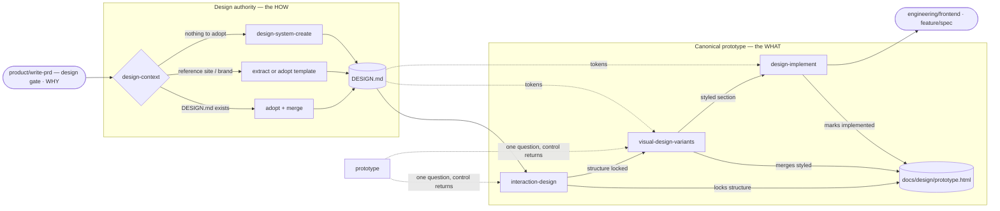
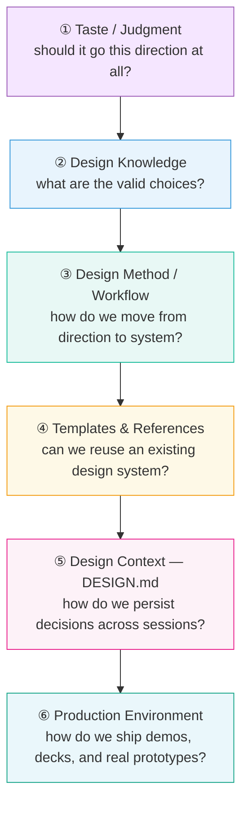

# Design · UX

Last updated: 2026-09-09

How the UX design system in this repo is designed: the internal pipeline of stage skills, the six-layer model of external capabilities they dispatch to, and the contract between the two. For the detailed external-tool catalog — every tool, comparison tables, and workflow recipes — see [`external-skills.md`](external-skills.md). For step-by-step procedures, see [`workflows/design.md`](../../../workflows/design.md).

## What this phase owns

UX design turns PRD intent into implemented components. Shared design understanding is a **triad** (contract: `craft/context/init-context/references/design-memory.md`, symlinked into each skill's `references/`):

| Question | Document | Holds |
| --- | --- | --- |
| **Why** | `product.html` (product docs) | Personas, capabilities, journeys — owned by product skills; inferable from the repo via `map-current-product` |
| **How** | `DESIGN.md` (project root) | Design authority: tokens in YAML frontmatter + prose rationale |
| **What** | `docs/design/prototype.html` | The canonical prototype: per-surface sections, five switchable states, fidelity and lock markers |

The internal skills are **thin stage orchestrators**: they own the triad transitions (approval gates, fidelity markers, memory layers), run the stage workflow, and dispatch heavy design work — taste, knowledge lookups, visual production, polish — to whatever external tools are installed. Every stage has a native fallback, so the pipeline is complete with zero external tools installed and strictly better with them.

## The internal pipeline



Solid edges are the sequence; dashed edges are reads and returns, not stages. Every stage has a hard prerequisite, so entry is at the earliest unsettled stage — not necessarily `design-context`.

| Skill | Purpose | Entered when | Inputs → Outputs | Gate |
| --- | --- | --- | --- | --- |
| `design-context` | Decide where design authority comes from | No `DESIGN.md` yet, a legacy `system.md` to migrate, or a reference site/brand to import | PRD Part 1, existing sources → root `DESIGN.md` | Approval before write |
| `design-system-create` | From-scratch fallback when there is nothing to adopt | Called directly, or via `design-context` when the user picks the native path | PRD Part 1 → root `DESIGN.md` + preview HTML | Approval before write |
| `interaction-design` | Define HOW users interact before HOW it looks | New feature with unclear flows; thin PRD Part 3 | PRD Parts 1+3 → wireframe sections in `prototype.html` (locked at approval) + working exploration in `<work-root>/<effort>/interaction/` | Structure locks at approval |
| `visual-design-variants` | Explore 3 genuinely different visual directions on locked structure | Locked wireframe sections exist, `DESIGN.md` exists | Locked sections + `DESIGN.md` → variant HTMLs (working), winner merged into the section (`wireframe → styled`) | Approved variant merges |
| `design-implement` | Convert the styled section into production code | A `styled` locked section exists | Styled section + `DESIGN.md` → component source + `docs/design/components/<name>.md` + section marked `implemented` | Review pass before done |

Two hard sequencing rules, both machine-checkable in the prototype:

1. **Interaction before visuals** — structure (what/where/when) is designed and locked (`data-structure="locked"`) before color, typography, or polish. `visual-design-variants` may not move buttons, navigation, or state transitions; a structural change reopens the section through `interaction-design`.
2. **One canonical token source** — root `DESIGN.md` is the only how downstream skills read for visual values. `design-context` decides what feeds it (adopt, extract, migrate, or create) and keeps the prototype's `:root` token block in sync.

Memory layers: `<work-root>/<effort>/` artifacts are Working layer (untracked, disposable after implementation); the work root is configured in `docs/agents/memory.md` and defaults to `.scratch/`. The triad documents and `docs/design/components/*.md` are Human layer (git-tracked, outlive features). Legacy `docs/design/system.md` files remain readable until `design-context` folds them into `DESIGN.md`. Full table, with promotion targets, in `workflows/design.md`.

## The six-layer external model

External UI/UX tools cluster into six capability layers. The pipeline consumes them *by layer* — a stage asks for "a layer-① taste pass", never for a named vendor — so tools can be installed, swapped, or absent without touching skill logic.



Most external-tool failures come from skipping layers (jumping to ⑥ without ①–③) or conflating them (using a ④ template when you need a ③ method).

## Dispatch contract

A stage recognizes a capability **by what a skill's own description claims as its main artifact** — never by a vendor name, which a distributed skill cannot look up. Each stage probes only the slots it consumes, at the point it consumes them, and the native workflow is always the fallback.

| Layer | Capability slot | Recognize it by | Consumed by | Dispatch point | Fallback |
|:---:|---|---|---|---|---|
| ① | Taste / judgment | Argues for or vetoes a direction; produces no palette, template, or code as its own artifact | `visual-design-variants` | Step 2.5 — sharpen direction strategies | Directions proposed inline |
| ② | Knowledge — type/color | Answers "what are the valid options" from a catalog of font pairings or palettes; never picks one | `design-system-create` | Step 2 — decided once, applied at 2.2 and 2.3 | Proposed from first principles |
| ② | Knowledge — UX guidelines | Same, for state-design and flow patterns by product type | `interaction-design` | Step 1.5 — prior art for the state table | The five-state table |
| ③ | Method / workflow | Owns a named repeatable pass over work that already exists — audit, redesign, polish, motion, a11y | `design-implement` + standalone redesign | Step 4.5 polish pass; redesign tools run before re-entering the pipeline | Built-in quality gates |
| ④ | Templates & references | Ships finished design systems or brand specs to adopt wholesale; carries no process, makes no judgment | `design-context` | Step 2 — adopt a ready-made brand spec | Create from scratch |
| ⑤ | Design context (DESIGN.md) | Creates, extracts, or maintains a root `DESIGN.md` as a durable file across sessions | `design-context` | Steps 1–3 — adopt, extract, or initialize | Native `design-system-create` path |
| ⑥ | Production environments | Renders high-fidelity mockups, prototypes, or decks from a settled brief; decides nothing | `visual-design-variants` | Step 2.5 — high-fidelity variant production | Inline HTML generation |

When a candidate matches two slots, place it by its main artifact: a stance is ①, a lookup is ②, a workflow is ③, a finished spec is ④, a `DESIGN.md` lifecycle is ⑤, a rendered surface is ⑥.

### The capability record

Each probe appends one row to `<work-root>/<effort>/design/capabilities.md` — Working layer, dies with the effort, co-located with `system-preview.html`. With no active effort it is `<work-root>/design/capabilities.md`.

```markdown
| Slot | Found | Decision | By |
|---|---|---|---|
| ① taste | none | native — directions proposed inline | visual-design-variants |
| ③ method | <name> | accepted — polish pass, limits 1–3 applied | design-implement |
```

The row is what makes an optional step checkable: "skip silently" is not a done condition, "the `③ method` row exists and reads `none`" is. Rows are disjoint — a skill writes only the slots it consumes and never edits another's — so there is no contention and no owner. Each stage declares it `Contributes:`, per the contributor mode in `init-context/references/PROTOCOL.md`. A row that contradicts what you observe is reported to the user, not overwritten; refresh one only when the user says a skill was installed or removed.

The reconciliation rules, enforced by every stage:

- **Pipeline skills own canonical paths.** External output lands where the stage says it lands (e.g. `visual/variants/variant-{a,b,c}.html` with the state switcher intact); only the stage's approval gate merges anything into `docs/design/prototype.html`.
- **`DESIGN.md` holds token authority.** Engine-invented visual values are rejected; engine output is reconciled into DESIGN.md tokens, never accepted raw.
- **Locked structure stays locked.** External production engines vary visual properties only; any structural change routes back to `interaction-design`, which reopens the section.
- **Skills name layers and capabilities, never vendors.** Recognition is by capability signature, in the table above. [`external-skills.md`](external-skills.md) catalogs the ecosystem for a human choosing what to install; no skill reads it at runtime.

## Prototype

`prototype` sits alongside the pipeline as a shared utility, not a stage. It builds throwaway code to answer one design question when conversation cannot settle it — a logic harness for state models, or radically different UI layouts for interface questions. Any stage may call it; control returns to the stage that raised the question. The code is disposable; the decision it buys is not. Decisions are recorded in `prototypes/<slug>/decision.md`. Despite the name, it never writes the canonical `docs/design/prototype.html` — only pipeline stages merge into that, through their gates.

## Further reading

- [`external-skills.md`](external-skills.md) — the reference book: every external tool by layer, comparison tables, head-to-head notes, workflow recipes, installation.
- [`workflows/design.md`](../../../workflows/design.md) — step-by-step procedures, workflow patterns, quality standards, troubleshooting.
- [`../README.md`](../README.md) — the design phase overview: UX vs technical, entry and skip conditions.
