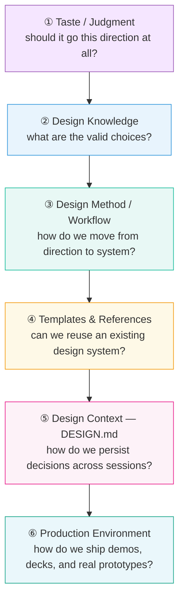
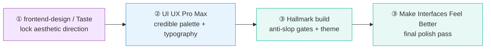
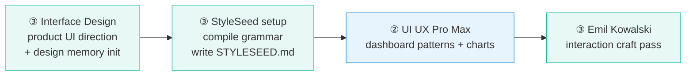
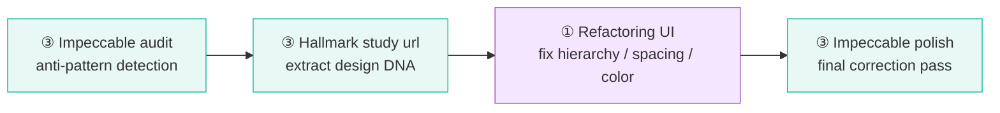
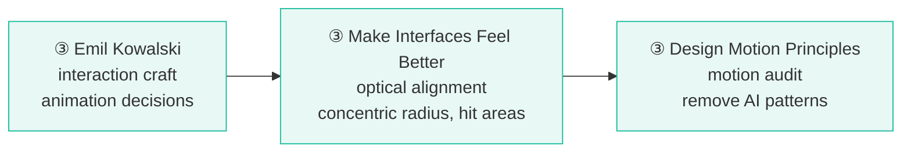
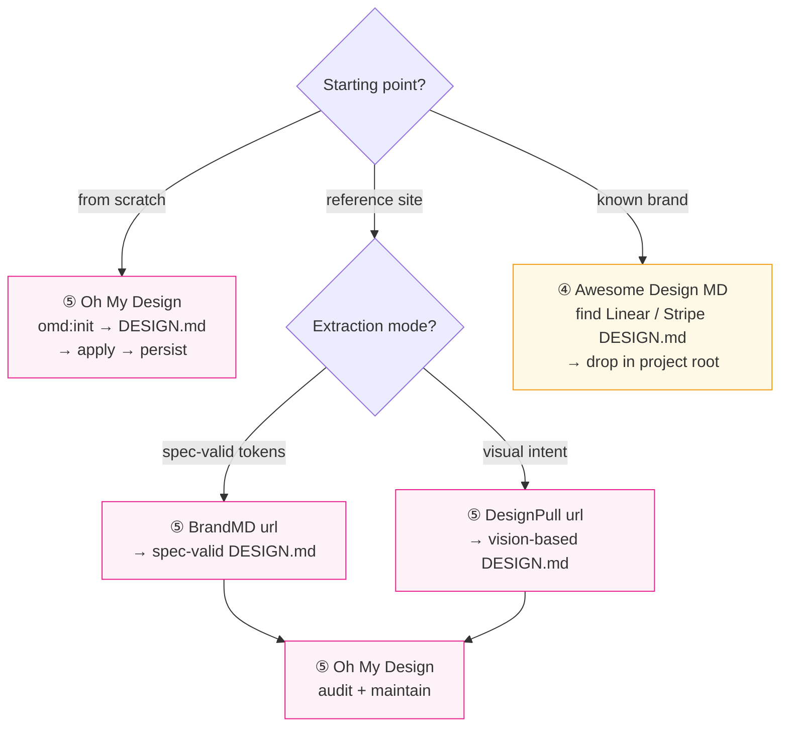
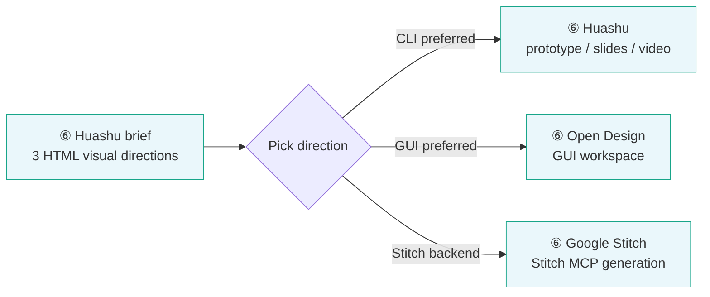

# External UI/UX Skills — Reference Book

Last updated: 2026-09-09

A detailed catalog and comparison of the external UI/UX skill ecosystem. This is the reference behind the six capability layers the internal pipeline dispatches to — for the system architecture, dispatch points, and reconciliation contract, see [`README.md`](README.md); for pipeline procedures, see [`workflows/design.md`](../../../workflows/design.md).

**This is a human-facing catalog, not a runtime lookup.** Skills recognize a capability by its signature — what a skill's own description claims as its main artifact — because a distributed skill cannot resolve a vendor name. The signature table lives in [`README.md`](README.md); this file exists to help you decide what to install.

UI/UX work in this repo relies primarily on **external skill ecosystems** — not internal skills authored here. This book maps those external systems: what each one is for, how it compares to its neighbors, and which combination fits a given task.

The landscape splits into six distinct layers. Confusing them leads to using a polish tool when you needed a direction tool, or a knowledge DB when you needed a production environment.

## The Six Layers



What belongs in each layer — and what doesn't:

- **① Taste / Judgment** — a stance, not an asset. Tools here argue for a direction and veto generic output. If a tool *produces* palettes, templates, or code as its main artifact, it belongs in ②–⑥, not here.
- **② Design Knowledge** — retrieval, not judgment. Databases of valid choices (styles, palettes, pairings, guidelines) you query. They answer "what are the options", never "which option".
- **③ Method / Workflow** — repeatable process. These tools move a project from direction to system via named operations (build/audit/redesign/polish), and often persist decisions between runs. Knowledge DBs (②) answer lookups; methods (③) own a workflow.
- **④ Templates & References** — finished design systems, ready to adopt wholesale. No process, no judgment — drop in and conform.
- **⑤ Design Context** — persistence infrastructure. The DESIGN.md format spec plus the tools that create, extract, and maintain it. Distinct from ④: ④ *is* the spec content, ⑤ is the format and lifecycle.
- **⑥ Production Environment** — output engines. High-fidelity mockups, prototypes, slides, video. They render; they don't decide. Feeding an undecided brief to a ⑥ tool is how you get polished slop.

---

## Quick Decision Table

| Layer | What you need | Recommended tools |
|:---:|---|---|
| ① | Design direction — vague brief, need aesthetic stance | [frontend-design], [Taste], [StyleSeed], [Huashu] |
| ① | 0→1 landing page / marketing site | [frontend-design], [Taste], [Hallmark], [UI UX Pro Max] |
| ③ | 0→1 SaaS / dashboard / agent console | [Interface Design], [StyleSeed], [UI UX Pro Max] |
| ⑥ | Fast clickable prototype / demo | [Huashu], [Open Design], [Google Stitch] |
| ③⑥ | See 3–5 real visual directions at once | [Huashu], [StyleSeed], [Open Design], [Google Stitch] |
| ③⑥ | Mobile app UI | [Mobile App UI Design], [Huashu], [Open Design] |
| ⑥ | Slides / infographic / video | [Huashu], [Open Design], [StyleSeed] |
| ③ | Existing UI is ugly — redesign it | [Impeccable], [Hallmark], [Refactoring UI] |
| ③ | UI is at 80%, needs to feel professional | [Emil Kowalski], [Make Interfaces Feel Better] |
| ③ | Animation looks AI-generated | [Emil Kowalski], [Design Motion Principles] |
| ①③ | Avoid purple gradients / three-card layouts | [Taste], [Hallmark], [Impeccable], [StyleSeed] |
| ⑤ | Build a persistent design system | [DESIGN.md], [Interface Design], [StyleSeed] |
| ⑤ | Extract a design system from a reference site | [BrandMD], [DesignPull], [TypeUI Extractor] |
| ④⑤ | Get a ready-made brand design spec | [Awesome Design MD], [Oh My Design] |
| ⑤ | Create / maintain / apply DESIGN.md | [Oh My Design], [Google DESIGN.md] |
| ④⑤ | DESIGN.md + agent execution rules together | [Awesome Design Skills] |
| ② | Simulate a full design team (UX research, critique) | [Naksha Studio], [Design With Claude] |
| ⑥ | GUI workspace, not pure CLI | [Open Design], [Google Stitch] |

[frontend-design]: https://github.com/anthropics/skills
[Taste]: https://github.com/Leonxlnx/taste-skill
[StyleSeed]: https://github.com/bitjaru/styleseed
[Huashu]: https://github.com/alchaincyf/huashu-design
[Hallmark]: https://github.com/nutlope/hallmark
[UI UX Pro Max]: https://github.com/nextlevelbuilder/ui-ux-pro-max-skill
[Interface Design]: https://github.com/Dammyjay93/interface-design
[Open Design]: https://github.com/nexu-io/open-design
[Google Stitch]: https://github.com/google-labs-code/stitch-skills
[Mobile App UI Design]: https://github.com/ceorkm/mobile-app-ui-design
[Impeccable]: https://github.com/pbakaus/impeccable
[Refactoring UI]: https://github.com/LovroPodobnik/refactoring-ui-skill
[Emil Kowalski]: https://github.com/emilkowalski/skills
[Make Interfaces Feel Better]: https://github.com/jakubkrehel/make-interfaces-feel-better
[Design Motion Principles]: https://github.com/kylezantos/design-motion-principles
[DESIGN.md]: https://github.com/google-labs-code/design.md
[BrandMD]: https://github.com/yuvrajangadsingh/brandmd
[DesignPull]: https://github.com/hasi98/designpull
[TypeUI Extractor]: https://github.com/bergside/design-md-chrome
[Awesome Design MD]: https://github.com/VoltAgent/awesome-design-md
[Oh My Design]: https://github.com/kwakseongjae/oh-my-design
[Awesome Design Skills]: https://github.com/bergside/awesome-design-skills
[Naksha Studio]: https://github.com/Adityaraj0421/design-studio
[Design With Claude]: https://github.com/imsaif/design-with-claude

---

## Tool Catalog

### Layer ①  Taste & Judgment

| Tool | Mechanism | Persistence | Output | Pick when |
|---|---|---|---|---|
| frontend-design | Creative-director system prompt | None | Direction decisions, then code | You want an opinionated collaborator inside the build session |
| Taste | Anti-pattern list + preflight checklist | None | Vetoes + constraints | You already have direction; you want insurance against generic output |
| Refactoring UI | Tactical rule set from the book | None | Structural corrections | The page looks engineer-built and you need fixes, not reimagining |

**vs. notes:** frontend-design and Taste both operate at 0→1, but frontend-design *proposes* (an aesthetic stance, one defensible risk per session) while Taste *vetoes* (slop detection, preflight checks). They compose well: frontend-design to pick a direction, Taste to keep execution honest. Refactoring UI is the odd one out — it's judgment applied to *existing* UI, which makes it the bridge into layer-③ redesign work.

#### [`frontend-design`](https://github.com/anthropics/skills) — Anthropic
**What:** Creative Director system prompt. Establishes aesthetic direction before writing any code — product, user, page task, visual direction, then opinionated choices on typography, palette, layout. Explicitly requires one defensible aesthetic risk per session.
**Not:** a template library, a DESIGN.md manager, a style database.
**Best for:** Any new UI where direction is undefined.
**Invoke:** install via [CC] plugins

---

#### [`Taste Skill`](https://github.com/Leonxlnx/taste-skill)
**What:** Anti-slop judgment layer. Prevents AI from producing boring/generic/templated frontend. Works as a macroesthetic constraint + anti-pattern list + preflight checklist.
**Not:** a design system generator, a template library, a DESIGN.md manager.
**Best for:** Landing pages, portfolios, creative web, marketing pages, redesigns.
**Invoke:** `@taste-skill` or install SKILL.md

---

#### [`Refactoring UI Skill`](https://github.com/LovroPodobnik/refactoring-ui-skill)
**What:** Adam Wathan's *Refactoring UI* tactical rules as an agent skill. Targets hierarchy, spacing, typography, color, depth, borders, layout.
**Not:** creative direction, visual template library.
**Best for:** "Why does this page look like an engineer built it?" — structural correction, not aesthetic reimagining.
**Invoke:** install SKILL.md; also see [gnurio/refactoring-ui-plugin](https://github.com/gnurio/refactoring-ui-plugin) for a 10-skill review split

---

### Layer ②  Design Knowledge

| Tool | Content | Query style | Output | Pick when |
|---|---|---|---|---|
| UI UX Pro Max | 84 styles, palettes, font pairings, UX guidelines, 22+ stacks | Lookup by product type / style | `design-system/MASTER.md` + per-page overrides | You need a credible style/palette/typography decision fast |
| Design With Claude | 45+ specialist skills (research, strategy, critique, a11y) | Invoke a specialist role | Analysis, critique, strategy docs | You need the *process artifacts* of a design team, not visual choices |
| Naksha Studio | Simulated roles: Director, UX Researcher, UI Designer, Critic… | Conversational roleplay | Multi-perspective critique | You want adversarial review from several design personas |

**vs. notes:** UI UX Pro Max is a *database* — you query it and get options. Design With Claude and Naksha Studio are *persona libraries* — they simulate what a design team does (research, critique, accessibility review) rather than what a style catalog contains. Pick UI UX Pro Max for "what font pairs with this brand", pick the persona tools for "poke holes in this flow".

#### [`UI UX Pro Max`](https://github.com/nextlevelbuilder/ui-ux-pro-max-skill)
**What:** Design intelligence / knowledge retrieval skill. Database of 84 styles, color palettes, font pairings, product types, UX guidelines, chart types, icons across 22+ stacks. Query it to look up valid choices or generate a design system.
**Outputs:** `design-system/MASTER.md` + per-page override files.
**Best for:** Any UI where you need to look up a credible style/palette/typography decision fast.
**Invoke:** install per its repo instructions (external skill, not vendored here); `/design-system-create` dispatches to layer-② skills like this one when installed

---

#### [`Design With Claude (dwic)`](https://github.com/imsaif/design-with-claude)

**Installation weight: Heavy — plugin packaging.** The standalone SKILL.md routes to 48 specialist plugin commands outside its folder; installing that folder alone leaves an incomplete router. The audit package adds MCP SDK and Zod dependencies, although the specialist guidance itself is Markdown. Leave out of the lightweight preset.

**What:** Library of 45+ design specialist skills (UX research, UX strategy, critique, accessibility, interaction, design systems, product design). Answers "what does a real design team do beyond drawing UI?"
**Not:** a visual style skill or template generator.
**Best for:** UX research, strategy, critique, accessibility review, interaction design.
**Invoke:** `@dwic` or install individual skills

---

#### [`Naksha Studio`](https://github.com/Adityaraj0421/design-studio)

**Installation weight: Heavy — plugin suite and integrations.** Includes agents and commands outside the skill folder, plus Figma, preview, and Firebase MCP integrations for the corresponding workflows. Leave out of the lightweight preset.

**What:** Virtual design team — simulates Design Director, UX Researcher, UI Designer, Design System, Accessibility, Critic, Prototype specialist roles.
**Best for:** Discovery, UX strategy, multi-perspective critique, iterative design process simulation.

---

### Layer ③  Design Method / Workflow

| Tool | Scope | Persistence | Operations | Pick when |
|---|---|---|---|---|
| Hallmark | 0→1 creative sites + redesign | `design.md` via `study` | build / audit / redesign / study | Marketing/creative work with anti-slop gates; reference-site DNA extraction |
| StyleSeed | Full method, direction → verified implementation | `STYLESEED.md` (locks skin, color, font, radius, motion) | setup / reference / build / score / verify / restyle | You want a repeatable method with drift prevention across sessions |
| Interface Design | Product UI only — dashboards, SaaS, admin | Design memory (radius, spacing, color per project) | screen generation with memory | Agent consoles, CRMs, internal tools — not marketing |
| Impeccable | Existing UI, 0.7 → 1.0 | Extracted tokens via `extract` | 23 commands: audit / polish / bolder / extract… | Systematic improvement of a UI that already exists |

**vs. notes:** The split that matters is *what kind of site* and *starting from what*. Interface Design is deliberately narrow — product UI with persistent memory, and it refuses marketing pages. Hallmark and StyleSeed both cover 0→1 creative work; Hallmark is lighter (21 themes, four operations, strong `study <url>` extraction), StyleSeed is the heavier end-to-end method (22+ skills, scoring, verification, named brand recipes that change structure, not just CSS). Impeccable barely competes with any of them — it's the redesign/fixer you point at an existing UI, and its `extract` feeds the others.

#### [`Hallmark`](https://github.com/nutlope/hallmark)
**What:** Anti-slop design workflow with 21 built-in themes. Supports four operations: `build`, `audit`, `redesign`, `study`. The `study <url>` command extracts macrostructure + typography + color anchor and can output a portable `design.md`.
**Best for:** 0→1 creative sites; reference site → new design via "design DNA" extraction.
**Invoke:** `hallmark build / audit / redesign / study`

---

#### [`StyleSeed`](https://github.com/bitjaru/styleseed)

**Installation weight: Large workflow bundle.** Its 23 installed skills add workflow and discovery overhead; this is distinct from requiring an external service. Keep it in its existing separate StyleSeed preset and enable when needed.

**What:** 22+ skill design method engine. Covers: setup, reference compilation, creative direction, page, component, pattern, motion, tokens, review, scoring, a11y, verify, restyle. Uses `STYLESEED.md` (not DESIGN.md) to lock skin, key color, font, radius, motion and prevent design drift across sessions.
**Best for:** Projects needing a repeatable method from direction → system → verified implementation. Has named brand recipes (enterprise-workbench, editorial, commerce, brutalist-lite, etc.) that change structure and morphology, not just CSS.
**Invoke:** `styleseed setup`, `styleseed reference`, `styleseed build`, `styleseed score`, `styleseed verify`

---

#### [`Interface Design`](https://github.com/Dammyjay93/interface-design)
**What:** Product UI / design engineering skill. Explicitly scoped to dashboards, admin, SaaS, settings, data interfaces, interactive tools — not marketing pages.
**Key feature:** Design memory — persists UI decisions (radius, spacing, color system) so subsequent screens stay consistent.
**Best for:** Agent consoles, CRMs, internal tools, analytics dashboards.
**Invoke:** install SKILL.md; design memory is maintained per-project

---

#### [`Impeccable`](https://github.com/pbakaus/impeccable)
**What:** Design critic + fixer with 23 commands. Covers design, redesign, critique, audit, polish, animate, colorize, extract. Runs deterministic anti-pattern detectors. Can extract reusable patterns/tokens from existing implementation into a design system.
**Best for:** Existing UI that needs systematic improvement (0.7 → 1.0). Also good for 0→1 when paired with an audit pass.
**Commands:** `/impeccable audit`, `/impeccable polish`, `/impeccable bolder`, `/impeccable extract`, and 19 more

---

### Layer ③ (Specialist)  Polish & Motion

These are layer-③ methods narrowed to the last 10%: interaction craft, motion, and mobile.

| Tool | Domain | Modes | Pick when |
|---|---|---|---|
| Emil Kowalski Skills | Interaction craft, springs, gestures | build + review (`review-animations`, `improve-animations`) | Animation decisions need Vercel/Linear-grade judgment |
| Make Interfaces Feel Better | Optical polish: alignment, radius, shadows, hit areas | fix pass | It's at 80 points and you can't name what's missing |
| Design Motion Principles | Motion only | build + audit | You suspect AI motion anti-patterns (hover-scale everywhere, stagger spam) |
| Mobile App UI Design | Mobile patterns, typography, interactions | build | Any mobile app UI, 0→1 or redesign |

**vs. notes:** Emil Kowalski and Design Motion Principles overlap on animation; Emil is *craft judgment* (spring vs ease, gesture feel, Apple-grade materials), DMP is *systematic audit* (motion-gap analysis, anti-pattern flags). Run DMP to find the problems, Emil to fix the ones that matter. Make Interfaces Feel Better covers the static half of the same 80→95 gap — optical alignment, concentric radius, hit areas — and composes with either.

#### [`Emil Kowalski Skills`](https://github.com/emilkowalski/skills)
**What:** Design engineering / interaction craft. From Emil's experience at Vercel and Linear. Skills: `emil-design-eng`, `animate`, `review-animations`, `improve-animations`, `apple-design`.
**Best for:** Spring vs ease decisions, gesture behavior, component animation, interaction craft. The `apple-design` skill specifically covers springs, swipe, sheets, momentum, translucent materials, reduced motion.
**Not for:** 0→1 design direction, color palettes, DESIGN.md.

---

#### [`Make Interfaces Feel Better`](https://github.com/jakubkrehel/make-interfaces-feel-better)
**What:** Last 10% polish skill. Covers animation, typography, icons, hover states, optical alignment, concentric radius, shadow, hit areas.
**Best for:** "This is at 80 points — why doesn't it feel like a professional product?"
**Not for:** 0→1 design, design systems, templates.

---

#### [`Design Motion Principles`](https://github.com/kylezantos/design-motion-principles)
**What:** Dedicated motion design skill. Supports build and audit modes. Runs motion-gap analysis (detects state transitions that should animate but don't). Flags AI motion anti-patterns: hover-scale everywhere, stagger spam, pulsing indicators, purposeless animation.
**Best for:** Demo motion polish, product motion audit, existing UI animation review.

---

#### [`Mobile App UI Design`](https://github.com/ceorkm/mobile-app-ui-design)
**What:** Mobile-specific skill. Covers onboarding, home, finance, meditation, wallet, fitness, navigation patterns, mobile typography, spacing, shadows, mobile interactions.
**Structure:** `SKILL.md` + `references/industry-conventions.md`
**Best for:** Any mobile app UI, 0→1 or redesign.

---

### Layer ④  Templates & References

#### [`Awesome Design MD`](https://github.com/VoltAgent/awesome-design-md)
**What:** Curated collection of DESIGN.md files extracted from known products (Linear, Stripe, etc.). Drop one in your project, and the agent designs to that brand's spec.
**Use:** Find a reference brand → copy its DESIGN.md into project root → agent reads it.

---

#### [`Awesome Design Skills`](https://github.com/bergside/awesome-design-skills)

**Installation weight: Large catalog, low runtime cost.** The 67+ alternative design-system skills are not dependency-heavy, but bulk installation adds competing style instructions and generic-name collisions. Select individual systems on demand.

**What:** Registry of 67+ design systems, each providing both a `SKILL.md` (how the agent should implement) and a `DESIGN.md` (what the design should look like). Embodies the correct two-layer separation.

```
DESIGN.md  → what should it look like? (visual intent, tokens, rationale)
SKILL.md   → how should the agent work? (component rules, a11y, quality gates)
```

**vs. Awesome Design MD:** Awesome Design MD gives you the *spec* (DESIGN.md only — you supply the execution); Awesome Design Skills gives you spec *plus* execution rules as a matched pair. If your agent runtime reads SKILL.md natively, the paired registry is strictly more useful; if you only need the visual tokens, the simpler catalog has less to wade through.

---

### Layer ⑤  Design Context (DESIGN.md Ecosystem)

| Tool | Role | Determinism | Output | Pick when |
|---|---|---|---|---|
| Google DESIGN.md | The format spec itself | — | Format definition | Always — this is what the others produce |
| Oh My Design | Full lifecycle OS: init, apply, audit, memory | Deterministic lifecycle | DESIGN.md + corrections over time | You want DESIGN.md to stay alive across many sessions |
| BrandMD | Website → DESIGN.md extractor | Deterministic CSS/spec extraction | Spec-valid DESIGN.md | "Make it like this site" and you want validated tokens |
| DesignPull | Website → DESIGN.md extractor | Vision model + screenshot + CSS | Intent-rich DESIGN.md | The site's *feel* matters more than exact values |
| TypeUI Extractor | Chrome extension extractor | Browser-driven CSS capture | DESIGN.md or SKILL.md | You're browsing and want one-click capture |

#### [Google `DESIGN.md`](https://github.com/google-labs-code/design.md) — the format spec · [spec](https://github.com/google-labs-code/design.md/blob/main/docs/spec.md)
**What:** Open format specification for agent-readable design systems. YAML frontmatter = machine-readable tokens; prose = human-readable rationale.
**This is a format, not a skill.** Analogous to `AGENTS.md` for software engineering.

```yaml
---
colors:
typography:
spacing:
---
# Visual identity
## Principles
## Components
## Usage
```

---

#### [`Oh My Design`](https://github.com/kwakseongjae/oh-my-design)

**Installation weight: Heavy — lifecycle suite.** Includes channel-specific skills, roles, a large reference catalog, and optional hooks. The core needs no separate API key, daemon, or MCP server; the weight comes from installing and maintaining the broader environment. Leave out of the lightweight preset.

**What:** DESIGN.md operating system / full lifecycle workflow. Includes: skills, specialist agents, hooks, 440+ quality-graded company references, doctor, memory/preferences, audit, anti-slop, review.
**Lifecycle:** `omd:init` → create DESIGN.md → design screens → DESIGN.md persists → next session reads same design → corrections saved.
**Best for:** Any project needing consistent design across multiple sessions.

---

#### [`BrandMD`](https://github.com/yuvrajangadsingh/brandmd)

**Installation weight: Heavy — extractor runtime.** The CLI depends on Playwright, Google GenAI, Chroma.js, and Commander. This requires more than installing a Markdown skill. Leave out of the lightweight preset.

**What:** Website → DESIGN.md extractor. Deterministic CSS/spec extraction, output validated against Google's DESIGN.md linter.
**Use:** `brandmd https://stripe.com` → get a spec-valid DESIGN.md.
**Best for:** "I found a site I like — make the agent design to that spec."
**vs DesignPull:** deterministic/spec-valid extraction (tokens + CSS); DesignPull adds vision + design intent.

---

#### [`DesignPull`](https://github.com/hasi98/designpull)

**Installation weight: Heavy — browser extension and model setup.** Requires the extension plus a model-provider API key or a local Ollama model. Leave out of the lightweight preset.

**What:** Website → DESIGN.md extractor using vision model + full-page screenshot + CSS tokens. Captures layout, imagery style, brand voice, visual intent, do/don't rules — not just hex codes.
**vs BrandMD:** richer intent extraction; less deterministic. Pick BrandMD when you'll mechanically conform to the spec; DesignPull when you want the agent to understand *why* the site looks the way it does.

---

#### [`TypeUI DESIGN.md Extractor`](https://github.com/bergside/design-md-chrome) — Chrome extension

**Installation weight: Separate browser setup.** This is an extension, not an agent skill; exclude from the skill preset rather than treating it as a skill-folder install.

**What:** Open a website → extract CSS/style → output DESIGN.md or SKILL.md.
**Use:** Reference capture tool, not a design skill.

---

### Layer ⑥  Production Environments

| Tool | Environment | Backend | Outputs | Pick when |
|---|---|---|---|---|
| Huashu Design | CLI / skill | Local HTML-native templates | Prototypes, HTML slides, PPTX, MP4/GIF, PDF | You want 3 real HTML directions to pick from, fast, no external service |
| Open Design | Local GUI workspace | Your coding agent ([CC], [CD], Cursor, OpenCode) | HTML, dashboards, slides, images, video, PDF, PPTX | You want a design-tool GUI, not a chat loop |
| Google Stitch | Skill suite + MCP | Google Stitch generation API | Screen generation, variants, design → code | You're already in the Google Stitch ecosystem |

**vs. notes:** The axis is *where the pixels come from*. Huashu renders from its own local template library (60 HTML-native styles) — fully offline, brand persisted in `brand-spec.md`, and its brief → 3-directions → pick-one workflow maps directly onto `visual-design-variants`. Open Design is a *workspace* — the agent is the engine, the tool is the environment around it. Stitch delegates generation to Google's backend via MCP, which means setup cost plus an external dependency, in exchange for a hosted generation model. For pipeline dispatch, Huashu is the lowest-friction ⑥; Stitch is only worth it if the team already pays the MCP cost.

#### [`Huashu Design`](https://github.com/alchaincyf/huashu-design)
**What:** HTML-native design production tool. Directly produces: clickable App/Web prototypes, HTML slides, editable PPTX, animations, MP4/GIF, infographics, PDF/PNG/SVG, design variants. Has actual template assets (60 HTML-native styles: 20 web / 20 PPT / 20 infographic) and starter components.
**Key workflow:** brief → 3 real HTML visual directions → you pick → implementation continues.
**Uses `brand-spec.md`** (not DESIGN.md) for brand persistence.

---

#### [`Open Design`](https://github.com/nexu-io/open-design)

**Installation weight: Heavy — full application.** Installs a design workspace around the coding agent rather than a standalone skill. Leave out of the lightweight preset.

**What:** Complete local-first AI design workspace. Works with [CC], [CD], Cursor, OpenCode as the design engine. Supports: Home/Brief → Plugins/Skills → Brand Reference → Design System → Studio → Prototype/Mobile/Deck/Image/Video.
**Outputs:** HTML, prototype, dashboards, slides, images, video, PDF, PPTX, MP4.
**Best for:** When you want a GUI workspace experience, not pure CLI.

---

#### [`Google Stitch Skills`](https://github.com/google-labs-code/stitch-skills)

**Installation weight: Heavy — MCP and hosted service.** Requires a configured Stitch MCP connection and access to Google Stitch generation. Installing the skill files alone is insufficient. Leave out of the lightweight preset.

**What:** Google's official Stitch agent skill suite. Integrates with Stitch MCP → Google Stitch AI design generation. Supports design exploration, screen generation, variants, design → code, multi-screen, DESIGN.md workflow.
**Stack:** Coding Agent ↔ Stitch Skills ↔ Stitch MCP ↔ Google Stitch
**SDK:** [google-labs-code/stitch-sdk](https://github.com/google-labs-code/stitch-sdk)

---

## Workflow Recipes

### 0→1 Landing Page



### 0→1 SaaS / Dashboard / Agent Console



### Redesign Existing UI



### Polish Pass (80 → 95)



### Set Up DESIGN.md for a New Project



### Prototype / Demo Production



---

## Notes on Installation

Installation-weight annotations were reviewed on **2026-09-09**. They distinguish runtime/service dependencies from large workflow bundles and catalog clutter. “Heavy” means excluded from the lightweight UI/UX preset, not a judgment of design quality; an MCP mention does not imply that every workflow requires MCP.

Each external skill ships as a `SKILL.md` (or equivalent) installed into the agent's skill path. Typical install locations:

- **[CC]:** `.claude/skills/<skill-name>/SKILL.md` or the `plugins/` path for Anthropic-hosted skills
- **[CD] / Cursor / OpenCode:** `AGENTS.md` inline or skill directory per that runtime's convention

Verify the target skill's own README for the exact install command — most now support one-line install via the Agent Skills open standard.

For skills backed by external services (Google Stitch, Stitch MCP), the MCP server must be configured separately before the skill can call the generation API.
