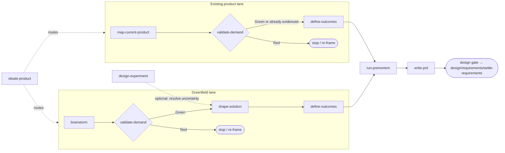

# Plan

Last updated: 2026-09-14

From raw idea or existing codebase to durable product intent an engineer can build against. Ten skills contribute to one shared product model through two lanes: greenfield creation and existing-product improvement.

Read [the product memory contract](../craft/context/init-context/references/product-memory.md) for the record schema and update rules. The source contract lives with context initialization; each product skill exposes the same file through a local `references/product-memory.md` symlink so packaged copies can materialize it without separate maintained versions.

## The lanes

Product work answers the earliest open question. Greenfield work starts with demand; existing product work starts with current behavior.

`validate-demand` is the kill switch: a Red verdict here is the cheapest possible outcome. `write-prd` is the exit: it consolidates accepted intent into the product document that `design/requirements/settle-requirements` consumes — directly, or through the optional UX and technical design sub-phases when the PRD leaves experience or structure open.

## Where to start

| You have | Start with |
| --- | --- |
| A vague idea or problem statement | `brainstorm` |
| A specific idea and you want a go/no-go | `validate-demand` |
| An existing codebase and you want to know what it already does | `map-current-product` |
| A validated greenfield demand with no solution shape | `shape-solution` |
| A solution shape that needs verifiable commitments | `define-outcomes` |
| An existing-product improvement to scope | `define-outcomes` |
| A feature list to prioritize, cut, or reduce to an MVP | `define-outcomes` — commitment and depth |
| A specific assumption to validate cheaply before committing | `design-experiment` |
| A scoped plan you want to stress-test | `run-premortem` |
| A multi-session effort with interdependent open decisions | `explore-unknowns` |
| A Green demand verdict and nothing tracked yet | `write-prd` — early mode, Part 1 only |
| No idea which of the above applies | `ideate-product` — it diagnoses and routes |

## The skills

### Discovery — is this problem worth solving?

**`brainstorm`** — turns an ambiguous idea into a Jobs-to-be-Done brief through Socratic dialogue: who the user is, what job they hire the product for, how they solve it today, and what constrains any solution. Asks questions in small blocks and stops before feature scoping. Enriches shared personas, problems, constraints, assumptions, and questions.

**`validate-demand`** — the gate. Grades evidence behind a demand claim on a five-level scale, scores the Three Soul Questions (who is the user, where is the pain, why choose you), issues a traffic-light verdict with three concrete next steps. Green promotes the core idea via an early `write-prd` run; Red stops or sends back to `brainstorm`. Also grades active-product improvement evidence: support tickets, analytics, usage funnels, churn, lost-deal notes.

**`map-current-product`** — the existing-product baseline. Reads product docs and code to extract product-facing roles, routes/flows, implemented user stories with layered needs, module need-fit verdicts, in-progress work, planned work, gaps, and source evidence. Does not scope future changes; gives `shape-solution`, `define-outcomes`, and `write-prd` a reliable picture of what exists today.

**`run-premortem`** — assumes the project has failed 6 months out, then works backward to root causes, scored risks, and prevention strategies. Lives in discovery but runs late in the pipeline — most effective after `define-outcomes` and immediately before `write-prd`. Also works standalone on any plan.

**`ideate-product`** — the router. Diagnoses which question is actually open by reading the effort state and existing artifacts, then routes to the owning skill. Performs no analysis and owns no artifact.

**`explore-unknowns`** — maps a multi-session effort into dependency-ordered decision tickets when the destination is known but the route is not. It coordinates decisions; domain skills still own their answers.

### Definition — what exactly are we building?

**`shape-solution`** — turns a validated demand or current-product baseline into a concrete solution shape: target experience, connected journeys, required capabilities, and the scope space they sit in (primary scenario × product form × data grade).

**`define-outcomes`** — turns a chosen solution into verifiable product commitments: outcome-oriented user stories with observable success states, end-to-end verification scenarios, and a commitment level and depth for every capability. Commitment (`committed` / `reduced` / `deferred` / `excluded` / `open`) says whether the product promises it; depth (`full` / `narrowed` / `fixed` / `manual`) says how far it goes. The two axes are what a P0/P1 ladder cannot express — a capability that ships, but narrower than shaped. Delivery sequencing stays downstream.

**`design-experiment`** — designs a bounded experiment to resolve a named, falsifiable uncertainty cheaply before full commitment. The experiment returns evidence to `shape-solution` (if the target experience changes) or `define-outcomes` (if a commitment needs adjustment). The experiment's scope never becomes the product's scope.

**`write-prd`** — consolidates durable product knowledge in `docs/product/<product-slug>/product.html`. Promotes accepted conclusions with necessary rationale and evidence, preserves IDs and user edits. Runs early after Green demand, then again as scope settles or an increment is accepted.

## Handoff to design

`write-prd` fixes *what* to build. The design gate routes to `/design` when *how it looks* or *how the system is shaped* is still open. Entry is `design/requirements/settle-requirements`, which defines testable acceptance criteria before UX or technical design begins.

## Typical workflows

**Greenfield, full run:**
`brainstorm` → `validate-demand` → `shape-solution` → `define-outcomes` → `run-premortem` → `write-prd`

**Reality check on an existing idea:**
`validate-demand` alone — grades whatever evidence exists and issues a verdict without requiring upstream artifacts.

**Existing codebase:**
`map-current-product` → `define-outcomes` → `write-prd` delta mode

**Stalled effort:**
`ideate-product` reads `state.md` and artifacts, reports which question is open, routes there.
