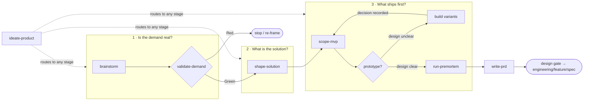

# Product

Last updated: 2026-08-10

From raw idea to a PRD an engineer can build against. Eight skills form one pipeline with a
single gate, a router, and two on-demand tools. This README is the complete map — the
skill directories carry no READMEs of their own.

## The pipeline

Product work is three questions answered in order. Most efforts fail by skipping a
question, not by answering one badly.

`validate-demand` is the kill switch: a Red verdict here is the cheapest possible outcome,
so nothing downstream runs until it passes. It is also the first promotion point — a Green
verdict is where the core idea earns its place in the tracked product docs, via an early
`write-prd` run. `write-prd` is then the exit: it consolidates every
artifact into the document `engineering/feature/spec` consumes — directly, or through the
optional `design/` phase when the PRD leaves experience or structure open (see the Design
Gate in `write-prd`). `prototype` is an optional
loop within Q3 — when `scope-mvp` surfaces a design question that conversation can't
settle (how should this behavior work? what should this interface look like?), `prototype`
builds throwaway code with multiple variants, the user decides, the decision is recorded,
and control returns to `scope-mvp` to continue scoping. The loop can run multiple times if
several design questions emerge.

## Where to start

| You have | Start with |
| --- | --- |
| A vague idea or problem statement | `brainstorm` |
| A specific idea and you want a go/no-go | `validate-demand` |
| A validated demand, or an existing codebase to make sense of | `shape-solution` |
| A designed solution with too many features | `scope-mvp` |
| A scoped plan you want to stress-test | `run-premortem` |
| A Green demand verdict and nothing tracked yet | `write-prd` — early mode, Part 1 only |
| Completed artifacts and you need the spec | `write-prd` |
| No idea which of the above applies | `ideate-product` — it diagnoses and routes |

Skills can also run standalone: `validate-demand` works as a reality check on any claim,
`run-premortem` stress-tests any plan, and `shape-solution` can reverse-engineer user
stories from an existing codebase with no prior discovery.

## The skills

### Discovery (`discovery/`) — is this problem worth solving?

**`brainstorm`** — turns an ambiguous idea into a Jobs-to-be-Done brief through Socratic
dialogue: who the user is, what job they hire the product for, how they solve it today,
and what constrains any solution. Asks questions one at a time, keeps it conversational,
and stops before feature scoping. Owns `discovery/brainstorm.md`. **Credit: adapted from
[Jesse Hattabaugh's superpowers brainstorming skill](https://github.com/obra/superpowers/blob/main/skills/brainstorming/SKILL.md)
for the Socratic conversation pattern.**

**`validate-demand`** — the gate. Grades the evidence behind the demand claim on a
five-level scale, scores the Three Soul Questions (who is the user, where is the pain, why
choose you), classifies the demand as painkiller / reward / vitamin, slices to a beachhead
segment, and issues a traffic-light verdict with three concrete next steps. Green promotes the
core idea via an early `write-prd` run and then proceeds to `shape-solution`; Red stops the
effort or sends it back to `brainstorm`, promoting nothing. Owns `discovery/demand.md`.

**`run-premortem`** — assumes the project has already failed 6 months out, then works
backward to root causes, scored risks, and prevention strategies. Lives in `discovery/`
but runs late in the pipeline: it reads the MVP scope and demand evidence, so it is most
effective after `scope-mvp` and immediately before `write-prd`. Also works standalone on
any plan. Owns `discovery/premortem.md`.

**`ideate-product`** — the router. Diagnoses which of the three questions is actually open
by reading the effort state and existing artifacts, then routes to the owning skill. It
performs no analysis and owns no artifact; the handoff ends at `write-prd`.

### Definition (`definition/`) — what exactly are we building?

**`shape-solution`** — turns a validated demand (or an existing codebase) into a concrete
solution shape: a 3D Persona, a 4-Act Narrative, a 4-Stage User Journey, and the scenarios
the solution must cover. Output depth adapts to complexity — Markdown for simple ideas,
Mermaid diagrams and optional HTML demos for complex systems. The user story is the key
artifact because it makes scope decisions arguable instead of arbitrary. Owns
`discovery/solution.md`.

**`scope-mvp`** — resolves the three scope axes (scenario × product form × data
availability), then triages features into P0 (build now), P1/P2 (not yet), and Not-To-Do
(never for this MVP), anchored to one falsifiable core assumption. Includes an ambition
review that challenges whether the scope is the right bet, not just a complete one. When
scoping reveals design questions that conversation can't settle (how should a state
transition work? what should a layout look like?), routes to `prototype` for a
throwaway-code decision loop, then resumes scoping once the decision is recorded. Owns
`discovery/mvp.md`.

**`prototype`** — on-demand within Q3, not a pipeline stage. When `scope-mvp` surfaces a
design question that conversation can't answer, builds throwaway code with multiple
variants: for logic questions, an interactive harness exposing all state transitions; for
UI questions, 3-5 radically different layouts switchable via URL param. User compares
variants, picks one (or steals pieces from several), and the decision is recorded. Control
returns to `scope-mvp`. Can loop multiple times if several design questions emerge. Owns
`prototypes/<slug>/decision.md`. **Credit: adapted from [Matt Pocock's prototype
workflow](../../references/matt-pocock/skills/engineering/prototype/).**

**`write-prd`** — the synthesizer, and the pipeline's one promotion step. Consolidates
completed artifacts into a single AI-executable PRD, mapping each upstream output to its PRD
section and asking only for what is genuinely missing. It links or condenses; it never
silently reclassifies facts owned upstream. Owns `<product-docs>/<slug>/prd.md` — the only
product artifact in a tracked layer. Runs early (Part 1 only) once demand is validated, then
extends as later stages close. Use `spec` instead when you want a technical feature
specification.

## Two layers, one boundary

The pipeline writes into two layers, and the split is the thing to understand before using
any of these skills.

| | Working layer | Human layer |
| --- | --- | --- |
| Answers | *How is this effort going?* | *What are we building, and why?* |
| Holds | Discovery drafts, evidence trails, prototype records | The PRD |
| Path | `<work-root>/<effort>/` — default `.scratch/` | `<product-docs>/<slug>/` — default `docs/product/` |
| Git | Ignored | Tracked |
| Lifetime | Dies with the effort | Outlives it |

Six of the eight skills write only to the working layer. Their output is a draft — genuinely
useful while the effort runs, and genuinely disposable after. `write-prd` is where their
durable conclusions cross into the tracked layer, and `prototype` additionally routes
architectural verdicts to an ADR.

The test for which layer something belongs in: **if the work root were deleted today, would
the project have lost a fact it still needs?** A demand verdict, a persona, a Not-To-Do list —
yes, those must survive. The 5-Whys chain that produced the verdict, the three personas
considered and rejected, the axis-coherence check — no. Those did their job.

This is why `write-prd` is recommended right after the demand gate rather than only at the
end. The moment `validate-demand` returns Green, the project has a validated reason to exist,
and that reason should not live in a directory that `rm -rf` reclaims. Efforts abandoned
mid-pipeline still leave a record of what was considered and why it stopped.

## How they work together

Every skill follows the same shared-memory contract, which is what makes the pipeline
composable. Each declares its layer, the one artifact it owns, and what it promotes:

1. **One skill, one artifact.** Each skill writes exactly one file and never edits an
   upstream one — if a brief is wrong, it names the conflict and recommends re-running the
   owning skill.
2. **Read before write.** Each skill reads `docs/agents/memory.md`, the active `state.md`,
   the PRD when one exists, and the upstream artifacts it depends on, so nothing is
   re-derived or re-asked.
3. **Promotion is one-way.** Facts move from the working layer up to the PRD or an ADR,
   never back down. The working artifact keeps a link, not a second copy.
4. **Explicit handoff.** After writing, each skill updates `state.md` with its artifact
   pointer and the next transition, so any later session (or `ideate-product`) can resume
   exactly where the effort stopped.
5. **Graceful degradation.** If memory routing is absent, skills work in conversation only
   and recommend `manage-context` before persisting.

The artifact chain, in execution order:

| # | Skill | Artifact | Layer | Promotes | Feeds |
| --- | --- | --- | --- | --- | --- |
| 1 | `brainstorm` | `discovery/brainstorm.md` | working | Persona, job, struggle | `validate-demand` |
| 2 | `validate-demand` | `discovery/demand.md` | working | Demand type, grade, verdict | `write-prd` on Green, then `shape-solution` |
| 3 | `shape-solution` | `discovery/solution.md` | working | User stories, first-use moment | `scope-mvp` |
| 4 | `scope-mvp` | `discovery/mvp.md` | working | Requirements, scope, Not-To-Do | `prototype` *(if design unclear)* or `run-premortem` |
| — | `prototype` | `prototypes/<slug>/decision.md` | working | Interaction → PRD; architectural → ADR | back to `scope-mvp` *(can loop)* |
| 5 | `run-premortem` | `discovery/premortem.md` | working | Edge cases, NFRs | `write-prd` |
| 6 | `write-prd` | `<product-docs>/<slug>/prd.md` | **human** | — *(is the promotion)* | `engineering/feature/spec` — directly or via `design/` |
| — | `ideate-product` | none (router) | — | — | — |

## Credit

The `prototype` skill adapts the throwaway-code workflow from [Matt Pocock's engineering skills](../../references/matt-pocock/skills/engineering/prototype/), which pioneered the multi-variant comparison pattern and the discipline of capturing decisions while archiving code.

The `brainstorm` skill adapts the Socratic conversation pattern from [Jesse Hattabaugh's superpowers brainstorming skill](https://github.com/obra/superpowers/blob/main/skills/brainstorming/SKILL.md), which pioneered the one-question-at-a-time exploration flow and the hard gate before design.

## Typical workflows

**Greenfield, full run** — a new idea taken all the way to a spec:
`brainstorm` → `validate-demand` → `shape-solution` → `scope-mvp` → `run-premortem` →
`write-prd`. Expect the gate to send weak ideas back — that is the pipeline working, not
failing. Within `scope-mvp`, expect zero or more `prototype` loops when design questions
emerge that conversation can't settle. After `write-prd`, the Design Gate routes to `spec`
directly or through the optional `design/` phase.

**Scoping with design uncertainty** — the MVP scope is unclear because key behaviors or
interfaces aren't decided yet: `scope-mvp` → `prototype` → (user decides from variants) →
`scope-mvp` resumes. The loop can repeat for each design question. Once all questions are
resolved, proceed to `run-premortem`.

**Reality check** — someone asks "is this worth building?" about an existing idea:
run `validate-demand` alone. It grades whatever evidence exists and issues a verdict
without requiring upstream artifacts.

**Existing codebase** — inherit or revisit a product that already has code:
`shape-solution` in codebase mode extracts implemented user stories, in-progress
features, and planned work directly from the code, then the pipeline continues normally
with `scope-mvp`.

**Stalled effort** — discovery started weeks ago and nobody remembers the state:
`ideate-product` reads `state.md` and the artifacts, reports which question is open, and
routes there.

**Plan stress-test** — a plan exists (from this pipeline or anywhere else) and needs a
devil's-advocate pass before commitment: run `run-premortem` alone on the plan.
