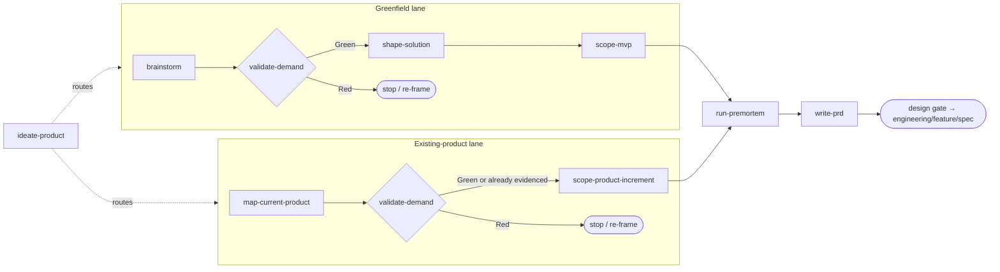

# Product

Last updated: 2026-08-18

From raw idea or existing codebase to a PRD an engineer can build against. Nine skills form two
lanes: greenfield product creation and existing-product improvement. This README is the complete
map — the skill directories carry no READMEs of their own.

## The lanes

Product work answers the earliest open question. Greenfield work starts with demand; existing
product work starts with current behavior.



`validate-demand` is the kill switch when demand or improvement value is disputed: a Red verdict
here is the cheapest possible outcome. It is also the first promotion point — a Green verdict is
where the core idea earns its place in the tracked product docs, via an early `write-prd` run.
`write-prd` is then the exit: it consolidates every artifact into the document
`engineering/feature/spec` consumes — directly, or through the optional `design/` phase when the
PRD leaves experience or structure open (see the Design Gate in `write-prd`).

## Where to start

| You have | Start with |
| --- | --- |
| A vague idea or problem statement | `brainstorm` |
| A specific idea and you want a go/no-go | `validate-demand` |
| An existing codebase/app and you want to know what it already does | `map-current-product` |
| User stories from existing code | `map-current-product` |
| A validated greenfield demand with no solution shape | `shape-solution` |
| A designed solution with too many features | `scope-mvp` |
| An existing-product improvement to scope | `scope-product-increment` |
| A scoped plan you want to stress-test | `run-premortem` |
| A Green demand verdict and nothing tracked yet | `write-prd` — early mode, Part 1 only |
| A scoped existing-product increment and an existing PRD | `write-prd` — delta mode |
| Completed artifacts and you need the spec | `write-prd` |
| No idea which of the above applies | `ideate-product` — it diagnoses and routes |

Skills can also run standalone: `validate-demand` works as a reality check on any claim,
`run-premortem` stress-tests any plan, and `map-current-product` can reverse-engineer user
stories from an existing codebase with no prior discovery.

## The skills

### Discovery (`discovery/`) — is this problem worth solving?

**`brainstorm`** — turns an ambiguous idea into a Jobs-to-be-Done brief through Socratic
dialogue: who the user is, what job they hire the product for, how they solve it today,
and what constrains any solution. Asks questions one at a time, keeps it conversational,
and stops before feature scoping. Owns `discovery/brainstorm.md`. **Credit: adapted from
[Jesse Hattabaugh's superpowers brainstorming skill](https://github.com/obra/superpowers/blob/main/skills/brainstorming/SKILL.md)
for the Socratic conversation pattern.**

**`validate-demand`** — the gate. Grades the evidence behind the demand claim on a
five-level scale, scores the Three Soul Questions (who is the user, where is the pain, why
choose you), classifies the demand as painkiller / reward / vitamin, slices to a beachhead
segment, and issues a traffic-light verdict with three concrete next steps. Green promotes the
core idea via an early `write-prd` run and then proceeds to `shape-solution` for greenfield
work, or `scope-product-increment` for active-product improvements; Red stops the effort or
sends it back to `brainstorm`, promoting nothing. Owns `discovery/demand.md`.

For active-product improvements, it grades support tickets, analytics, usage funnels, churn,
lost-deal notes, stakeholder evidence, and observed sessions before an increment is scoped.

**`map-current-product`** — the existing-product baseline. Reads product docs and code to
extract product-facing roles, routes/flows, implemented user stories, in-progress work, planned
work, gaps, and source evidence. It does not scope future changes; it gives
`scope-product-increment`, `shape-solution`, and `write-prd` a reliable picture of what exists
today. Owns `discovery/current-product.md`. **Credit: adapts PM-Skills user-story discipline,
OpenSpec brownfield-first exploration, and the prior `shape-solution` codebase inventory into a
standalone artifact.**

**`run-premortem`** — assumes the project has already failed 6 months out, then works
backward to root causes, scored risks, and prevention strategies. Lives in `discovery/`
but runs late in the pipeline: it reads the MVP scope and demand evidence, so it is most
effective after `scope-mvp` and immediately before `write-prd`. Also works standalone on
any plan. Owns `discovery/premortem.md`.

**`ideate-product`** — the router. Diagnoses which question is actually open across the
greenfield and existing-product lanes by reading the effort state and existing artifacts, then
routes to the owning skill. It performs no analysis and owns no artifact.

### Definition (`definition/`) — what exactly are we building?

**`shape-solution`** — turns a validated demand or current-product baseline into a concrete
solution shape: a 3D Persona, a 4-Act Narrative, a 4-Stage User Journey, and the scenarios the
solution must cover. Output depth adapts to complexity — Markdown for simple ideas, Mermaid
diagrams and optional HTML demos for complex systems. It consumes `current-product.md` when
existing-product behavior matters instead of re-reading the whole codebase. Owns
`discovery/solution.md`.

**`scope-mvp`** — resolves the three scope axes (scenario × product form × data
availability), then triages features into P0 (build now), P1/P2 (not yet), and Not-To-Do
(never for this MVP), anchored to one falsifiable core assumption. Includes an ambition
review that challenges whether the scope is the right bet, not just a complete one. It stays
greenfield/MVP-focused; existing-product iteration routes to `scope-product-increment`. Owns
`discovery/mvp.md`.

**`scope-product-increment`** — scopes active-product improvement as an explicit
`ADDED / MODIFIED / REMOVED` behavior delta against `current-product.md` or the PRD. It records
P0/P1/out-of-scope, acceptance criteria, edge cases and recovery, instrumentation, success
metrics, and refinement notes. Owns `discovery/increment.md`. **Credit: adapts PM-Skills
acceptance criteria, edge-case, instrumentation, and refinement-note patterns; OpenSpec delta
language; and gstack scope postures with explicit opt-in for scope changes.**

**`write-prd`** — the synthesizer, and the pipeline's one promotion step. Consolidates
completed artifacts into a single AI-executable PRD, mapping each upstream output to its PRD
section and asking only for what is genuinely missing. It links or condenses; it never
silently reclassifies facts owned upstream. Owns `<product-docs>/<slug>/prd.md` — the only
product artifact in a tracked layer. Runs early (Part 1 only) once demand is validated, then
extends as later stages close. In delta mode, it preserves an existing PRD and applies a scoped
product increment through an Update Log entry and minimal section edits. Use `spec` instead
when you want a technical feature specification.

## Handoff to design

The PRD fixes *what* to build. When *how it looks* or *how the system is shaped* is still
open, `write-prd` routes through the `design/` phase before `engineering/feature/spec`.

For UX questions — layout, information hierarchy, visual system, interaction states — the
entry point is `design/ux/design-context`, which establishes the design token source
(`docs/design/system.md`). From there the UX pipeline runs:

```
design-context → interaction-design → visual-design-variants → design-implement
```

When a design question surfaces during product work that conversation cannot settle — how a
state transition should feel, what a layout should look like — the loop goes to
`design/ux/prototype`: throwaway variants, decision recorded, control returns to the product
skill that raised it. The prototype code is disposable; the decision it bought is not.

For technical design questions — domain model, module boundaries, system architecture — the
entry point is `design/technical/`.

Both branches may run for the same effort. See `design/README.md` for the full routing table.

## Two layers, one boundary

The pipeline writes into two layers, and the split is the thing to understand before using
any of these skills.

| | Working layer | Human layer |
| --- | --- | --- |
| Answers | *How is this effort going?* | *What are we building, and why?* |
| Holds | Discovery drafts, evidence trails, prototype records | The PRD |
| Path | `<work-root>/<effort>/` — default `.scratch/` | `<product-docs>/<slug>/` — default `docs/product/` |
| Git | Ignored | Tracked |
| Lifetime | Dies with the effort | Outlives it |

Seven of the nine skills write only to the working layer. Their output is a draft — genuinely
useful while the effort runs, and genuinely disposable after. `write-prd` is where their durable
conclusions cross into the tracked layer; `ideate-product` writes nothing.

The test for which layer something belongs in: **if the work root were deleted today, would
the project have lost a fact it still needs?** A demand verdict, a persona, a Not-To-Do list —
yes, those must survive. The 5-Whys chain that produced the verdict, the three personas
considered and rejected, the axis-coherence check — no. Those did their job.

This is why `write-prd` is recommended right after the demand gate rather than only at the
end. The moment `validate-demand` returns Green, the project has a validated reason to exist,
and that reason should not live in a directory that `rm -rf` reclaims. Efforts abandoned
mid-pipeline still leave a record of what was considered and why it stopped.

## How they work together

Every skill follows the same shared-memory contract, which is what makes the pipeline
composable. Each declares its layer, the one artifact it owns, and what it promotes:

1. **One skill, one artifact.** Each skill writes exactly one file and never edits an
   upstream one — if a brief is wrong, it names the conflict and recommends re-running the
   owning skill.
2. **Read before write.** Each skill reads `docs/agents/memory.md`, the active `state.md`,
   the PRD when one exists, and the upstream artifacts it depends on, so nothing is
   re-derived or re-asked.
3. **Promotion is one-way.** Facts move from the working layer up to the PRD or an ADR,
   never back down. The working artifact keeps a link, not a second copy.
4. **Explicit handoff.** After writing, each skill updates `state.md` with its artifact
   pointer, so any later session can resume exactly where the effort stopped.
5. **Graceful degradation.** If memory routing is absent, skills work in conversation only
   and recommend `manage-context` before persisting.

The artifact chain, in execution order:

| # | Skill | Artifact | Layer | Promotes |
| --- | --- | --- | --- | --- |
| 1 | `brainstorm` | `discovery/brainstorm.md` | working | Persona, job, struggle |
| 2 | `validate-demand` | `discovery/demand.md` | working | Demand type, grade, verdict |
| 2B | `map-current-product` | `discovery/current-product.md` | working | Implemented stories, gaps, evidence |
| 3 | `shape-solution` | `discovery/solution.md` | working | User stories, first-use moment |
| 4A | `scope-mvp` | `discovery/mvp.md` | working | Requirements, scope, Not-To-Do |
| 4B | `scope-product-increment` | `discovery/increment.md` | working | Behavior delta, acceptance, instrumentation |
| 5 | `run-premortem` | `discovery/premortem.md` | working | Edge cases, NFRs |
| 6 | `write-prd` | `<product-docs>/<slug>/prd.md` | **human** | — *(is the promotion)* |
| — | `ideate-product` | none (router) | — | — |

## Credit

The `brainstorm` skill adapts the Socratic conversation pattern from [Jesse Hattabaugh's superpowers brainstorming skill](https://github.com/obra/superpowers/blob/main/skills/brainstorming/SKILL.md), which pioneered the one-question-at-a-time exploration flow and the hard gate before design.

The existing-product lane adapts principles from PM-Skills, OpenSpec, and gstack while keeping
their reference snapshots read-only. See [`../../THIRD_PARTY_NOTICES.md`](../../THIRD_PARTY_NOTICES.md).

## Typical workflows

**Greenfield, full run** — a new idea taken all the way to a spec:
`brainstorm` → `validate-demand` → `shape-solution` → `scope-mvp` → `run-premortem` →
`write-prd`. Expect the gate to send weak ideas back — that is the pipeline working, not
failing. After `write-prd`, the Design Gate routes to `spec` directly or through the
optional `design/` phase.

**Reality check** — someone asks "is this worth building?" about an existing idea:
run `validate-demand` alone. It grades whatever evidence exists and issues a verdict
without requiring upstream artifacts.

**Existing codebase** — inherit or revisit a product that already has code:
`map-current-product` extracts implemented user stories, in-progress features, planned work, and
gaps directly from the code. If the user asks for the next improvement, validate the evidence if
needed, then run `scope-product-increment` and `write-prd` in delta mode.

**Improve existing product** — a live app has a known problem:
`map-current-product` if no baseline exists → `validate-demand` when the evidence is weak or
disputed → `scope-product-increment` → optional `run-premortem` → `write-prd` delta mode.

**Stalled effort** — discovery started weeks ago and nobody remembers the state:
`ideate-product` reads `state.md` and the artifacts, reports which question is open, and
routes there.

**Plan stress-test** — a plan exists (from this pipeline or anywhere else) and needs a
devil's-advocate pass before commitment: run `run-premortem` alone on the plan.
