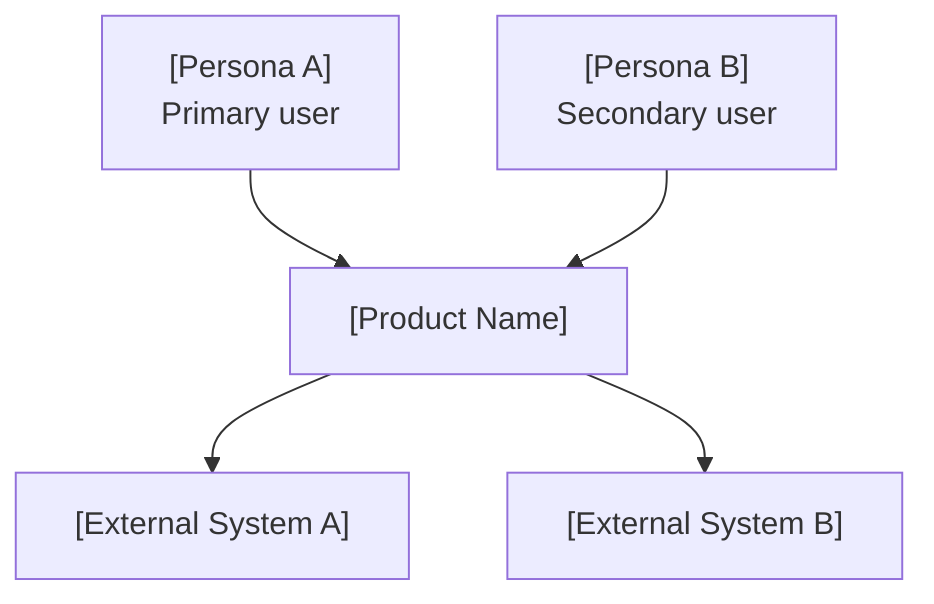
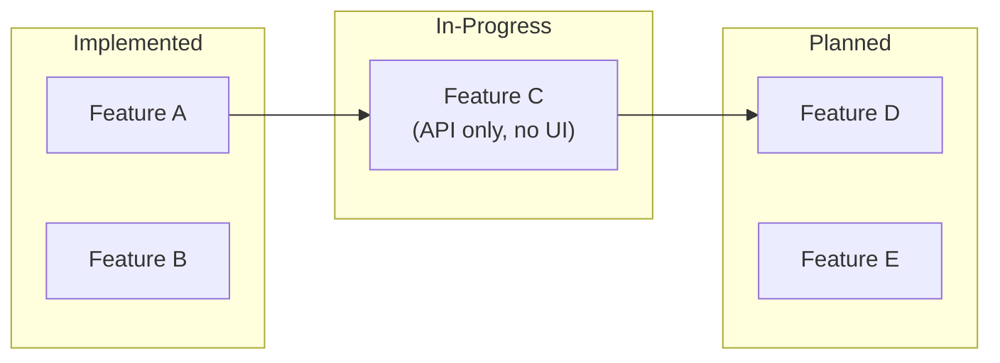
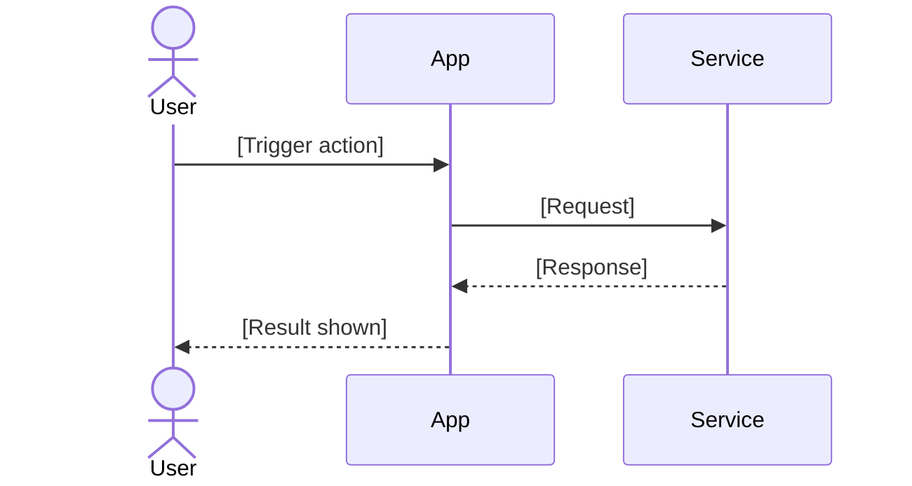

# Shape Solution

Last updated: 2026-08-18

Three narrative outputs plus the scenarios they imply — for new ideas and already-mapped
existing products. One purpose: make the user real enough that every design tradeoff has a
human answer.

This is stage 2 of product ideation — **Solution Shaping**. Stage 1 established that the job is real;
this stage decides what the solution looks like from the user's side. The user story is the key
artifact, because it is what makes scope decisions arguable instead of arbitrary.

1. **3D Persona** — who they are, what they currently do (their hack), what they fear
2. **4-Act Narrative** — status quo → breaking point → product → new identity
3. **4-Stage Journey** — discovery → first use → core habit → long-term dependency
4. **Scenarios** — the concrete situations the solution must cover

**Output depth is adaptive.** A simple idea or feature produces a Markdown document. A complex
codebase or multi-persona system produces Mermaid diagrams and optionally an HTML demonstration.
Don't produce more than the situation calls for.

Full framework detail, examples, and failure modes: [references/framework.md](references/framework.md)

## Shared Memory Contract

```text
Layer:    working — the solution shape while it is still being worked out
Owns:     <work-root>/<effort>/discovery/solution.md
Promotes: user stories, first-use moment → PRD Parts 1 and 3, via write-prd
```

Read `docs/agents/memory.md`, the active `state.md`, and `discovery/brainstorm.md` plus
`discovery/demand.md` when present. For existing-product work, read
`discovery/current-product.md`; if a codebase is present but that baseline is missing, route to
`map-current-product` first instead of exploring the code here. Also read
`<product-docs>/<slug>/prd.md` when it exists — the demand gate may have already promoted the
persona and job into it, in which case that is the authoritative statement and this artifact
elaborates on it rather than restating it.

Preserve the upstream demand type and verdict; write only the persona, narrative, journey,
scenarios, and resulting design implications. Update `state.md` with the artifact pointer.

The user stories are the durable output here. They outlive this effort because they define what
the product does for whom — but their tracked home is the PRD, not this file. Write them once
here; `write-prd` promotes them.

If `demand.md` shows Yellow or Red, say so and stop. Designing a solution for unvalidated
demand is the expensive mistake this pipeline exists to prevent.

---
## Phase 0A — Triage the Input

| Input type | Signals | Entry point |
| --- | --- | --- |
| **Upstream artifacts present** | `brainstorm.md` and `demand.md` exist | Harvest them → Phase 0B |
| **Existing product baseline** | `current-product.md` exists | Read it → Phase 0C → Phase 0B |
| **Existing codebase with no baseline** | Repo path, project dir, or "what does this app do?" | Stop and route to `map-current-product` |
| **Vague idea** | "I want to build X for Y" | Missing all three dimensions → Phase 0B → Phase 1 |
| **Feature list** | Itemized features, no user context | Have the "what", missing Who + Fear → Phase 0B → Phase 1 |
| **Partial context** | PRD with some user description or scenarios | Assess gaps → Phase 0B → ask only what is missing |
| **Rich context** | Persona named, current hack described, emotional stakes stated | Phase 0B → Phase 3 |

If you have enough context, generate. Don't interview when you can infer.

---

## Phase 0B — Rate Complexity

Complexity determines output depth. Rate before generating anything.

**Signals of a Simple situation:**

- No existing codebase — pure idea or single feature concept
- Single persona (one user type does everything meaningful)
- Fewer than five distinct user flows
- No external system integrations (auth, payments, messaging, third-party APIs)
- Contained scope: a single-purpose tool or one bounded feature within a product

**Signals of a Complex situation:**

- Existing-product baseline with multiple modules, layers, or services
- Two or more distinct user roles with different permissions or journeys
- Five or more user flows, especially where they interact or branch
- Multiple integrated systems (auth + data storage + external APIs + notifications)
- Architecture constraints: multi-tenancy, offline capability, real-time sync, compliance
- Explicit tension between existing design decisions and new requirements

**Output by rating:**

| Rating | Output |
| --- | --- |
| **Simple** | Standard Markdown: persona, narrative, journey, scenarios, story prompt |
| **Complex** | Markdown + at least one Mermaid diagram; optionally a self-contained HTML demo for UI-heavy features |

When in doubt, start Simple and promote to Complex only if the narrative requires it. A
diagram for a to-do app is noise; missing one for a multi-role SaaS is a gap.

---
## Phase 0C — Current Product Baseline

*Run only when `current-product.md` exists. Skip for greenfield ideas.*

Use `map-current-product`'s artifact as the source of truth for implemented stories,
in-progress behavior, planned work, and gaps. Do not re-read the whole codebase here unless a
specific evidence pointer is ambiguous.

Extract only what shaping needs:

- primary and secondary personas already visible in the product
- implemented user stories that anchor the narrative
- in-progress or planned behavior that affects the primary scenario
- gaps that change the user's journey or first-use moment

If the baseline is stale or lacks evidence paths, route back to `map-current-product` instead
of patching it here.

---
## Phase 1 — Diagnose Persona Gaps

**Read the upstream artifacts first** (brainstorm, demand, or codebase exploration output).
They have already established the specific user, the current workaround, the trigger moment,
and the emotional stakes.

| Dimension | Already answered upstream by |
| --- | --- |
| **Who** (surface) | JTBD Pillar 1 user context; validation Q1 zone and beachhead segment; `current-product.md` roles or inferred personas |
| **What** (behavior) | JTBD Current Pain; validation status-quo evidence; existing features reveal what users currently can do |
| **Fear** (motivation) | JTBD Task Trilogy emotional/social layers; validation 5-Whys terminus |

Do not re-ask what an upstream artifact or codebase exploration already answers.

Then assess what genuinely remains:

| Dimension | Present if input mentions… | Still missing if… |
| --- | --- | --- |
| **Who** | Specific role, tech fluency, device or context | Says "users" or "busy professionals" — no named identity |
| **What** | The current workaround — specific tool + where it breaks | Story starts with your product already solving things |
| **Fear** | Anxiety, accountability, status threat, specific consequence | Only positive desires: "wants efficiency", "save time" |

**Rule**: all three present → Phase 3. Any genuine gap → Phase 2.

---

## Phase 2 — Targeted Interview

Ask only what is missing. Consolidate into a single message — no back-and-forth chain.

- **Who gap**: "Who is the primary user — exact job title, and are they comfortable with technology?"
- **What gap**: "What do they do today to solve this problem, before your tool exists?"
- **Fear gap**: "What are they afraid of? If this goes wrong, who finds out?"

### When to probe deeper

Good answers are concrete and uncomfortable. Vague answers produce generic stories.

| They say… | Problem | Push for |
| --- | --- | --- |
| "A busy professional" | No identity — could be anyone | "What's their exact job? What does their worst morning look like?" |
| "They want to save time" | Desire, not fear — no stakes | "If they fail at this, who finds out? What do they lose?" |
| "They're frustrated with current tools" | No specific tool or failure | "Which tool? Where exactly does it break down?" |
| "I don't know" | — | Make a reasonable assumption, flag it: "I'll assume X — correct me if wrong." |

**Stop when you have** a persona with a name and job context, a concrete current hack (tool + the
moment it fails), and a specific fear with a named consequence or audience.

---
## Phase 3 — Generate the Narrative

### 3D Persona

Specific enough that two people would draw the same mental picture.

- **Who**: name + exact job title + one-sentence daily context (device, setting, pace)
- **What**: the current hack — the specific tool and exactly where it fails them
- **Fear**: what they are running from, not what they want — name the person or audience who would witness the failure

For multiple personas (Complex), give each their own 3D card and rank them by product impact.

### 4-Act Narrative

The story arc is the "why" behind every feature. Show it happening; don't summarize.

- **Act 1 — Status Quo**: the ordinary routine, the workaround in action. No drama. Establish time, place, rhythm.
- **Act 2 — Breaking Point**: a specific triggering event (meeting, deadline, public moment) where the hack fails visibly. Show the emotional consequence, not just the logistical one.
- **Act 3 — Intervention**: one named interaction with the product, with a concrete time contrast (old way vs. new). Name the exact click or action.
- **Act 4 — New Reality**: an identity shift. "I'm now the person who…" — not a metric, not a feature.

### 4-Stage User Journey

Where UX decisions live. Each stage has a job:

- **Discovery**: what surfaces the product? What skepticism must it overcome ("just another tool I'll abandon")?
- **First Use**: one action, immediate value. The "Aha!" must be a single visible result in under 30 seconds.
- **Core Process**: the repeated trigger and habit. What keeps the 10th use from feeling stale?
- **Long-Term Value**: the identity moment when they realize the tool changed who they are. Design implication for retention.

For multiple personas (Complex), map only the journey segments that diverge between personas.

### Scenarios

For each scenario: the trigger, who is present, where they are, what they have at hand, and what
"done" looks like. Then state the axis properties `scope-mvp` reads:

| Property | Values to state |
| --- | --- |
| Frequency | Per-day / per-week / per-month / episodic |
| Session length | Seconds / minutes / a working session |
| Participants | Single user / collaborative / handed off between roles |
| Connectivity | Always online / intermittent / offline required |
| Attention | Attended (user waits) / unattended (runs in background) |

Mark the **primary scenario** — the one the MVP must serve. Secondary scenarios are context, not scope.

When complexity is Complex, also state for the primary scenario: which personas participate,
which existing features already serve it, and which features are still needed (referencing
`current-product.md` by name).

### Story Prompt

Close with a paragraph anyone can hand to a teammate or paste into any AI system:

> "I'm building [tool] for [Who], who currently [current hack]. They are terrified of [Fear]. The
> first use should be [one action]. The core habit is [Core Process]. The goal: they feel
> [Ending Emotion]."

---
## Phase 3B — Rich Output (Complex only)

*Skip entirely when complexity rating is Simple.*

Generate diagrams and optionally an HTML demonstration after the narrative is complete.
Only produce what adds signal — a diagram that duplicates prose is noise.

### Mermaid: System Context Diagram

Show who uses the system and what external systems it connects to. Use a C4-style or simple
flowchart — whichever is clearer for the specific product.



Include only systems that are real and named. Don't invent integrations.

### Mermaid: Feature Status Map

Show what is implemented, in-progress, and planned. Use subgraphs or node styles to distinguish
status. Derive this directly from `current-product.md`.



Omit this diagram when there is no existing-product baseline. For greenfield complex systems,
use a feature dependency map instead — which features must ship before others can.

### Mermaid: Primary User Journey

The core scenario as a diagram. Use a sequence diagram for multi-party interactions
(user ↔ system ↔ external service). Use a flowchart for single-user decision flows.



Keep it to the primary scenario. Secondary scenarios get a brief prose note, not a second diagram.

### HTML Demonstration (optional)

Generate a self-contained HTML page when the product is UI-heavy and a static mockup
communicates the key interaction better than prose or a diagram.

Rules:
- Fully self-contained: no external CSS frameworks, no CDN script tags, no remote fonts
- Inline all styles; inline any JavaScript
- Demonstrate the primary scenario only — the one action that produces the "Aha!" moment
- Label it "Design Demo — [YYYY-MM-DD]" so readers know it is illustrative, not production
- Use realistic data, not Lorem Ipsum placeholders

Skip the HTML demo entirely when the product is a CLI, API, background service, or data pipeline.

---
## Phase 4 — Quality Validation

Check every output before presenting. If anything fails, revise it.

### Always check (Simple and Complex)

| Element | Must pass | Common failure to catch |
| --- | --- | --- |
| **Who** | Has a name, specific job title, one concrete daily detail | "A busy professional" with no role or context |
| **Current hack** | Names the specific tool + the exact moment it fails | "They struggle with the problem" |
| **Fear** | Answers "who finds out if this fails?" — names a person or audience | "They want to save time" (a desire, not a fear) |
| **Act 2** | A specific triggering event (meeting, deadline, public failure) | "They were frustrated one day" |
| **Act 3** | One named interaction + visible time contrast | "They discovered all the features" |
| **Act 4** | Identity statement ("I'm now the person who…") — not a metric | "They saved 120 hours this quarter" |
| **First Use** | One action, immediate value, no multi-step onboarding | "The onboarding was smooth" |
| **Scenarios** | A primary scenario marked, all five axis properties stated | "Users will use it at work" |
| **Story Prompt** | Complete, usable as-is, no placeholders | Missing fear or ending emotion |

### Additionally check when Complex

| Element | Must pass | Common failure to catch |
| --- | --- | --- |
| **Current product baseline** | Three-tier list (implemented / in-progress / planned) is present when existing-product work is in scope | Jumping to narrative without reading `current-product.md` |
| **Multiple personas** | Each has a 3D card; narrative shows where journeys diverge | All personas collapsed into one generic user |
| **Diagrams** | Every diagram adds signal not already present in prose | Diagram is a prettier version of an existing table |
| **System context** | All real external dependencies are named | Internal modules drawn as if they are external systems |
| **Feature status** | Implemented vs. planned are clearly distinguished | All features shown as equal, regardless of build status |
| **Architecture constraints** | Stated explicitly as scenario constraints | Multi-tenancy or compliance mentioned once then forgotten |
| **Gap identification** | At least one integration gap or missing flow is named | Clean inventory that implies the product is further along than it is |
| **HTML demo** | Self-contained, labeled, primary scenario only | Contains placeholder data or external script tags |

If any element feels generic — it probably is. Flag it and offer a sharper version.

---
## Output Format

### Simple output

```markdown
Last updated: [YYYY-MM-DD]

## Persona: [Name]
**Who:** [Exact job title, tech comfort, device/setting]
**Current Hack:** [Specific tool + where it fails]
**Fear:** [Named consequence — who finds out, what they lose]

## The Story
**Act 1 — Status Quo:** [Routine, workaround in action, no drama]
**Act 2 — Breaking Point:** [Specific event where the hack fails publicly]
**Act 3 — Intervention:** [One named action + time contrast]
**Act 4 — New Reality:** ["I'm now the person who…" — identity shift]

## User Journey
**Discovery:** [Trigger + core skepticism + what overcomes it]
**First Use:** [One action + immediate value + "Aha!" moment]
**Core Process:** [Repeated trigger + anti-fatigue mechanism]
**Long-Term Value:** [Identity moment + design implication]

## Scenarios
**Primary:** [Trigger, who is present, where, what they have at hand, what "done" means]
| Property | Value |
| --- | --- |
| Frequency | |
| Session length | |
| Participants | |
| Connectivity | |
| Attention | |

**Secondary:** [Briefly — context, not scope]

## Story Prompt
> "[Complete paragraph — no placeholders]"
```

### Complex output (extends Simple)

After the Story Prompt, add:

```markdown
## Feature Inventory
**Implemented:** [working features from `current-product.md`, one per line]
**In Progress:** [partial features + where the gap is]
**Planned:** [roadmap items + where the intent lives]

## Diagrams

### System Context
[Mermaid diagram]

### Feature Status Map
[Mermaid diagram — only when codebase is present; otherwise feature dependency map]

### Primary User Journey
[Mermaid diagram]

## Additional Personas
[Repeat 3D Persona card + journey delta for each secondary persona]

## Architecture Constraints
[List constraints that bound the scenarios — auth model, multi-tenancy, compliance, rate limits]

## Design Demo
[Self-contained HTML — only for UI-heavy products; omit for CLI/API/background services]
```

---

Persist to `<work-root>/<effort>/discovery/solution.md`.

## What This Skill Does NOT Do

- **Does not validate demand** — it shapes a solution for a demand already judged real
- **Does not map an existing codebase** — `map-current-product` owns source-backed current behavior
- **Does not scope the MVP** — it produces stories and scenarios, not a feature triage
- **Does not write the PRD** — it drafts the solution, not the consolidated spec
- **Does not build prototypes** — it produces narratives and diagrams, not code
