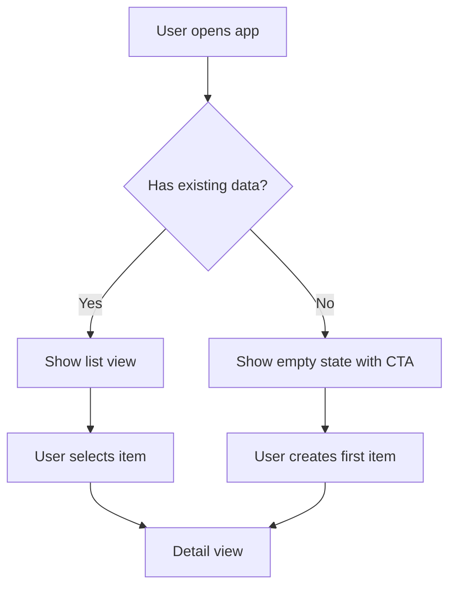

# PRD Writer

Last updated: 2026-08-18

Consolidate outputs from any prior toolkit skills into a single, AI-executable Product Requirements
Document (PRD). This skill maps what each prior skill already established to the correct PRD section,
asks only for what is genuinely missing, then generates the full document in one pass.

## Shared Memory Contract

```text
Layer:    human — product intent survives the effort that produced it
Owns:     <product-docs>/<slug>/prd.md   (default docs/product/<slug>/prd.md)
Promotes: this skill is itself the promotion step for the product pipeline
```

This is the only product skill that writes into a tracked layer. Every upstream discovery artifact is a draft under the work root; this skill is where their durable conclusions become project truth. If the work root were deleted the moment this skill finished, the project would still know what it is building and why.

Read `docs/agents/memory.md` for the product-docs home and work root, the active `state.md`,
and every completed artifact under `<effort>/discovery/` plus any
`<effort>/prototypes/*/decision.md`. For existing-product work, read
`discovery/current-product.md` and `discovery/increment.md` before editing the PRD. Synthesize
by linking or condensing; do not silently reclassify or rescope facts owned upstream.

Resolve `<slug>` from the effort slug so the PRD traces back to the discovery that produced it. If `docs/agents/memory.md` records no product-docs home, write to `docs/product/<slug>/prd.md` and say so; if there is no memory routing at all, work in conversation and recommend `manage-context` before persisting.

Update `state.md` with the PRD pointer.

See `references/prd-principles.md` for the full PRD framework, phasing guide, and worked examples.

## Maturity: run early, extend later

The PRD is one document with a version history, not a one-shot artifact written at the end of discovery. It can be created as soon as the demand gate passes and extended as later stages close.

| Run after | Fills | Leaves |
| --- | --- | --- |
| `validate-demand` returns Green | Part 0, Part 1 core problem triple and user story | Parts 2–4 marked `Pending — awaiting <skill>` |
| `scope-mvp` | Part 1 requirement list, scope boundaries, Not-To-Do | Parts 3–4 pending |
| `scope-product-increment` | Update Log, behavior delta, requirement changes, acceptance criteria, instrumentation, out-of-scope | Unchanged sections preserved |
| `run-premortem` | Part 3 edge cases and NFRs, Part 4 | — |

Running early is the recommended path: it puts the core idea in a tracked layer at the moment it stops being speculation, instead of leaving it in a disposable directory until the pipeline finishes. Efforts abandoned mid-pipeline still leave behind a record of what was considered and why it stopped.

When extending an existing PRD, bump the version, add an Update Log row naming the stage that
closed, and preserve user edits. Never regenerate from scratch over a PRD someone has edited. A
section marked `Pending` is honest; a section silently overwritten is not.

---

## Parse Input

Accept explicit document paths via `--doc <path>` / `-d <path>`. Multiple flags are allowed:

```
/write-prd --doc .scratch/my-effort/discovery/solution.md --doc .scratch/my-effort/discovery/mvp.md
```

If no flags are provided, resolve inputs from `state.md` and the configured discovery directory before scanning the current conversation.

Check whether `<product-docs>/<slug>/prd.md` already exists. If it does, this is an extension
or delta update — read it first and work out which parts are still `Pending`, which sections
are user-edited, and whether `discovery/increment.md` supplies an existing-product behavior
delta.

---

## Context Mapping

Do not re-ask for information already established by a prior step. Map existing context directly
to the corresponding PRD section:

| Prior Output | Maps to PRD Section |
|---|---|
| brainstorm | Part 1 — Job statement, struggling moment, forces, usage scenario |
| validate-demand | Part 1 — User persona, core pain point, demand type (Painkiller/Reward/Vitamin), evidence grade |
| map-current-product | Part 1 / Part 2 context — current users, implemented stories, current flows, and source-backed gaps |
| shape-solution | Part 1 and Part 3 — User stories, first-use moment, interaction flows (5-state coverage per feature) |
| scope-mvp | Part 1 — Scope axes (scenario × form × data), requirement list (P0/P1), Not-To-Do list |
| scope-product-increment | Update Log and changed sections — ADDED/MODIFIED/REMOVED behavior, P0/P1/out-of-scope, acceptance criteria, edge cases, instrumentation, success metrics |
| run-premortem | Part 3 — Edge cases, NFRs (derived from vaccine actions and monitoring signals) |
| prototype | Part 3 — Interaction decisions settled by throwaway variants |

If a prior step's output is present, use it directly. Do not reclassify demand type; do not
re-derive the persona; do not re-scope features.

An architectural decision in a `decision.md` is not PRD material — route it to an ADR via
`domain-modeling` and link it from Part 2.

## Existing PRD Delta Mode

Use delta mode when a PRD already exists and `discovery/increment.md` is present. The goal is to
extend the document, not regenerate it.

1. Read the existing PRD first and preserve user-edited prose unless it directly conflicts with
   the accepted increment.
2. Append an Update Log row with the new version, date, source artifact, and a one-line summary.
3. Apply `ADDED / MODIFIED / REMOVED` behavior to the smallest matching PRD sections:
   Scope, Requirement List, Part 2 flows, Part 3 feature states, Edge Cases, Analytics, and
   Out-of-Scope.
4. Keep unaffected sections byte-for-byte where practical. If a section must be rewritten, state
   which upstream delta required it.
5. If the increment contradicts the current PRD or baseline, stop and ask whether the PRD or the
   increment is authoritative.

`current-product.md` explains current behavior. `increment.md` owns the change. This skill only
promotes the accepted delta into the tracked PRD.

---

## Gap Assessment

Before generating, identify what is genuinely unknown. Ask **only** for:

| Gap | Ask when |
|---|---|
| Product name / working title | Not evident from any prior output |
| Target platform | Not resolved by the product-form axis in `scope-mvp` |
| Launch timeline | Always — no prior step owns this |
| Key stakeholders | Always — no prior step owns this |
| Performance / compatibility requirements | Not present in pre-mortem vaccine actions |

Consolidate all gap questions into one user message using the runtime's normal input mechanism. Do not ask questions one at a time.

---

## Workflow

Generate the PRD in three phases. Unless the user explicitly requests phased review, run all three
phases in a single pass and output the complete document.

**Phase 1 — Draft (Part 0 + Part 1)**
Establish document metadata and the requirement background: who the product is for, what problem it
solves, why it exists. Draw from brainstorm, validate-demand, shape-solution, and scope-mvp outputs.

**Phase 2 — Mid-Draft (Part 2)**
Generate the core business flowchart using Mermaid and the information architecture. This is the
structural skeleton of the solution before detailing interactions.

**Phase 3 — Final (Part 3 + Part 4)**
Produce the detailed interaction specifications (5-state per feature), edge cases, non-functional
requirements, and the launch plan milestone table.

---

## Output Format

Generate the complete PRD using this template. Every section must be filled — no placeholders,
no "TBD" in the final output unless the user has explicitly said a value is unknown.

The exception is an early run: when a stage has not yet closed, write
`*Pending — awaiting `<skill>`.*` under its heading instead of inventing content. This marks
the section as a known gap rather than an oversight, and tells the next session which skill
fills it.

````markdown
# PRD: [Product Name]

## Part 0 — Document Info

| Field | Value |
|-------|-------|
| Version | 0.1.0 |
| Stage | Draft |
| Stakeholders | [Names or roles] |
| Last Updated | [YYYY-MM-DD] |

### Update Log

| Version | Status | Changes |
|---------|--------|---------|
| 0.1.0 | Draft | Initial generation |

---

## Part 1 — Requirement Background & Goals

### Project Overview

[1–2 specific sentences: who it's for, what it does, and the level of complexity to expect.]

### Core Problem Triple

- **User Persona:** [A specific person in a specific situation — not a demographic category]
- **Usage Scenario:** [When, where, and under what pressure the user reaches for this product]
- **Core Pain Point:** [What is broken or missing about the existing solution]

### User Story

> As a [role], I want to [perform a task] so that [I achieve a specific value].

### Scope

**In-Scope (this phase):**
- [Feature or function 1]
- [Feature or function 2]

**Out-of-Scope (explicitly not building):**
- [Item 1 — brief reason]
- [Item 2 — brief reason]

### Requirement List

| ID | Module | Description | Priority | Status |
|----|--------|-------------|----------|--------|
| R1 | [Module] | [What this requirement covers] | P0 | Pending |
| R2 | [Module] | [What this requirement covers] | P0 | Pending |
| R3 | [Module] | [What this requirement covers] | P1 | Pending |

---

## Part 2 — Solution Overview

### Core Business Flowchart



### Information Architecture

- **[Page / Module]:** [Key components and their hierarchy]
- **[Page / Module]:** [Key components and their hierarchy]

---

## Part 3 — Detailed Solution

### [Feature / Page Name]

**Initial state:** [How this view looks when the user first opens it]
**Trigger action:** [User input — tap, click, type, swipe — that initiates the flow]
**Success state:** [What the UI shows after a successful action]
**Error state:** [What feedback is shown on failure, and what guidance is offered]
**Empty state:** [What is shown when there is no data — copy, illustration, CTA]

*(Repeat this block for each P0 feature)*

---

### Edge Cases

| Scenario | Handling |
|----------|----------|
| Rapid double-click / double-tap | 0.5s debounce on submit button |
| Network error during save | Toast: "Network error — changes not saved. Retry?" |
| Session timeout mid-flow | Preserve draft locally; prompt re-authentication |
| [Scenario from pre-mortem] | [Prevention action from vaccine plan] |

### Non-Functional Requirements

- **Performance:** [e.g., First Meaningful Paint < 2s on a mid-range device]
- **Compatibility:** [e.g., Chrome, Safari, Firefox — latest 2 major versions each]
- **Analytics:** [e.g., Track task completion rate, session length, error rate per flow]
- **Accessibility:** [e.g., WCAG 2.1 AA — keyboard navigation, screen reader support]

---

## Part 4 — Launch Plan

| Milestone | Description | Target Date |
|-----------|-------------|-------------|
| Requirements review | PRD finalized and approved by stakeholders | [Date] |
| UI/UX design | Wireframes reviewed; visual design approved | [Date] |
| Development | All P0 features built and unit-tested | [Date] |
| Internal QA | Edge cases validated; NFRs benchmarked | [Date] |
| Launch | MVP shipped to first users | [Date] |
````

---

## Quality Bar — Four Moats

Before saving a complete PRD, verify all four moats are present:

- [ ] Core business flowchart present (valid Mermaid block)
- [ ] Edge cases documented (minimum 3 distinct scenarios)
- [ ] Non-functional requirements defined (performance, compatibility, analytics)
- [ ] Out-of-Scope list present (minimum 2 items explicitly excluded)
- [ ] For delta mode, Update Log row added and unaffected PRD edits preserved

If any moat is missing, complete it before saving.

On an early run, the moats belonging to unclosed stages are marked `Pending` rather than
filled. Part 1 has its own bar and must always be complete: a named persona in a situation, a
specific pain point, and one user story. Those are the facts being promoted — a PRD whose Part
1 is vague has promoted nothing.

---

## Design Gate (optional)

The PRD fixes *what* to build. When *how it looks* or *how the system is shaped* is still open, route through `design/` before `spec`. Pick the row that matches the largest remaining open question:

| Open question after the PRD | Route to |
| --- | --- |
| Part 3 five-state specs are thin because layout, information hierarchy, or the visual system is undecided — or the effort is frontend-heavy with no design system | `design/ux/design-context` (then the UX pipeline — see `workflows/design.md`) |
| The destination is known but the route is foggy — multiple interdependent decisions, larger than one session | `craft/meta/wayfinder` |
| PRD terms have no agreed meaning, or a hard-to-reverse trade-off needs an ADR | `design/technical/domain-modeling` |
| The feature strains existing module boundaries, or it is unclear where behavior belongs | `design/technical/codebase-design` |
| The product is an agent system | `design/technical/design-agent-architecture` |
| The product is an operational decision loop | `design/technical/design-operational-ontology` |
| Only the implementation *approach* is open — product and experience are settled | `engineering/feature/brainstorm-feature` |
| None of the above | `spec` directly |

**Skip test** — skip design entirely when all three hold: the Part 2 flowchart and Part 3 five-state blocks are complete; vocabulary is settled (glossary exists or terms are unambiguous); the change fits the existing architecture. What remains then is implementation choices, which `plan` owns.

More than one row may apply — UX and technical design can both run. UX output additionally feeds frontend implementation via `design/ux/design-implement` and `spec`. A design question that the criteria and conversation cannot settle goes to `prototype`: throwaway variants, decision recorded in `prototypes/<slug>/decision.md`, control returns to the skill that raised it.

---

## Tool Coordination

- **Read** — Parse configured memory, explicit `--doc` inputs, and prior skill outputs. If the PRD already exists, read it before writing.
- **User input** — Gather all gaps in one message before generating; never ask mid-generation
- **Write** — Save the completed PRD to `<product-docs>/<slug>/prd.md`

Confirm the saved file path and layer to the user when done. The path should be inside the tracked `docs/product/` tree, not under the work root.

## What This Skill Does NOT Do

- **Does not discover the problem** — it consolidates what discovery already established
- **Does not validate demand** — it promotes the verdict, it does not grade evidence
- **Does not design the solution** — it records the solution shape, not invent it
- **Does not scope the MVP** — it maps the scope, not triage features
- **Does not scope active-product increments** — it promotes `increment.md`, not create it
- **Does not build the product** — it specifies what to build, not how to build it
