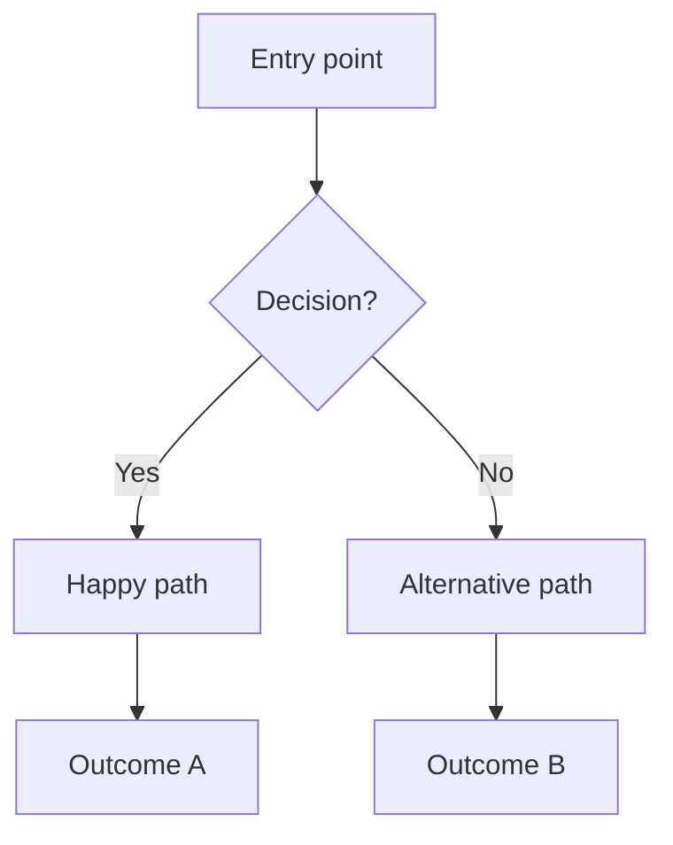

# PRD Principles Reference

Last updated: 2026-08-02

This reference condenses the full PRD framework for use by the `write-prd` skill. Read this when
you need to understand the "why" behind the output format, or when making judgment calls about
structure, depth, and quality bar.

---

## 1. Five-Part Structure

A complete PRD has five parts, each serving a distinct purpose:

| Part | Name | Purpose |
|------|------|---------|
| Part 0 | Document Info | Version, status, stakeholders, and change log — the metadata that makes the doc traceable |
| Part 1 | Requirement Background & Goals | Why this product exists, who it serves, and what exactly it must do |
| Part 2 | Solution Overview | The structural answer — flowchart and information architecture before detailing interactions |
| Part 3 | Detailed Solution | How every interaction works, what goes wrong, and what non-functional constraints apply |
| Part 4 | Launch Plan | The milestone sequence from spec to shipped |

**Rule:** Never collapse parts. Part 1 answers "what problem" before Part 2 answers "what structure"
before Part 3 answers "how it behaves." Merging them produces shallow answers everywhere.

---

## 2. Three-Phase Drafting

Use phases to make the document reviewable at each stage, rather than delivering everything at once
when the direction may still be wrong.

| Phase | Includes | Ready when |
|-------|----------|------------|
| Draft | Part 0 + Part 1 | Stakeholders agree on the problem definition and scope |
| Mid-Draft | + Part 2 | Stakeholders approve the flowchart and information architecture |
| Final | + Part 3 + Part 4 | All interaction specs, edge cases, NFRs, and dates confirmed |

**Version convention:** `0.x.0` = draft in progress, `1.0.0` = approved for development.

---

## 3. Semantic Versioning for PRDs

| Version | Meaning |
|---------|---------|
| 0.1.0 | Initial draft |
| 0.2.0 | Material revision to scope or goals |
| 0.x.y | Minor edits (y = patch) |
| 1.0.0 | Stakeholder-approved; development can begin |
| 1.x.0 | Approved changes mid-development |
| 2.0.0 | Major pivot — new direction |

Always record every version bump in the Update Log table (Part 0).

---

## 4. Five-State Interaction Specification

Every feature or page must be specified across five states. Omitting any state leaves the developer
making decisions that belong in the PRD.

| State | Question answered |
|-------|-------------------|
| Initial | What does the user see when they first arrive? |
| Trigger | What user action initiates the flow? (tap, click, type, swipe) |
| Success | What does the UI show after the action completes successfully? |
| Error | What feedback does the user get when something fails? What is the guidance? |
| Empty | What is shown when there is no data? (copy, illustration, call-to-action) |

**Anti-pattern:** Specifying only the success state. A PRD that describes only the happy path
produces code that fails gracefully only by accident.

---

## 5. Core Problem Triple

The three elements of Part 1 that make a requirement real rather than hypothetical:

**User Persona** — a specific person in a specific situation, not a demographic.
- Bad: "Busy professionals"
- Good: "A freelance designer who tracks client feedback in a shared Google Doc that has become a 200-row mess"

**Usage Scenario** — the moment of need, with context and pressure.
- Bad: "When they want to organize their work"
- Good: "On a Monday morning, before the first client call, trying to find which version of a deliverable was approved last week"

**Core Pain Point** — what is broken about what they do today.
- Bad: "Existing tools are hard to use"
- Good: "Search in Google Docs returns too many results with no way to filter by project or status, so they scroll manually every time"

---

## 6. Mermaid Flowchart Guidance

The Part 2 flowchart must represent the **core business logic** — the decision points and state
transitions that drive the product, not a UI wireframe or a data-flow diagram.

**Required elements:**
- At least one decision node (`{}` diamond shape)
- Both branches of every decision labeled
- Terminal states shown (not just "end")

**Common patterns:**

**Anti-pattern:** A linear flowchart with no decisions. If the chart has no diamonds, it is not
showing business logic — it is showing a to-do list.

---

## 7. Edge Case Coverage

Minimum three scenarios, covering:
1. A **user error** (wrong input, double submission, unexpected sequence)
2. A **system failure** (network error, timeout, unavailable dependency)
3. A **boundary condition** (empty state, maximum data limit, concurrent access)

Draw edge cases from the pre-mortem vaccine plan where available — those actions often translate
directly into "if X happens, show Y" handling rules.

---

## 8. Non-Functional Requirements

NFRs define the quality bar the feature must meet, not just what it does. Always specify at minimum:

- **Performance** — measurable threshold (e.g., "First Meaningful Paint < 2s on 4G connection")
- **Compatibility** — explicit browser/device/OS targets (e.g., "iOS 16+, Android 12+, Chrome/Safari latest 2")
- **Analytics** — what user behaviors to track (e.g., "completion rate of onboarding flow, error rate per form field")

Optional but recommended:
- **Accessibility** — WCAG level and specific requirements
- **Security** — data handling, authentication, session management constraints
- **Scalability** — expected load and growth assumptions

---

## 9. Good vs. Bad PRD Patterns

### Requirement List

Bad:
> R1 | Auth | User login | P0 | Pending

Good:
> R1 | Auth | Email + password login with "forgot password" flow. OAuth (Google) as secondary option. Session persists 7 days. | P0 | Pending

### User Story

Bad:
> As a user, I want to see my data.

Good:
> As a freelance designer with multiple active clients, I want to filter my feedback log by project and status so that I can find approved deliverables in under 30 seconds.

### Edge Case

Bad:
> Handle errors gracefully.

Good:
> If the API returns a 503 during file upload, display a non-blocking toast ("Upload failed — your draft is saved locally") and retry automatically after 5 seconds, up to 3 attempts.

---

## 10. AI Collaboration Workflow

When using this PRD as input for an AI coding agent:

1. **Generate draft** — run `/write-prd` with all available pipeline context. An early run right after the demand gate writes Part 1 and marks later parts `Pending`
2. **Human review** — stakeholders fill any remaining TBDs; verify scope, dates, and NFRs
3. **Mark Final** — bump version to 1.0.0 in Part 0; set Stage to "Final"
4. **Handoff** — point `state.md` at `<product-docs>/<slug>/prd.md`; the technical workflow consumes product intent without rewriting it
5. **Update on change** — bump version and add a row to the Update Log whenever the spec changes mid-development

The PRD lives in the tracked Human layer, not the disposable work root. Everything the pipeline produced upstream of it is a draft that dies with the effort; the PRD is where those conclusions become project truth.

**Rule:** Never hand an agent a Draft-stage PRD for implementation. Parts 3 and 4 must be complete
before development begins, or the agent will fill the gaps with assumptions.
