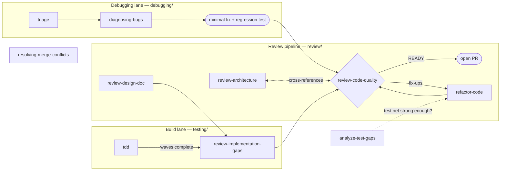

# Quality

Last updated: 2026-09-09

Correctness, clarity, and resilience across delivery. Ten skills in three lanes that run
throughout the lifecycle, not after it: a build lane (test-first implementation), a review
pipeline (design doc → gap analysis → code quality → corrective refactor), and a debugging
lane (triage → diagnosis → verified fix). `review-code-quality` is the convergence point —
every lane passes through it before code ships.

## The lanes

`review-code-quality` is the gate. It judges a change on two axes — **Standards** (does the
code follow this repo's conventions and quality bar?) and **Spec** (does it do what the
plan/issue asked?) — reported separately so one axis cannot mask the other, and issues a
merge verdict. `review-architecture` is its design-level peer: the two share a MECE boundary
table and route findings to each other through an explicit cross-reference channel rather
than duplicating them. `analyze-test-gaps` answers "is the test net strong enough?" before a
large refactor or ship. `resolving-merge-conflicts` is standalone — invoked whenever an
in-progress merge or rebase leaves conflict markers.

## Where to start

| You have | Start with |
| --- | --- |
| A task list or plan to implement test-first | `tdd` |
| A design doc, about to start coding | `review-design-doc` |
| A partially implemented plan — "what's left?" | `review-implementation-gaps` |
| Changes to verify before commit / PR — "review my code" | `review-code-quality` |
| A system-level design question (boundaries, topology, ADRs) | `review-architecture` |
| Working code that reads poorly | `refactor-code` — Depth 1, quick polish |
| Structural debt — duplication across files, oversized units | `refactor-code` — Depth 2, gated |
| "Are our tests good enough to refactor / ship?" | `analyze-test-gaps` |
| An incoming bug report to classify | `triage` |
| A confirmed bug with unknown cause | `diagnosing-bugs` |
| Conflict markers in an in-progress merge / rebase | `resolving-merge-conflicts` |

Every skill also runs standalone: `review-code-quality` reviews any diff without upstream
artifacts, `analyze-test-gaps` audits any codebase, and `diagnosing-bugs` needs only a
reproducible symptom.

## The skills

### Testing (`testing/`) — does the code do what it claims?

**`tdd`** — executes one criterion-based red-green-refactor behavior slice at a time. It proposes verification/review needs; the coordinator schedules authorized parallel work or executes serially. Canonical progress stays in tickets; fine-grained steps are Run Context, and final revision/environment evidence is retained Change Context.

**`analyze-test-gaps`** — audits test adequacy by business flow, not coverage percentage.
Identifies ≤8 critical paths, maps which tests actually protect them, runs the suite once
for a health snapshot with honest failure classification, and emits a capped P0/P1 gap list.
Three evidence sections/artifacts: `critical-paths.md`, `test-status.md`, `test-gaps.md`, using existing homes or the change-local verification directory. Run it
before a large refactor to know whether the safety net will hold.

### Review (`review/`) — is it built right?

**`review-design-doc`** — plan-stage review before any code exists: scope challenge,
architecture and assumption checks, test strategy, completeness. Artifact:
`docs/eng-reviews/plan-review-*.md`.

**`review-implementation-gaps`** — compares a design doc to the code and classifies every
planned item COMPLETE / PARTIAL / MISSING / DIVERGENT / UNEXPECTED with confidence scores.
Its artifact (`docs/eng-reviews/gap-analysis-*.md`) carries a hand-off hint that
`review-code-quality` auto-consumes.

**`review-code-quality`** — the production-readiness gate. Orchestrates domain subagent
pairs (api, db, auth, reliability, performance, security, code-reviewer) in parallel with an
inline fallback, tags every finding Standards or Spec, builds a test-coverage diagram, runs
static security greps, and issues a READY / READY-WITH-FIXES / NOT-READY verdict with a
prioritized next-steps plan. Three modes: recent changes (default), whole codebase vs
spec/rules, drill-down after an architecture review.

**`review-architecture`** — design-level review across business, application, data,
technology, deploy, and ADR aspects with its own explorer/reviewer subagent fleet. MECE with
`review-code-quality`; findings on the wrong side of the line travel via cross-references.

**`refactor-code`** — the corrective action, behavior-preserving at two depths. Depth 1:
quick polish of recently modified code (naming, nesting, redundancy, project style), applied
directly and verified by tests. Depth 2: structural refactor (cross-file duplication,
pattern application, complexity reduction) with baseline metrics, a ranked proposal the user
approves, grouped edits with tests between groups, and a before/after report.

### Debugging (`debugging/`) — why is it broken?

**`triage`** — classifies an incoming bug report: severity, scope, reproduction steps,
likely owner, and a durable brief for whoever picks it up.

**`diagnosing-bugs`** — root-cause analysis: build a red-capable loop, reproduce and
minimize, form falsifiable hypotheses, fix with a regression test. Routes seam failures to
`design/technical/improve-codebase-architecture`.

**`resolving-merge-conflicts`** — resolves in-progress merge/rebase conflicts by
reconstructing both sides' intent. Never auto-commits.

## Boundaries with other groups

- **Architecture restructuring** belongs to `design/technical/improve-codebase-architecture`;
  `review-architecture` judges the design, it does not redesign it. `diagnosing-bugs` routes
  seam failures there too.
- **Requirements** have one canonical source; engineering `spec` consumes it, the active agent plans directly, and `tasks` proposes child tickets; `tdd` executes
  them and `review-implementation-gaps` audits against them. Pre-code plan stress-testing at
  the product level is `product/discovery/run-premortem`.

## Typical workflows

**Feature build** — `tdd` executes the plan wave by wave → `review-implementation-gaps`
confirms spec compliance → `review-code-quality` issues the merge verdict →
`refactor-code` applies fix-ups → re-verdict.

**Pre-PR check** — `review-code-quality` alone (Mode A, both axes). The fastest useful
entry point.

**Architecture drill-down** — `review-architecture` flags design issues at specific files →
`review-code-quality` Mode C follows up at code level.

**Pre-refactor safety** — `analyze-test-gaps` checks the safety net → close P0 gaps →
`refactor-code` Depth 2.

**Bug** — `triage` classifies → `diagnosing-bugs` finds the cause → minimal fix with a
regression test → `review-code-quality` before merge.
