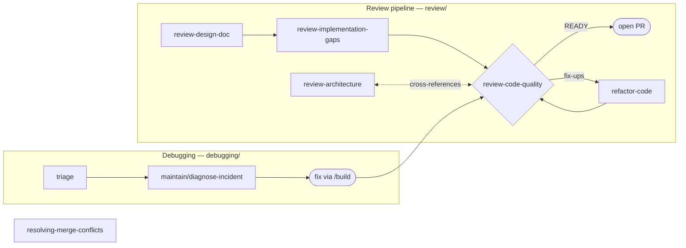

# Quality

Last updated: 2026-09-12

Correctness, clarity, and resilience across delivery. Skills in two lanes that run
throughout the lifecycle, not after it: a review
pipeline (design doc → gap analysis → code quality → corrective refactor), and a debugging
lane (triage → verified fix). `review-code-quality` is the convergence point —
every lane passes through it before code ships.

Note: `tdd` has moved to `build/` — test-driven development is part of the implementation loop, not a separate quality phase. `analyze-test-gaps` has moved to `test/` — coverage audit runs after build, not during. `diagnosing-bugs` has moved to `maintain/diagnose-incident` — incident diagnosis belongs in the maintenance loop. `triage` remains here as a cross-cutting entry point for incoming bug reports.

## The review pipeline

`review-code-quality` is the gate. It judges a change on two axes — **Standards** (does the code follow this repo's conventions and quality bar?) and **Spec** (does it do what the plan/issue asked?) — reported separately so one axis cannot mask the other, and issues a merge verdict. `review-architecture` is its design-level peer: the two share a MECE boundary table and route findings to each other through an explicit cross-reference channel rather than duplicating them. `resolving-merge-conflicts` is standalone — invoked whenever an in-progress merge or rebase leaves conflict markers.

## Where to start

| You have | Start with |
| --- | --- |
| A design doc, about to start coding | `review-design-doc` |
| A partially implemented plan — "what's left?" | `review-implementation-gaps` |
| Changes to verify before commit / PR — "review my code" | `review-code-quality` |
| A system-level design question (boundaries, topology, ADRs) | `review-architecture` |
| Working code that reads poorly | `refactor-code` — Depth 1, quick polish |
| Structural debt — duplication across files, oversized units | `refactor-code` — Depth 2, gated |
| An incoming bug report to classify | `triage` |
| Conflict markers in an in-progress merge / rebase | `resolving-merge-conflicts` |

`review-code-quality` runs standalone on any diff. `triage` runs standalone on any bug report.

## The skills

### Review (`review/`) — is it built right?

**`review-design-doc`** — plan-stage review before any code exists: scope challenge, architecture and assumption checks, test strategy, completeness. Artifact: `docs/eng-reviews/plan-review-*.md`.

**`review-implementation-gaps`** — compares a design doc to the code and classifies every planned item COMPLETE / PARTIAL / MISSING / DIVERGENT / UNEXPECTED with confidence scores. Its artifact (`docs/eng-reviews/gap-analysis-*.md`) carries a hand-off hint that `review-code-quality` auto-consumes.

**`review-code-quality`** — the production-readiness gate. Orchestrates domain subagent pairs (api, db, auth, reliability, performance, security, code-reviewer) in parallel with an inline fallback, tags every finding Standards or Spec, builds a test-coverage diagram, runs static security greps, and issues a READY / READY-WITH-FIXES / NOT-READY verdict with a prioritized next-steps plan. Three modes: recent changes (default), whole codebase vs spec/rules, drill-down after an architecture review.

**`review-architecture`** — design-level review across business, application, data, technology, deploy, and ADR aspects with its own explorer/reviewer subagent fleet. MECE with `review-code-quality`; findings on the wrong side of the line travel via cross-references.

**`refactor-code`** — the corrective action, behavior-preserving at two depths. Depth 1: quick polish of recently modified code (naming, nesting, redundancy, project style), applied directly and verified by tests. Depth 2: structural refactor (cross-file duplication, pattern application, complexity reduction) with baseline metrics, a ranked proposal the user approves, grouped edits with tests between groups, and a before/after report.

### Debugging (`debugging/`) — initial signal and conflict resolution

**`triage`** — classifies an incoming bug report: severity, scope, reproduction steps, likely owner, and a durable brief for whoever picks it up. Cross-cutting: runs at any lifecycle phase, not just during maintenance.

**`resolving-merge-conflicts`** — resolves in-progress merge/rebase conflicts by reconstructing both sides' intent. Never auto-commits.

Root-cause analysis and the fix loop live in `maintain/diagnose-incident` → `/build`. `triage` hands off there after classification.

## Boundaries with other phases

- **TDD and test-first implementation** belong to `build/tdd` — testing during implementation is part of the build loop, not a quality step after it.
- **Coverage audit and integration tests** belong to `test/analyze-test-gaps` — run after build is complete.
- **Root-cause diagnosis** belongs to `maintain/diagnose-incident` — incident analysis feeds the autonomous maintenance loop.
- **Architecture restructuring** belongs to `design/technical/audit-architecture`; `review-architecture` judges the design, it does not redesign it.
- **Requirements** have one canonical source; `build/plan-implementation` consumes it, `build/break-into-tasks` proposes child tickets, `build/tdd` executes them, and `review-implementation-gaps` audits against them.

## Typical workflows

**Pre-PR check** — `review-code-quality` alone (Mode A, both axes). The fastest useful entry point.

**Design-through-code review** — `review-design-doc` before coding → `review-implementation-gaps` mid-implementation → `review-code-quality` before merge → `refactor-code` on fix-ups → re-verdict.

**Architecture drill-down** — `review-architecture` flags design issues at specific files → `review-code-quality` Mode C follows up at code level.

**Bug** — `triage` classifies → `maintain/diagnose-incident` finds the cause → fix via `/build` → `review-code-quality` before merge.
